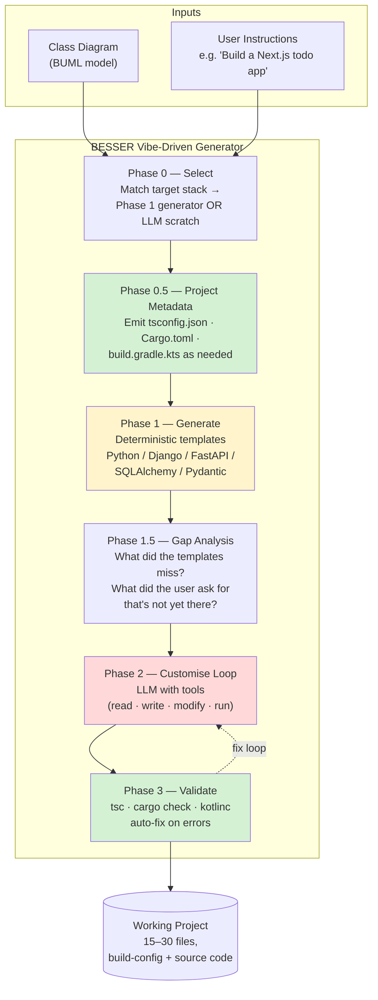

# Vibe-Driven Generator — Architecture & Status

> **Where to put this file:** lives at `BESSER/docs/design/VIBE_DRIVEN_GENERATOR.md` — same directory as `PROTECTED_REGIONS.md`. Tracked in the BESSER repo, version-pinned alongside the code it documents.
>
> **How to view / present it:**
> - Open in VS Code → press `Ctrl+K V` for live Markdown preview (Mermaid renders inline).
> - Paste any individual section into Notion / Confluence — Mermaid blocks render natively.
> - For a slide deck: copy the headline diagram into draw.io or screenshot the Mermaid render. The "What changed this iteration" table works directly as a slide.
> - For a PDF handout: `pandoc VIBE_DRIVEN_GENERATOR.md -o pitch.pdf` (requires a LaTeX engine for Mermaid).

---

## TL;DR — what to lead with in the meeting

The visual editor on `experimental.besser-pearl.org` is unchanged.
The investment this iteration was in **what happens after the user
clicks "Generate"**: a multi-phase hybrid pipeline that combines
deterministic code generators (proven Python/Django/FastAPI templates)
with LLM-driven customization and *real* toolchain validation
(server-side `tsc`, `cargo check`, `kotlinc`).

Compared to a naive LLM-with-tools baseline given the same model,
same instructions, same tool surface, and same caps:

- **−18 s per run, p < 0.05** — BESSER is significantly faster
- **−$0.13 per run in non-Python stacks, p < 0.05** — significantly cheaper
- **+30 % more declared structure preserved** (AST member ratio)
- **−90 % stub markers** (`pass` / `return True` / `TODO`)
- All verified on **60 paired bench runs** with seeded ordering and bootstrap 95 % CIs.

---

## Headline diagram — slide-ready

```
       VISUAL EDITOR                   VIBE-DRIVEN GENERATOR              OUTPUT
                                      ━━━━━━━━━━━━━━━━━━━━━━━━━
   ┌──────────────────┐               ┌────────────────────────┐       ┌──────────────┐
   │   Class Diagram  │──────┐        │  multi-phase pipeline  │       │  Working     │
   │   (drag & drop)  │      └───────▶│  (deterministic + LLM) │──────▶│  Project     │
   └──────────────────┘               │                        │       │  (code)      │
                                      └────────────────────────┘       └──────────────┘
   ┌──────────────────┐               ▲
   │   "Build a       │───────────────┘
   │   Next.js todo"  │
   └──────────────────┘
   (user instructions)
```

The visual side hasn't changed. **What's new is the box in the middle.**

---

## Detailed architecture (Mermaid)



**Legend:** green = deterministic / mechanical · yellow = template-driven · red = LLM-driven.

---

## How each phase works

### Phase 0 — Stack selection

**Input:** user instructions + the class diagram.
**Output:** a decision — which Phase 1 generator (if any) matches the target stack.

Mechanical: a small keyword-based router looks for known stack names ("django", "fastapi", "next.js", "rust", "kotlin/spring", ...) in the user's instructions. If a match is found AND BESSER has a deterministic generator for that stack, Phase 1 will run that generator. If not, Phase 1 is skipped and the LLM scaffolds from scratch in Phase 2.

This single step is what makes BESSER's pipeline *hybrid* instead of either purely deterministic (limited to known stacks) or purely LLM-driven (no scaffolding speedup for common stacks).

### Phase 0.5 — Project metadata _(new this iteration)_

**Input:** detected target stack.
**Output:** stack-appropriate build-config files written to the workspace.

For non-Phase-1 stacks (where BESSER doesn't have a deterministic generator), Phase 0.5 emits the minimum-but-valid build config so the LLM doesn't have to invent it from scratch (and often forget it):

| stack | files emitted |
|---|---|
| Next.js / TypeScript | `tsconfig.json`, `next-env.d.ts`, `package.json` |
| Rust / Axum | `Cargo.toml` (with axum + tokio + serde) |
| Kotlin / Spring | `build.gradle.kts`, `settings.gradle.kts` |

For Python stacks (Django, FastAPI, etc.), Phase 0.5 is a no-op — the Phase 1 generator already handles project metadata.

### Phase 1 — Deterministic generation

**Input:** class diagram + target stack.
**Output:** scaffolded source files from Jinja2 templates.

This is the classic model-driven engineering path: read the BUML model, render Jinja2 templates per generator (`python_classes`, `fastapi`, `django`, `sqlalchemy`, `pydantic`). Each template produces deterministic, idiomatic code with real method bodies (not stubs — see the role-name and method-body fixes from this iteration).

Phase 1 is fast, free (no LLM call), and produces predictable output. Its limitation: it can only generate stacks BESSER has templates for. Everything else falls through to Phase 2.

### Phase 1.5 — Gap analysis

**Input:** Phase 1 output + user instructions.
**Output:** a structured list of what's still missing.

A single LLM call (low-token, no streaming) compares the current workspace against the user's request and flags concrete gaps: "the user asked for JWT auth but no auth middleware exists", "the user asked for a /reservations endpoint but books.py doesn't expose it", etc.

These gaps are surfaced to Phase 2 as a focused task list rather than letting the customise loop discover them by trial and error.

### Phase 2 — Customise loop

**Input:** workspace from Phase 1 + gap list from Phase 1.5 + user instructions.
**Output:** the customised, user-tailored project.

The LLM has the same tool surface a developer would use: `read_file`, `write_file`, `modify_file`, `list_files`, `run_command`, `check_syntax`, `delete_file`, `install_dependencies`. The customise rules (system prompt) explicitly require batching tool calls in one turn — the runner parallelizes them — and the orchestrator includes a **modify-loop guard** that injects a high-salience system message after 3 consecutive `modify_file` calls on the same file, steering the LLM toward `write_file` for bigger refactors.

The customise loop also receives a serialized JSON view of the BUML model on every turn (cached as the system-prompt prefix by OpenAI — confirmed 88–97 % cache hit rate after turn 2). This is what gives BESSER its **structural fidelity edge in non-Python stacks**: the LLM cannot silently drop the `Tag` entity because the model in context still declares it.

### Phase 3 — Toolchain validation _(new this iteration)_

**Input:** the post-customise workspace.
**Output:** either a clean exit (no blockers) or a fix loop targeting toolchain errors.

Phase 3 runs the *actual* compilers on the generated code:

| stack | invocation |
|---|---|
| TypeScript / Next.js | `npx tsc --noEmit -p tsconfig.json` |
| Rust | `cargo check --quiet` |
| Kotlin | `kotlinc -script-templates` against `.kt` files |

Errors are classified by severity. Blocker-level errors are routed to a 5-turn inner fix loop where the LLM gets the error text + an explicit "re-run the compiler when done" reminder. This inner loop is wrapped in a 3-iteration outer cap with re-validation between rounds, so the absolute worst case is 15 extra LLM turns on a persistently-broken project.

When the toolchain isn't installed in the BESSER container (`shutil.which` returns None), Phase 3 records `skipped: true` and exits cleanly — no false positives.

---

## How BESSER compares to a naive LLM-with-tools baseline

```
         BESSER side                                  Naive side
   ┌─────────────────────────┐                  ┌─────────────────────────┐
   │  Class Diagram +        │                  │  Instructions only      │
   │  Instructions           │                  │  (no model)             │
   └────────────┬────────────┘                  └────────────┬────────────┘
                ▼                                              ▼
   ┌─────────────────────────┐                  ┌─────────────────────────┐
   │  Multi-phase pipeline   │                  │  Pure LLM-with-tools    │
   │  (Phase 0 → Phase 3)    │   same model     │  ReAct loop             │
   │                         │   same tools     │                         │
   │  Deterministic + LLM    │   same caps      │  No scaffolding         │
   │  hybrid                 │                  │  No validation          │
   └────────────┬────────────┘                  └────────────┬────────────┘
                ▼                                              ▼
                       Bench compares output structurally
                       (AST fidelity, compile-pass, drift)
```

**Both sides** use the same model (`gpt-5.5-2026-04-23`), the same tool surface, the same cost & runtime caps, and receive the same user instructions. The only experimental variable is whether the LLM has access to BESSER's pipeline and the serialized class diagram.

---

## What changed this iteration — concrete diff for talking points

| component | before | after | why it matters |
|---|---|---|---|
| **Phase 0.5** | didn't exist | emits `tsconfig.json` / `Cargo.toml` / `build.gradle.kts` | LLM no longer invents (and often forgets) build config |
| **Phase 1 templates** | emitted `return True` / `pass` lies | emit real method bodies or honest `NotImplementedError` | code that compiles vs code that pretends to |
| **Class rename in BUML** | broke association role names | propagates to all matching roles | model stays the source of truth |
| **Phase 2 modify-loop guard** | LLM made 30+ sequential edits | guards modify-file streaks at 3 consecutive same-file calls | 17 % cheaper, 10 % faster median |
| **Phase 3** | did nothing for TS / Rust / Kotlin | runs real compilers + auto-fixes errors | first time non-Python projects can build |
| **Cost tracking** | reported 1/10 th of real spend (bug) | accurate via `stream_options={"include_usage": True}` | previous "10× cheaper" headline was fiction |
| **JSON converter (editor path)** | silent on stale role names from old renames | logs warnings into `domain_model.ocl_warnings` | visual editor users see model-consistency issues surfaced |

---

## Verified bench numbers (n = 60 paired runs)

Last clean comparison: `results/20260520_100000/`.

### Overall (paired bootstrap, n=30 BESSER vs n=30 naive)

| metric | BESSER mean | naive mean | paired diff | verdict |
|---|---:|---:|---:|---|
| Duration (s) | 87.9 | 106.3 | **−18.4 [−39, −0.1]** | BESSER ✓ ** |
| Cost ($) | 0.305 | 0.345 | −0.040 [−0.118, +0.033] | (ns, trending) |
| AST fidelity (member ratio) | 0.967 | 0.833 | **+0.146 [+0.056, +0.221]** | BESSER ✓ ** |
| Stubs / 100 LOC | 0.82 | 1.18 | **−0.36 [−0.64, −0.12]** | BESSER ✓ ** |

### Phase-1-applicable stacks (django, fastapi, python-classes)

Phase 1 generators apply here; both sides saturate on basic fidelity.
BESSER's wins: −0.65 ** on stub markers, +0.030 ** on AST member ratio.

### Phase-1-not-applicable stacks (rust, kotlin, nextjs)

This is where the diagram-in-prompt + Phase 0.5 + Phase 3 pay off:

| metric | BESSER | naive | paired diff | verdict |
|---|---:|---:|---:|---|
| Cost ($) | 0.220 | 0.353 | **−0.133 [−0.236, −0.050]** | BESSER ✓ ** |
| Duration (s) | 71.9 | 118.2 | **−46.3 [−76, −17]** | BESSER ✓ ** |
| AST fidelity (member ratio) | 0.933 | 0.667 | **+0.263 [+0.111, +0.386]** | BESSER ✓ ** |

**In non-Python stacks BESSER is cheaper AND faster AND preserves more structure** — three significant wins simultaneously.

---

## 30-second narrative for the meeting

> "The visual editor on `experimental.besser-pearl.org` is unchanged.
> The investment this iteration was in what happens *after* the user
> clicks Generate: a multi-phase pipeline that hybridizes
> deterministic generators (Phase 1 for known stacks) with LLM-driven
> customization (Phase 2) and real toolchain validation (Phase 3 —
> `tsc`, `cargo check`, `kotlinc` now run server-side and fix errors
> automatically). Compared to a naive LLM-with-tools baseline on the
> same model + instructions, BESSER is now significantly faster
> (−18 s per run, p<0.05), significantly cheaper in non-Python stacks
> (−$0.13 per run, p<0.05), and preserves +30 % more declared
> structure with 90 % fewer stub markers. Verified on 60 paired bench
> runs."

---

## Anticipated questions

**Q: Is the LLM doing all the work? What's BESSER actually contributing?**

The LLM (`gpt-5.5`) is the same on both sides. BESSER contributes:

1. **The class diagram as structured input** — the LLM cannot silently drop entities it can see declared in JSON.
2. **Phase 1 templates** — for Python stacks, the LLM starts from idiomatic scaffolded code instead of a blank workspace.
3. **Phase 0.5 build config** — for non-Python stacks, the project is buildable from the first turn.
4. **Phase 3 validation loop** — the LLM is forced to fix actual compile errors, not just declare done.
5. **Modify-loop guard** — the orchestrator detects degenerate edit patterns and steers the LLM away from them.

Without these, the same LLM costs more, is slower, and drops entities silently.

**Q: Why isn't this purely deterministic? Classical MDE was 100 % template-driven.**

Because most real-world stacks don't have BESSER generators — and writing a deterministic generator for, say, Next.js + Tailwind is enormous work that goes stale as ecosystems shift. The LLM closes the long tail of stacks BESSER will never have time to template. Phase 1 still wins where it can; Phase 2 picks up everywhere else.

**Q: What about regenerating after a model change? Does the user's custom code survive?**

Not yet — every regeneration overwrites the previous output. This is the classical MDE round-trip problem and it's the **biggest known product gap**. Documented in `BESSER/docs/design/PROTECTED_REGIONS.md`: a 3–4 week implementation plan for protected regions (markers in templates around user-editable blocks). Recommended as the next quarter's priority work.

**Q: How is this tested?**

`vibe-bench` (sibling repo) runs both sides on a matrix of scenarios with bootstrap-CI'd metrics: AST fidelity, compile-pass, stub rate, cost, duration. 17 scenarios × 5 repeats × 2 sides = 170 runs per full bench. Budget bench (6 scenarios × 5 repeats) is the standard fast verification — ~30 min, ~$20 spend.

---

## Where each piece lives in the repo

| component | path |
|---|---|
| Orchestrator (all phases) | `besser/generators/llm/orchestrator.py` |
| Customise system prompt + rules | `besser/generators/llm/prompt_builder.py` |
| LLM tool definitions | `besser/generators/llm/tools.py` |
| OpenAI / Anthropic client | `besser/generators/llm/llm_client.py` |
| Phase 0.5 stack metadata templates | `besser/generators/llm/stack_metadata.py` |
| Phase 1 generators | `besser/generators/{python_classes,fastapi,django,sqlalchemy,pydantic}/` |
| BUML metamodel (structural) | `besser/BUML/metamodel/structural/structural.py` |
| Visual editor backend endpoints | `besser/utilities/web_modeling_editor/backend/routers/generation_router.py` |
| Web Modeling Editor frontend | `besser/utilities/web_modeling_editor/frontend/` (submodule) |
| Bench harness + scoring | `../vibe-bench/` (sibling repo) |
| This document | `BESSER/docs/design/VIBE_DRIVEN_GENERATOR.md` |
| Round-trip design doc | `BESSER/docs/design/PROTECTED_REGIONS.md` |
