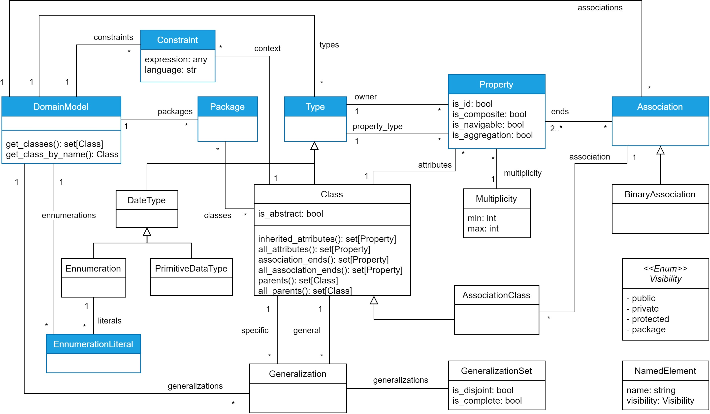

B-UML Language
==============

B-UML is the base language of the BESSER low-code platform. This language (inspired by UML) is implemented in Python. 
The metamodel is summarised in the following figure.

There are two ways to specify your model using B-UML: build the model coding in Python (based on the B-UML metamodel), 
or import a `PlantUML <https://plantuml.com/>`_ model to transform it into a B-UML model.

.. toctree::

  buml_language/buml_core
  buml_language/plantuml