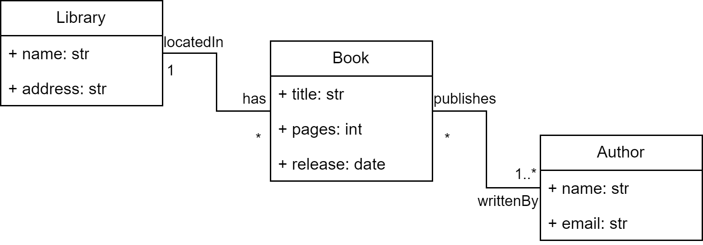

Build a model using the B-UML meta-classes
==========================================

.. note::
    
    This guide shows the definition of a :doc:`../model_types/structural` using the B-UML library in Python. However, any B-UML model can 
    be created using the B-UML libraries. More examples are available :doc:`here <../../examples>`.

The following guide shows how to define the classic Library model (see following image) using the B-UML library in Python.

To define your model using B-UML, you must first import the B-UML classes you are going to use. The following classes 
must be imported for this Library modeling example.

.. code-block:: python

    from besser.BUML.metamodel.structural import DomainModel, Class, Property, \
         Multiplicity, BinaryAssociation, StringType, IntegerType, DateType

Now, we can define the attributes, classes, relationships, and other elements of the model. The following is the definition 
of the *Book* class including its attributes.

.. code-block:: python

    # Book attributes definition
    title: Property = Property(name="title", owner=None, type=StringType)
    pages: Property = Property(name="pages", owner=None, type=IntegerType)
    release: Property = Property(name="release", owner=None, type=DateType)

    # Book class definition
    book: Class = Class (name="Book", attributes={title, pages, release})

In this example, we are importing and using ``StringType``, ``IntegerType``, and ``DateType`` as primitive data types. But BESSER
also provides additional data types including ``FloatType``, ``BooleanType``, ``TimeType``, ``DateTimeType``, ``TimeDeltaType`` and ``AnyType``.

Different types of relationships can be specified with B-UML such as associations (including binary associations), generalizations, 
generalization sets, and class associations. Using the ``BinaryAssociation`` class, we can specify the relationship between *Library* 
and *Book* as follows. 

.. code-block:: python

    # Library-Book association definition
    located_in: Property = Property(name="locatedIn", owner=None, type=library, multiplicity=Multiplicity(1, 1))
    has: Property = Property(name="has", owner=None, type=book, multiplicity=Multiplicity(0, "*"))
    lib_book_association: BinaryAssociation = BinaryAssociation(name="lib_book_assoc", ends={located_in, has})

Finally, create the domain model and add the classes, relationships and other elements of the model.

.. code-block:: python

    # Domain model definition
    library_model : DomainModel = DomainModel(name="Library model", types={library, book, author}, 
                                              associations={lib_book_association, book_author_association})

Now, ``library_model`` is your model specified using B-UML. You can access the classes, attributes, relationships, and all the 
elements of the model. For instance, you could print the name attributes of the ``Book`` class as follows.

.. code-block:: python

    # Getting the attributes of the Book class
    for attribute in book.attributes:
        print (attribute.name)

You should get output like this:

.. code-block:: console

    tittle
    pages
    release

.. note::
    
    You can consult the complete code for this basic example :doc:`here <../../examples/library_example>`.

.. note::
    
    For a detailed description of metamodel elements such as classes, attributes, generalizations and others, 
    please refer to the :doc:`API documentation <../../api>`.

Now that you have a model defined with B-UML, you can use our :doc:`../../generators`, or even build your own for a target technology. 

