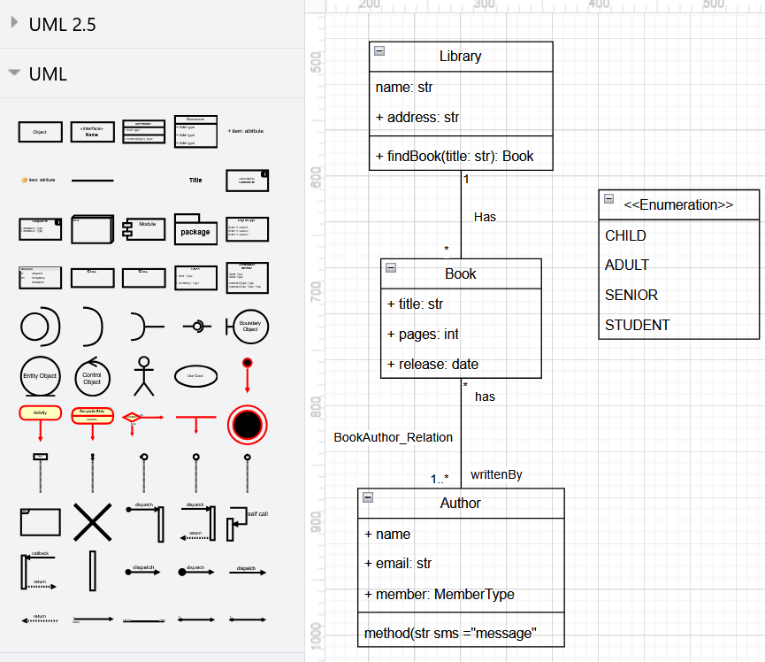

From Draw.io to B-UML
=====================

A B-UML model can also be generated from a class model built with `Draw.io <https://app.diagrams.net>`_ .
All you need is to provide the DrawIO or XML file exported from Draw.io and our T2M transformation will produce the B-UML 
based model, including the source code to build the model, in case you want to modify any part of your model.

Let's see an example with the classic library model.
The Draw.io model is shown below.

Export your Draw.io diagram as an XML file, e.g. ``library.drawio``. 

Then, load and process the model using our grammar and apply the transformation to obtain the B-UML based model.
You can do this in two ways:

1. Generate only the B-UML model object:

.. code-block:: python

    # Import methods and classes
    from besser.BUML.notations.structuralDrawIO import structural_drawio_to_buml
    from besser.BUML.metamodel.structural import DomainModel

    # Draw.io to B-UML model (without generating Python file)
    library_buml: DomainModel = structural_drawio_to_buml(drawio_file_path='library.drawio')

2. Generate both the model object and a Python file:

.. code-block:: python

    # Generate model and save to Python file
    library_buml: DomainModel = structural_drawio_to_buml(
        drawio_file_path='library.drawio',
        buml_file_path='library_model'
    )

.. note::
    
    The ``drawio_file_path`` parameter contains the path and name of the ``.drawio`` model to be transformed
    The optional ``buml_file_path`` parameter specifies the name for the generated Python file (without extension)

``library_buml`` is the B-UML model containing the domain specification. You can look up the classes, attributes, relationships, 
etc. For example, the following is the way to get the class names.

.. code-block:: python

    # Print class names
    for cls in library_buml.get_classes():
        print(cls.name)

You should get output like this:

.. code-block:: console

    Library
    Book
    Author

Supported Class Notations
-------------------------

The Draw.io parser supports several UML class notations:

1. Swimlane style (recommended)
    - Uses Draw.io's built-in swimlane shape
    - Supports attributes and methods
    - Clear visual separation of class sections

2. HTML style with verticalAlign
    - Uses Draw.io's rectangle with HTML formatting
    - Supports attributes and methods
    - Sections separated by horizontal lines

.. warning::

    - All associations must have unique names
    - Class names must be unique
    - Attributes and methods should follow UML notation (e.g., "+ name: String")
    - Supported multiplicity formats: "1", "*", "0..1", "1..*", etc.
    - To add multiplicities and association/end names, click on the association end and create labels
    - Association names should start with an uppercase letter (e.g., "HasBooks")
    - Association end names should start with a lowercase letter (e.g., "books", "author")

B-UML model source code
-------------------------

When you run this Draw.io to B-UML transformation, the file ``buml/buml_model.py`` will be created with the python code of your B-UML model definition. 
You could directly reuse this code to make quick modifications to your model. For example, you could add more classes, properties, or update the name 
of the ends of an association.

The B-UML model source code generated by the transformation from the ``library.drawio`` model would look similar to this:

.. literalinclude:: ../../code_eg/structural_grammar/buml/buml_model.py
   :language: python
   :linenos:

Getting Started with Draw.io
----------------------------

To create UML class diagrams in Draw.io:

1. Click on "More Shapes" at the bottom of the left sidebar
2. Enable "UML" or "UML 2.5" in the libraries list
3. Use the proper UML shapes from these libraries for your diagram:
   - Class shapes from the UML library
   - Association arrows
   - Inheritance arrows
   - etc.

.. tip::
    
    Always use shapes from the UML libraries rather than generic shapes to ensure proper UML notation and compatibility with the parser.

.. note::

    An extension for Draw.io is available in Visual Studio Code, which allows you to create diagrams directly in the code editor.