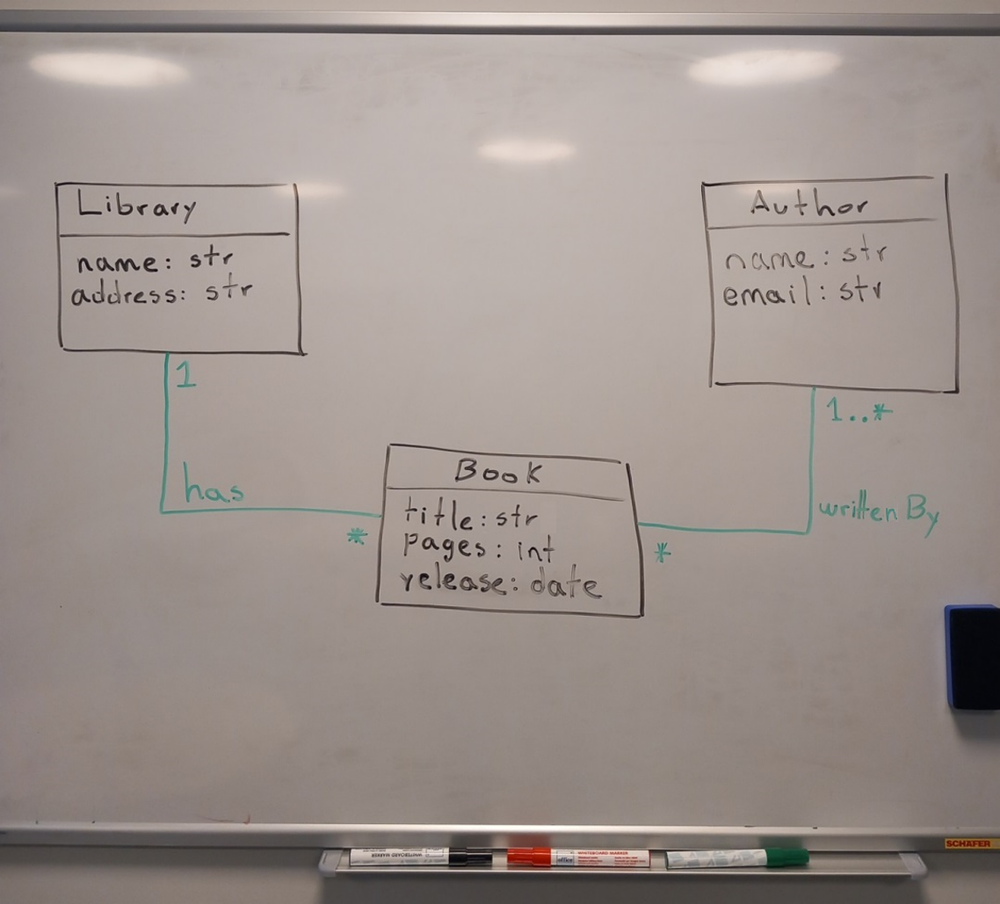

From an image to B-UML
======================

BESSER also enables the definition of a :doc:`../model_types/structural` from an image, for example, a picture of a hand-drawn model on a board. 
For this we use `OpenAI's GPT4 <https://openai.com/gpt-4>`_  and you must have an OpenAI token to implement this BESSER 
functionality. We have selected GPT4 due to the `results obtained in our experiment <https://modeling-languages.com/image-to-uml-with-llm/>`_,
however, there are still several details to improve mainly in complex models. Let's see an example.

The following image is the hand-drawn class model representing the basic example of the Library.

.. warning::

    Please make sure your image is below 20 MB in size and is of one the following formats: ['png', 'jpeg']

To transform this image to a :doc:`../model_types/structural` you can use the following code.

.. code-block:: python

    from besser.BUML.metamodel.structural import DomainModel
    from besser.utilities import image_to_buml

    library_model: DomainModel = image_to_buml(image_path="library_hand_draw.png", openai_token="****")

The function ``image_to_buml()`` has as parameters the image path and the OpenAI token, and returns the structural model ``library_model``. 

.. note::

    By default, the ``gpt-4o`` model is used. If you wish to use another version of the GPT model, you can specify it using the ``openai_model`` 
    parameter in the ``image_to_buml()`` function. More details of the function in the :doc:`API documentation <../../api/BUML/notations/image2buml/image>`

Additionally (and similar to the PlantUML to BUML transformation), the file ``buml/buml_model.py`` is generated with the structural model source code
definition. You could reuse that code to modify, enhance, and recreate your structural model. The structural model source code generated by the transformation 
from the ``library_hand_draw.png`` model is as follows.

.. literalinclude:: ../../../../tests/BUML/notations/image_to_buml/buml/buml_model_from_image.py
   :language: python
   :linenos:

From an image to PlantUML
-------------------------

Similarly, it is also possible to obtain the PlantUML code from a model in an image, as follows.

.. code-block:: python

    from besser.utilities import image_to_plantuml

    plantUML_model: str = image_to_plantuml(image_path="library_hand_draw.png", openai_token="****")
    print(plantUML_model)

The result of this transformation is a string with the code specified in the PlantUML notation:

.. code-block:: console

    @startuml

    class Library {
        name: str
        address: str
    }

    class Book {
        title: str
        pages: int
        release: date
    }

    class Author {
        name: str
        email: str
    }

    Library "1" -- "*" Book : has
    Book "*" -- "1..*" Author : writtenBy

    @enduml