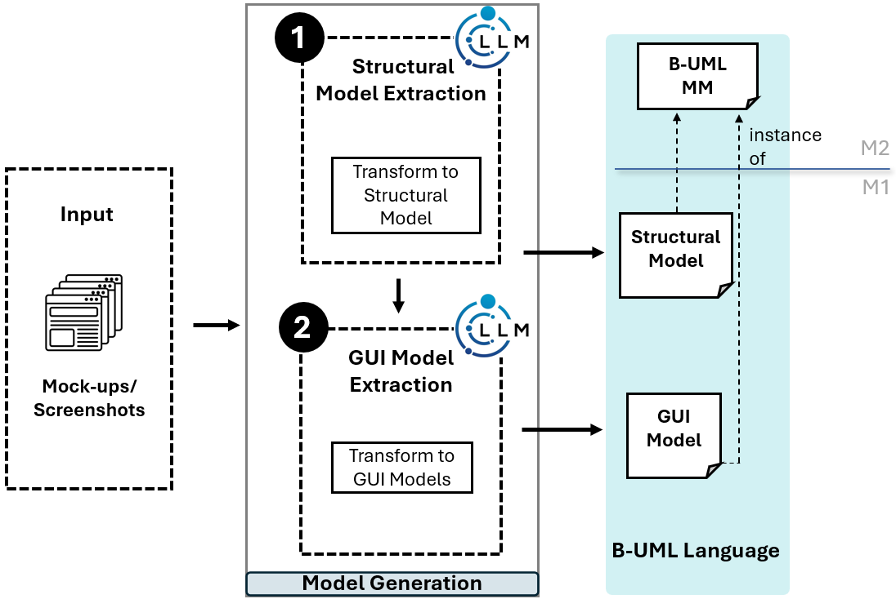

From UI Mock-ups to B-UML
===========================

BESSER introduces an innovative low-code approach to automating the extraction of B-UML models, encompassing both structural and GUI representations, directly from
mockups. Leveraging the power of Large Language Models (LLMs), BESSER transforms visual UI representations into functional software artifacts,
streamlining the design and development of web applications.

Key Contributions
-----------------
Below are the key functionalities of this component of BESSER:

1. Structural Model Extraction:
    - Automatically derives :doc:`../model_types/structural` from UI mock-up images.

2. GUI Model Extraction:
    - Generates IFML-like :doc:`../model_types/gui` aligned seamlessly with structural models.

For each phase of the process, we have implemented task-specaific prompts. You can explore the details for each step by clicking on the relevant links below:

- **Step 1:** Explore the implementation for deriving structural models in our `mockup_to_structural` component. (`GitHub Repository <https://github.com/BESSER-PEARL/BESSER/tree/feature/mockup_to_buml/besser/BUML/notations/mockup_to_buml>`__)
- **Step 2:** Learn about the generation of GUI models, including handling multiple pages, in our `mockup_to_buml` component. (`GitHub Repository <https://github.com/BESSER-PEARL/BESSER/tree/feature/mockup_to_buml/besser/BUML/notations/mockup_to_gui/besser_integration/multiple_pages>`__)

.. note::
   As displayed in the image above, after generating the B-UML model (both Structural and GUI models),
   you can use these models to generate a web application using the :doc:`Django Web App Generator<../../generators/django>`.

Getting Started
----------------
Follow these steps to transform your UI mock-ups into B-UML model using BESSER:

+ Single UI Image:
    1. Prepare your UI image:

       - Place the image in a folder at your desired path.
       - Run the model generator by providing the path to the UI mock-up as input. The generator will analyze the image and produce two Python code files: one representing the Structural model and another representing the GUI model.

    2. Generate the GUI model:

       - Use the following code snippet to generate the GUI model:

.. code-block:: python

    from besser.BUML.notations.mockup_to_buml.mockup_to_buml import mockup_to_buml

    buml_model = mockup_to_buml(
        api_key = "****",
        input_folder="path to your UI mock-up folder",
        output_folder="path to your output folder"
        )

+ Multiple UI Images:
    1. Prepare your UI images and additional files:

       - Place the images in a folder at your desired path.
       - Prepare these files: ``Navigation image file``, ``Page order text file``, and ``Additional information text file``.
       - Refer to the :doc:`UI Mock-Up to B-UML example <../../examples/mockup_to_buml_example>` for details on creating these files.

    2. Generate the GUI model:

       - Use the following code snippet to generate the GUI model for multiple pages:

.. code-block:: python

    from besser.BUML.notations.mockup_to_buml.mockup_to_buml import mockup_to_buml

    buml_model = mockup_to_buml(
        api_key = "****",
        input_folder="path to mockup images folder",
        navigation_image_path="path to navigation image file",
        pages_order_file_path="path to page order file",
        additional_text_file_path="path to additional text file",
        output_folder="path to your output folder"
    )

Access the Output
-----------------
The generator will analyze the provided UI image(s) and create: GUI model in the ``output/gui_model`` folder as a file with name ``generated_gui_model.py`` and Structural model in the ``output/buml`` folder as a file with name ``buml.py``.

.. note::

   If you do not specify an output path, the ``output`` folder will be automatically created
   inside the **same directory** where you call ``mockup_to_buml``.

Example inputs and Outputs
--------------------------

Visit the :doc:`UI Mock-Up to B-UML example <../../examples/mockup_to_buml_example>` section to explore:

+	Sample input UI mockups and additional input files for multi-page cases.
+	Generated Structural Model.
+	Python-based IFML-like GUI models.
+	Integrated GUI models with navigation logic.
