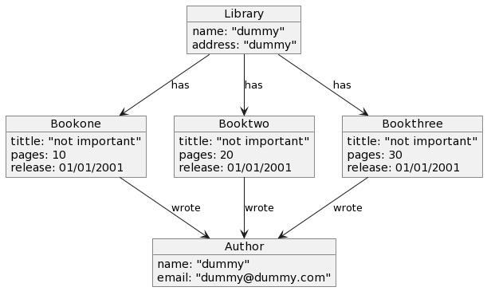

PlantUML-compatible grammar for object models
=============================================

An instance can be generated by parsing the Object diagram defined using PlantUML Object Diagram `PlantUML Object Diagram <https://plantuml.com/object-diagram>`_ .

Let's see an example with object diagram of the classic `library model <https://besser.readthedocs.io/en/latest/_images/library_uml_model.png>`_. The textual object 
diagram written in PlantUML Syntax is shown below.

.. literalinclude:: ../../../../tests/BUML/notations/objectPlantUML/libraryObjectDiagram.plantuml
   :language: console
   :linenos:

And the object diagram produced by PlantUML is as follows.

To Parse and Load the objects you can create the test case using the following code:

.. code-block:: python

    from antlr4 import *
    from besser.BUML.notations.od.ODLexer import ODLexer
    from besser.BUML.notations.od.ODParser import ODParser
    from besser.BUML.notations.od.ODListener import ODListener
    def test_number_of_objects():
        od = "path to Object diagram"
        all_objs = []
        input_stream = FileStream(od)
        lexer = ODLexer(input_stream)
        stream = CommonTokenStream(lexer)
        parser = ODParser(stream)
        tree = parser.objectDiagram()
        listener = ODListener(all_objs)
        walker = ParseTreeWalker()
        walker.walk(listener, tree)
        assert ....
