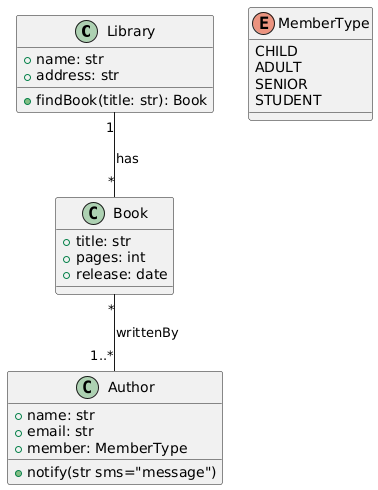

PlantUML-compatible grammar for structural models
=================================================

A B-UML model can also be generated from a class model built with `PlantUML <https://plantuml.com/>`_ .
All you need is to provide the textual model (PlantUML) and our T2M transformation will produce the B-UML 
based model.

Let's see an example with the classic library model.
The textual model written in PlantUML is shown below.

.. literalinclude:: ../../code_eg/structural_grammar/library.plantuml
   :language: console
   :linenos:

And the diagram produced by PlantUML is as follows.

Save the PlantUML textual model in a file, e.g. ``library.plantuml``. (``.txt`` extension is also allowed)

Then, load and process the model using our grammar and apply the transformation to obtain the B-UML based model.

.. code-block:: python

    # Import methods and classes
    from besser.BUML.notations.structuralPlantUML import plantuml_to_buml
    from besser.BUML.metamodel.structural import DomainModel

    # PlantUML to B-UML model
    library_buml: DomainModel = plantuml_to_buml(plantUML_model_path='library.plantuml')

.. note::
    
    The ``plantUML_model_path`` parameter contains the path and name of the ``.plantuml`` model to be transformed

``library_buml`` is the B-UML model containing the domain specification. You can look up the classes, attributes, relationships, 
etc. For example, you can print the class names as follows.

.. code-block:: python

    # Print class names
    for cls in library_buml.get_classes():
        print(cls.name)

You should get output like this:

.. code-block:: console

    Library
    Book
    Author

.. warning::

    Although the PlantUML notation allows the definition of unnamed associations, for the BESSER platform it is necessary that all 
    associations have a unique name.

B-UML model source code
-----------------------

When you run this PlantUML to B-UML transformation, you could also generate a ``.py`` file with the python based code of your B-UML model definition. 
This code is reusable, allowing you to make quick updates to your model. For example, you could add more classes, properties, or update the name 
of the ends of an association.

To generate the py file, set the ``buml_file_path`` parameter with your desired file path in the ``plantuml_to_buml`` method.

.. code-block:: python

    # Import methods and classes
    from besser.BUML.notations.structuralPlantUML import plantuml_to_buml
    from besser.BUML.metamodel.structural import DomainModel

    # PlantUML to B-UML model
    library_buml: DomainModel = plantuml_to_buml(plantUML_model_path='library.plantuml', 
                                                 buml_file_path="buml/model.py")

After running this code, the file ``model.py`` with your B-UML model source code will be created in the ``buml`` folder, containing content similar 
to the following example:

.. literalinclude:: ../../code_eg/structural_grammar/buml/buml_model.py
   :language: python
   :linenos: