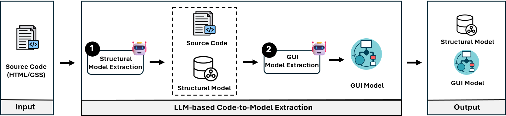

From Source Code to B-UML
========================

BESSER provides an automated pipeline for transforming **web source code**
(e.g., HTML/CSS)) into **B-UML models**, including
both **Structural** and **GUI (IFML-like)** representations.

By leveraging Large Language Models (LLMs), this pipeline analyzes the
structure, components, and interactions defined in source code and produces
executable Python-based B-UML models. These models can later be reused to
generate complete web applications.

Key Contributions
-----------------
The Source Code to B-UML pipeline provides the following capabilities:

1. Structural Model Extraction:
    - Automatically derives :doc:`../model_types/structural` models
      from source code using an intermediate PlantUML representation.

2. GUI Model Extraction:
    - Generates IFML-like :doc:`../model_types/gui` models from source code.
    - Supports both **single-page** and **multi-page** applications.

Pipeline Overview
-----------------
The pipeline automatically detects the number of source code pages
(HTM files) in the input folder:

- **Single page** → executes the *one-page pipeline*
- **Multiple pages** → executes the *multi-page pipeline*

Pipeline includes the following main stages:

- **Structural B-UML generation** (`GitHub Repository <https://github.com/BESSER-PEARL/BESSER/tree/feature/source_code_to_buml/besser/BUML/notations/sourceCode_to_structural>`__)
- **GUI model generation** (`GitHub Repository <https://github.com/BESSER-PEARL/BESSER/tree/feature/source_code_to_buml/besser/BUML/notations/sourceCode_to_buml>`__)

Detailed explanations of each stage are available through the corresponding links above.

Getting Started
---------------
Follow these steps to transform your source code into B-UML models using BESSER.

Single Page Application
+++++++++++++++++++++++

1. Prepare your source code:
    - Place **one HTML file** in a folder.
    - Optionally prepare a separate folder containing a styling file (CSS).

2. Run the Source Code to B-UML pipeline:

.. code-block:: python

    from besser.BUML.notations.sourceCode_to_buml import source_code_to_buml

    source_code_to_buml(
        api_key="****",
        input_folder="path/to/source_code_folder",
        styling_file_path="path/to/css_folder",  # optional
        output_folder="path/to/output_folder" # optional
    )

**Parameter Descriptions:**

- ``api_key``:
  OpenAI API key used to invoke LLM-based transformations.
- ``input_folder``:
  Path to the folder containing a single source code page.
- ``styling_file_path`` (optional):
  Path to a folder containing CSS or styling-related files.
- ``output_folder`` (optional):
  Path where generated B-UML models and SVG files will be stored.
  If not specified, an ``output`` folder is created in the current directory.

Multiple Page Application
+++++++++++++++++++++++++

1. Prepare your source code and additional files:
    - Place **multiple HTML files** in a single folder.
    - Prepare the following auxiliary files:
        - Navigation image file
        - Page order text file
        - Additional information text file (domain relationships, cardinalities)
    - Optionally prepare a folder containing CSS or styling files.

2. Run the Source Code to B-UML pipeline:

.. code-block:: python

    from besser.BUML.notations.sourceCode_to_buml import source_code_to_buml

    source_code_to_buml(
        api_key="****",
        input_folder="path/to/source_code_folder",
        navigation_image_path="path/to/navigation_image.png",
        pages_order_file_path="path/to/pages_order.txt",
        additional_info_path="path/to/additional_info.txt",
        styling_file_path="path/to/css_folder",  # optional
        output_folder="path/to/output_folder" # optional
    )

**Parameter Descriptions:**

- ``api_key``:
  OpenAI API key used for LLM-based transformations.
- ``input_folder``:
  Folder containing multiple source code pages.
- ``navigation_image_path``:
  Image describing navigation between pages (used to infer transitions).
- ``pages_order_file_path``:
  Text file defining the order of pages in the application.
- ``additional_info_path``:
  Text file describing the relationships (and cardinalities) between key concepts of the application.
- ``styling_file_path`` (optional):
  Folder containing CSS or styling files.
- ``output_folder`` (optional):
  Destination folder for generated B-UML models and SVG outputs.

Accessing the Output
--------------------
After execution, the pipeline generates:

- **Structural Model**
  - Location: ``output/buml/model.py``

- **GUI Model**
  - Location: ``output/gui_model/generated_gui_model.py``

- **Intermediate PlantUML**
  - Location: ``output/plantuml/generated_plantuml.puml``

.. note::
   Once the B-UML models (Structural and GUI) are generated, they can be
   directly used with the
   :doc:`Django Web App Generator <../../generators/django>`
   to automatically generate a fully functional web application.

Examples
--------
Visit the :doc:`Source Code to B-UML Example <../../examples/source_code_to_buml_example>`
section to explore:

- Sample single-page and multi-page source code inputs
- Generated Structural B-UML models
- IFML-like GUI models
- Integrated navigation logic

