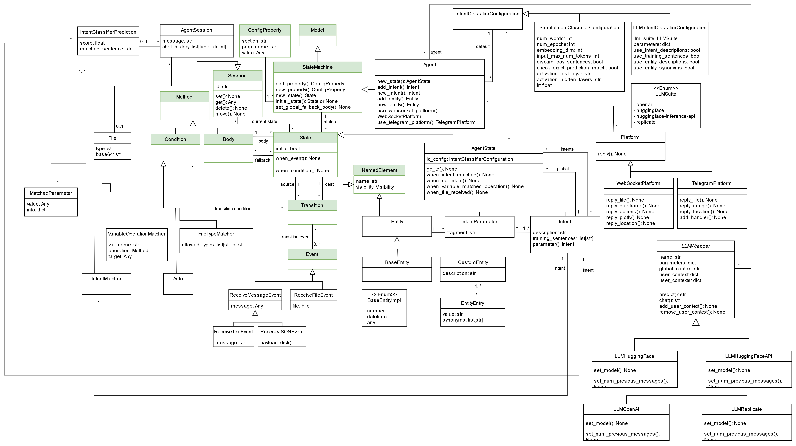

Agent model
===========

.. warning::

   While you can define agents using the B-UML agent metamodel, the BAF generator still has limitations in terms of supported features. If your goal is to develop an agent in a textual notation, we'd recommend to get accustomed to the BAF.
   The B-UML agent notation is fitting if you plan to re-use agent components in different agents or if you plan to develop/use model-based techniques on the agents. 
   If you aim to develop agents graphically, then the BESSER framework provides a graphical editor for that purpose.

Agent metamodel
-----------------------

This metamodel allows the definition of agents. 
The agents follow a state machine-like behavior, where they can be in different states and transition between them based on events and conditions.
Thus, similarly to the state machine metamodel, the agent metamodel contains the main elements of a state machine:

- AgentState: Represent the different conditions or statuses that an agent can be in at any given time.
- Transitions: Define the rules for how an agent moves from one state to another, triggered by events or conditions.
- Events: External or internal stimuli (inputs) that cause a check of conditions and potentially trigger transitions between states.
- Conditions: Conditions that must be met for a transition to occur, allowing for more complex decision-making.
- Actions: Activities or responses (outputs) that occur due to transitions or when the agent is in a specific state. Each state has a **Body**, which defines the sequence of actions to be executed when an event causes the transition to a state (and a **fallback body** that defines the actions to be executed in case of error in the machine).
- AgentSession: An agent can have multiple **sessions** running simultaneously (e.g., one for each user interacting with the agent). A Session is always located in one of the states. If there are multiple sessions, each can store data privately (with respect to the other sessions). When modelling an agent, a session is only used as an argument for the events and bodies.

Beyond the state machine-like elements, the agent metamodel also includes agent specific elements. These are closely related to the agent concepts contained in the `BESSER Agentic Framework <https://github.com/BESSER-PEARL/BESSER-Agentic-Framework>`_:

- Agent
- Intent
- IntentParameter
- Entity
- IntentClassifierConfiguration
- Platform
- LLMWrapper

To read about their meaning and usage, please refer to the `documentation <https://besser-agentic-framework.readthedocs.io/latest/>`_ of the BESSER Agentic Framework.

Actions
~~~~~~~

Each state body is a sequence of actions.  The following action classes are
available in ``besser.BUML.metamodel.state_machine.agent``:

**Text and LLM replies**

- ``AgentReply(message)`` — send a plain-text reply.
- ``LLMReply(prompt, llm_name)`` — generate a reply using an LLM; ``prompt``
  is an optional system prompt, ``llm_name`` selects a registered LLM (defaults
  to the agent default).
- ``LLMChatReply(prompt, llm_name)`` — like ``LLMReply`` but calls
  ``llm.chat(...)`` with the conversation history, making it suitable for
  multi-turn dialogue states.
- ``RAGReply(rag_db_name)`` — answer using a configured RAG database.
- ``DBReply(query, llm_name)`` — answer from a SQL database using an LLM.

**Web crawling**

- ``WebCrawlLLMReply(initial_url, max_depth, max_pages, crawl_format,
  base_url_prefix, run_crawl, no_crawl_error_message, system_message_prefix,
  llm_name)`` — performs a BFS web crawl starting at ``initial_url`` and
  queries an LLM with the retrieved content.  The crawl result is cached in the
  session; set ``run_crawl=False`` in subsequent states to reuse the cache
  without re-fetching.

**WebSocket rich-media replies**

The following actions map to the corresponding ``WebSocketPlatform`` methods and
require the agent to use a ``WebSocketPlatform``:

- ``WebSocketReplyMarkdown(message)`` — send Markdown-formatted text.
- ``WebSocketReplyHTML(message)`` — send an HTML-formatted message.
- ``WebSocketReplySpeech(message, audio_speed)`` — convert text to speech and
  send the audio.
- ``WebSocketReplyOptions(options)`` — present a list of selectable options.
- ``WebSocketReplyLocation(latitude, longitude)`` — send a geographic
  coordinate.
- ``WebSocketReplyFile()`` — send a file; the body must supply a ``File``
  object at runtime.
- ``WebSocketReplyImage()`` — send an image (NumPy ``ndarray``); body must
  supply the array at runtime.
- ``WebSocketReplyDataframe()`` — send a pandas ``DataFrame``; body must supply
  it at runtime.
- ``WebSocketReplyPlotly()`` — send a Plotly figure; body must supply a
  ``plotly.graph_objects.Figure`` at runtime.

RAG (Retrieval-Augmented Generation)
~~~~~~~~~~~~~~~~~~~~~~~~~~~~~~~~~~~~~

Agents can use RAG to answer questions from a set of documents (e.g. PDFs).
A RAG element is added to an agent via ``agent.new_rag()`` and combines a
``RAGVectorStore`` (embedding config), a ``RAGTextSplitter`` (chunking strategy),
and an LLM name. Use ``RAGReply`` in a state body to trigger a RAG query.

When generated, a data folder named after the RAG element is created
(e.g. ``"Knowledge Base"`` produces ``knowledge_base/``). Place your PDF
documents in this folder before running the agent.

The optional ``llm_prompt`` parameter injects a fixed prefix instruction before
every RAG query, useful for enforcing domain-specific constraints or tone:

.. code-block:: python

    kb = agent.new_rag(
        name='Knowledge Base',
        vector_store=vector_store,
        splitter=splitter,
        llm_name='gpt-4o-mini',
        llm_prompt='Answer only from the provided documents.',
    )

Multiple LLMs
~~~~~~~~~~~~~

An agent can register more than one LLM and reference each by name. Add an
LLM with ``agent.new_llm()``:

.. code-block:: python

    fast = agent.new_llm(name='fast', provider='openai', parameters={'model': 'gpt-4o-mini'})
    big = agent.new_llm(name='big', provider='openai', parameters={'model': 'gpt-4o'})

``provider`` selects the concrete wrapper: ``openai`` → ``LLMOpenAI``,
``huggingface`` → ``LLMHuggingFace``, ``huggingface_api`` →
``LLMHuggingFaceAPI``, ``replicate`` → ``LLMReplicate``. ``parameters`` is a
free-form dict passed to the wrapper (e.g. the model id). Optional
``num_previous_messages`` (default 1) and ``global_context`` are also supported.

The first LLM registered becomes the default. Change the default with
``agent.set_default_llm('big')``. Any consumer — ``LLMReply``, ``DBReply``,
``RAGReply`` and reasoning states — uses the default unless it specifies its
own ``llm_name``. Every ``llm_name`` reference must resolve to a registered
LLM; this is checked by ``agent.validate()``.

Reasoning states
~~~~~~~~~~~~~~~~

A ``ReasoningState`` is a state whose body is an autonomous reasoning loop
driven by an LLM (using the agent's tools, skills and workspaces). Create one
with ``agent.new_reasoning_state()``:

.. code-block:: python

    assistant = agent.new_reasoning_state(
        name='assistant',
        llm='big',                  # registered LLM name; omit to use the default
        max_steps=8,                # max reasoning iterations
        enable_task_planning=True,
        stream_steps=True,
        system_prompt='You are a helpful assistant.',
        fallback_message='Sorry, I could not complete that.',
    )

The body of a reasoning state is supplied automatically by the factory; the
metamodel rejects manual ``set_body`` / ``set_fallback_body`` calls on it.

Tools, skills and workspaces
~~~~~~~~~~~~~~~~~~~~~~~~~~~~~

Reasoning states draw on three agent-level primitives, shared by every
reasoning state:

- **Tools** (``agent.new_tool(name, description, code)``) — callable functions the agent can invoke. ``code`` holds the Python implementation.
- **Skills** (``agent.new_skill(name, content, description)``) — reusable instruction snippets injected into the reasoning context.
- **Workspaces** (``agent.new_workspace(name, path, description, writable, max_read_bytes)``) — file-system locations the agent may read from (and write to when ``writable``).

.. note::

    The classes highlighted in green originate from the :doc:`structural metamodel <structural>` and :doc:`state machine <state_machine>` .

Example agent model
-------------------

As a simple example, we modeled the `Greetings Agent <https://besser-agentic-framework.readthedocs.io/latest/your_first_agent.html#the-greetings-agent>`_ from the BAF documentation.

.. code-block:: python

    import datetime
    from besser.BUML.metamodel.state_machine.state_machine import Body, ConfigProperty
    from besser.BUML.metamodel.state_machine.agent import Agent, AgentSession
    import operator

    agent = Agent('Generated_Agent')

    agent.add_property(ConfigProperty('websocket_platform', 'websocket.host', 'localhost'))
    agent.add_property(ConfigProperty('websocket_platform', 'websocket.port', 8765))
    agent.add_property(ConfigProperty('websocket_platform', 'streamlit.host', 'localhost'))
    agent.add_property(ConfigProperty('websocket_platform', 'streamlit.port', 5000))
    agent.add_property(ConfigProperty('nlp', 'nlp.language', 'en'))
    agent.add_property(ConfigProperty('nlp', 'nlp.region', 'US'))
    agent.add_property(ConfigProperty('nlp', 'nlp.timezone', 'Europe/Madrid'))
    agent.add_property(ConfigProperty('nlp', 'nlp.pre_processing', True))
    agent.add_property(ConfigProperty('nlp', 'nlp.intent_threshold', 0.4))

    # INTENTS
    Greeting = agent.new_intent('Greeting', [
        'Hi',
        'Hello',
        'Howdy',
    ])
    Good = agent.new_intent('Good', [
        'Good',
        'Fine',
        'I m alright',
    ])
    Bad = agent.new_intent('Bad', [
        'Bad',
        'Not so good',
        'Could be better',
    ])

    # STATES
    initial = agent.new_state('initial', initial=True)
    greeting = agent.new_state('greeting')
    bad = agent.new_state('bad')
    good = agent.new_state('good')

    # initial state
    # greeting state
    def greeting_body(session: AgentSession):
        session.reply('Hi!')
        session.reply('How are you?')

    greeting.set_body(Body('greeting_body', greeting_body))
    greeting.when_intent_matched(Good).go_to(good)
    greeting.when_intent_matched(Bad).go_to(bad)

    # bad state
    def bad_body(session: AgentSession):
        session.reply('I m sorry to hear that...')

    bad.set_body(Body('bad_body', bad_body))
    bad.go_to(initial)

    # good state
    def good_body(session: AgentSession):
        session.reply('I am glad to hear that!')

    good.set_body(Body('good_body', good_body))
    good.go_to(initial)
