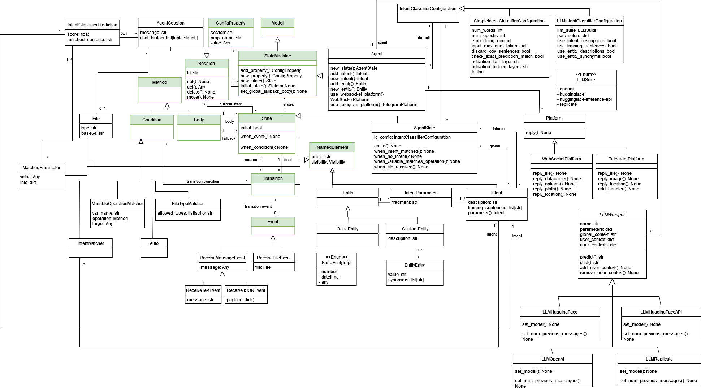

Agent model
===========

.. warning::

   While you can define agents using the B-UML agent metamodel, the BAF generator still has limitations in terms of supported features. If your goal is to develop an agent in a textual notation, we'd recommend to get accustomed to the BAF.
   The B-UML agent notation is fitting if you plan to re-use agent components in different agents or if you plan to develop/use model-based techniques on the agents. 
   If you aim to develop agents graphically, then the BESSER framework provides a graphical editor for that purpose.

Agent metamodel
-----------------------

This metamodel allows the definition of agents. 
The agents follow a state machine-like behavior, where they can be in different states and transition between them based on events and conditions.
Thus, similarly to the state machine metamodel, the agent metamodel contains the main elements of a state machine:

- AgentState: Represent the different conditions or statuses that an agent can be in at any given time.
- Transitions: Define the rules for how an agent moves from one state to another, triggered by events or conditions.
- Events: External or internal stimuli (inputs) that cause a check of conditions and potentially trigger transitions between states.
- Conditions: Conditions that must be met for a transition to occur, allowing for more complex decision-making.
- Actions: Activities or responses (outputs) that occur due to transitions or when the agent is in a specific state. Each state has a **Body**, which defines the sequence of actions to be executed when an event causes the transition to a state (and a **fallback body** that defines the actions to be executed in case of error in the machine).
- AgentSession: An agent can have multiple **sessions** running simultaneously (e.g., one for each user interacting with the agent). A Session is always located in one of the states. If there are multiple sessions, each can store data privately (with respect to the other sessions). When modelling an agent, a session is only used as an argument for the events and bodies.

Beyond the state machine-like elements, the agent metamodel also includes agent specific elements. These are closely related to the agent concepts contained in the `BESSER Agentic Framework <https://github.com/BESSER-PEARL/BESSER-Agentic-Framework>`_:

- Agent
- Intent
- IntentParameter
- Entity
- IntentClassifierConfiguration
- Platform
- LLMWrapper

To read about their meaning and usage, please refer to the `documentation <https://besser-agentic-framework.readthedocs.io/latest/>`_ of the BESSER Agentic Framework.

.. note::

    The classes highlighted in green originate from the :doc:`structural metamodel <structural>` and :doc:`state machine <state_machine>` .

Example agent model
-------------------

As a simple example, we modeled the `Greetings Agent <https://besser-agentic-framework.readthedocs.io/latest/your_first_agent.html#the-greetings-agent>`_ from the BAF documentation.

.. code-block:: python

    import datetime
    from besser.BUML.metamodel.state_machine.state_machine import Body, ConfigProperty
    from besser.BUML.metamodel.state_machine.agent import Agent, AgentSession
    import operator

    agent = Agent('Generated_Agent')

    agent.add_property(ConfigProperty('websocket_platform', 'websocket.host', 'localhost'))
    agent.add_property(ConfigProperty('websocket_platform', 'websocket.port', 8765))
    agent.add_property(ConfigProperty('websocket_platform', 'streamlit.host', 'localhost'))
    agent.add_property(ConfigProperty('websocket_platform', 'streamlit.port', 5000))
    agent.add_property(ConfigProperty('nlp', 'nlp.language', 'en'))
    agent.add_property(ConfigProperty('nlp', 'nlp.region', 'US'))
    agent.add_property(ConfigProperty('nlp', 'nlp.timezone', 'Europe/Madrid'))
    agent.add_property(ConfigProperty('nlp', 'nlp.pre_processing', True))
    agent.add_property(ConfigProperty('nlp', 'nlp.intent_threshold', 0.4))

    # INTENTS
    Greeting = agent.new_intent('Greeting', [
        'Hi',
        'Hello',
        'Howdy',
    ])
    Good = agent.new_intent('Good', [
        'Good',
        'Fine',
        'I m alright',
    ])
    Bad = agent.new_intent('Bad', [
        'Bad',
        'Not so good',
        'Could be better',
    ])

    # STATES
    initial = agent.new_state('initial', initial=True)
    greeting = agent.new_state('greeting')
    bad = agent.new_state('bad')
    good = agent.new_state('good')

    # initial state
    # greeting state
    def greeting_body(session: AgentSession):
        session.reply('Hi!')
        session.reply('How are you?')

    greeting.set_body(Body('greeting_body', greeting_body))
    greeting.when_intent_matched(Good).go_to(good)
    greeting.when_intent_matched(Bad).go_to(bad)

    # bad state
    def bad_body(session: AgentSession):
        session.reply('I m sorry to hear that...')

    bad.set_body(Body('bad_body', bad_body))
    bad.go_to(initial)

    # good state
    def good_body(session: AgentSession):
        session.reply('I am glad to hear that!')

    good.set_body(Body('good_body', good_body))
    good.go_to(initial)
