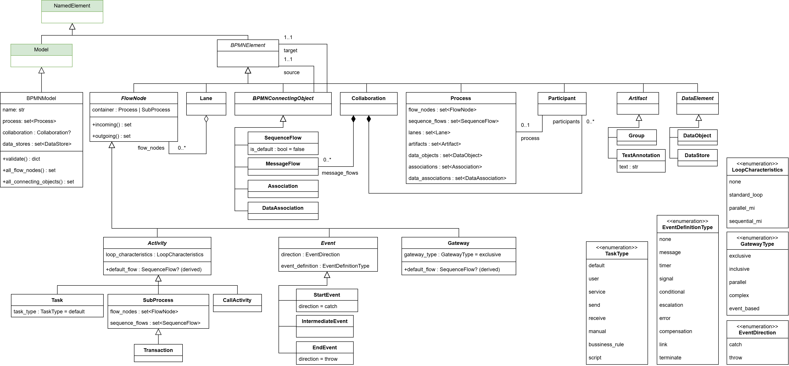

BPMN model
==========

.. _bpmn-metamodel:

BPMN metamodel
--------------

This metamodel allows the definition of BPMN (Business Process Model and Notation)
diagrams, the OMG standard for visualising and specifying business processes. A BPMN
model captures the flow of work across **flow nodes** (tasks, events, gateways)
connected by **sequence flows**, optionally organised into **pools** (one per
participant) and **lanes** (sub-partitions of a pool). The metamodel covers the
BPMN element set supported by the Web Modeling Editor (WME) and follows the `BPMN
2.0.2`_ class hierarchy.

.. _`BPMN 2.0.2`: https://www.omg.org/spec/BPMN/2.0.2/PDF/

The top-level container is ``BPMNModel``. A diagram without pools has a single
``Process``; a diagram with pools has a ``Collaboration`` whose ``Participant``\s each
reference one ``Process``.

.. note::

  The classes highlighted in green originate from the :doc:`structural metamodel <structural>`.
  For the sake of clarity, associations of ``BPMNModel`` and ``Process`` are represented as attributes.

Key concepts
^^^^^^^^^^^^

- **Flow nodes** (``FlowNode``): everything that can sit in a process and be the
  source or target of a sequence flow. Three concrete branches:

  - ``Activity``: work to be performed. Concrete subtypes: ``Task``,
    ``SubProcess``, ``Transaction`` (a ``SubProcess`` subclass per BPMN 2.0.2
    § 10.3), and ``CallActivity``. Tasks carry a ``task_type`` (``USER``,
    ``SERVICE``, ``SEND``, ``RECEIVE``, ``MANUAL``, ``BUSINESS_RULE``,
    ``SCRIPT``, ``DEFAULT``). All activities carry ``loop_characteristics``
    (``NONE`` / ``STANDARD_LOOP`` / ``PARALLEL_MI`` / ``SEQUENTIAL_MI``).
  - ``Event``: something that happens. Concrete subtypes: ``StartEvent``,
    ``IntermediateEvent``, ``EndEvent``. See the *Event model* subsection below.
  - ``Gateway``: branch / merge / join point. The kind is set via
    ``gateway_type`` (``EXCLUSIVE``, ``INCLUSIVE``, ``PARALLEL``, ``COMPLEX``,
    ``EVENT_BASED``).

- **Connecting objects** (``BPMNConnectingObject``): four concrete subtypes:
  ``SequenceFlow`` (orders flow nodes inside a process or sub-process),
  ``MessageFlow`` (across pool boundaries; endpoints may be message-eligible
  nodes (activities or events) or whole ``Participant`` pools per
  BPMN 2.0.2 § 9.3),
  ``Association`` (links an artifact to any element), ``DataAssociation``
  (connects exactly one ``DataElement`` to exactly one ``FlowNode``).
- **Containers**: ``Process`` and ``SubProcess`` both hold flow nodes and sequence
  flows (they expose the same ``flow_nodes`` / ``sequence_flows`` API and are
  duck-type compatible). ``Lane`` partitions a process; ``Participant`` is a pool
  referencing a process; ``Collaboration`` groups participants and the message
  flows between them.
- **Data & artifacts**: ``DataObject`` (process-scoped), ``DataStore``
  (model-scoped; per BPMN 2.0.2 § 10.3 a root-level element shared across
  processes), ``TextAnnotation``, ``Group``.

``BPMNModel`` also exposes three convenience methods: ``all_flow_nodes()`` returns
every flow node across all processes, ``all_sequence_flows()`` returns every sequence
flow including those nested inside sub-processes, and ``all_connecting_objects()``
returns every connecting object across the entire model.

Event model
^^^^^^^^^^^

Events split along **two orthogonal axes**:

- ``direction`` (``EventDirection.CATCH`` / ``THROW``):  ``CATCH`` means the event waits to 
  receive a trigger (message arrives, timer fires, signal broadcast from elsewhere); ``THROW`` 
  means the event sends a trigger as the flow passes through it. Fixed to ``CATCH`` on 
  ``StartEvent`` and ``THROW`` on ``EndEvent``; free on ``IntermediateEvent``. 
- ``event_definition`` (``EventDefinitionType``): ``NONE``, ``MESSAGE``,
  ``TIMER``, ``SIGNAL``, ``ESCALATION``, ``ERROR``, ``COMPENSATION``, ``LINK``,
  ``CONDITIONAL``, ``TERMINATE``.

The metamodel enforces a legality table of valid ``(class, direction,
event_definition)`` triples at construction time, so illegal combinations
(e.g. ``StartEvent(event_definition=TERMINATE)``) raise ``ValueError``
immediately rather than waiting for ``validate()``.

Sequence-flow defaults
^^^^^^^^^^^^^^^^^^^^^^

``SequenceFlow.is_default`` may be set to ``True`` only when the source is an
``Activity`` or an exclusive / inclusive / complex ``Gateway`` (BPMN 2.0.2
§ 8.3.13). The metamodel guards this in the setter and re-validates in
``BPMNModel.validate()``. The derived ``Activity.default_flow`` /
``Gateway.default_flow`` properties return the single outgoing flow marked
``is_default=True``, or ``None`` if no default is set. Because the flag and the
property read from the same underlying field they can never disagree.

Example
^^^^^^^

A pool-less process with a start event, a user task, and an end event:

.. code-block:: python

    from besser.BUML.metamodel.bpmn import (
        BPMNModel, Process, Task, StartEvent, EndEvent, SequenceFlow,
        TaskType,
    )

    start = StartEvent(name="received")
    task = Task(name="Review order", task_type=TaskType.USER)
    end = EndEvent(name="done")
    process = Process(
        name="Order Review",
        flow_nodes={start, task, end},
        sequence_flows={SequenceFlow(start, task), SequenceFlow(task, end)},
    )
    model = BPMNModel(name="OrderReview", processes={process})

Validation
^^^^^^^^^^

Call ``BPMNModel.validate()`` to check structural correctness: endpoint
references resolve, sequence flows stay within a single container, message
flows cross pool boundaries, default-flow source rules hold, event-definition
triples are legal, lane membership matches process membership, and every
participant references a process in the model:

.. code-block:: python

    result = model.validate(raise_exception=False)
    # result = {"success": True/False, "errors": [...], "warnings": [...]}

Validation collects all errors and warnings in a single pass
rather than stopping at the first failure, so one call reports everything that
is wrong.

Round-trip with the Web Modeling Editor
^^^^^^^^^^^^^^^^^^^^^^^^^^^^^^^^^^^^^^^

The BPMN converters live alongside the others under
``besser.utilities.web_modeling_editor.backend.services.converters``:

``process_bpmn_diagram(json)``
    WME BPMN JSON → ``BPMNModel``.

``bpmn_object_to_json(model)``
    ``BPMNModel`` → WME BPMN JSON.

``bpmn_buml_to_json(content)``
    B-UML ``.py`` source string → WME BPMN JSON (executes the source and
    delegates to ``bpmn_object_to_json``).

``bpmn_model_to_code(model)``
    ``BPMNModel`` → executable Python that reconstructs the model when
    ``exec()``'d.

Because BPMN names can be empty, whitespace, or repeated, the metamodel
identifies elements **by object** (no ``__eq__`` / ``__hash__`` overrides);
the converters keep the original WME ids in an opaque ``BPMNElement.layout``
side-channel so round-trips remain stable.
