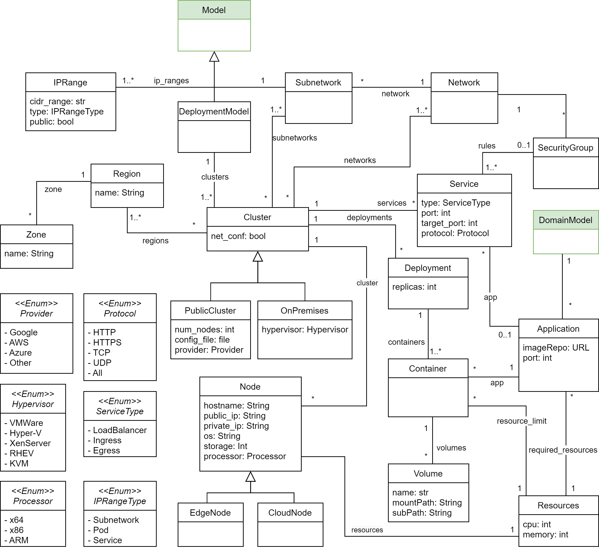

Deployment architecture model
=============================

This type of models enables the specification of the deployment architecture of your application, including the description of the infrastructure 
(such as clusters, services, and nodes) and the deployment of your application using software containers. Additionally, it allows for modeling both
On-premises and multi-cloud environments for your deployments.

.. note::

  The classes highlighted in green originate from the :doc:`structural metamodel <structural>`.

Supported notations
-------------------

To create a structural model, you can use the following notation:

* :doc:`Coding in Python Using the B-UML python library <../model_building/buml_core>`
* :doc:`Grammar for deployment architecture model <../model_building/deployment_grammar>`