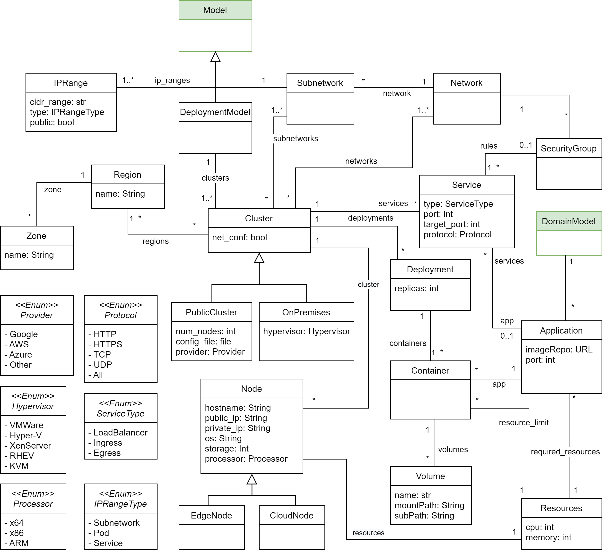

Deployment architecture model
=============================

This kind of models enables the specification of the deployment architecture of your applicaiton including the description of the infrastructure 
(clusters, services, nodes, etc) and the deployment of your application using software containers. Also On-premises and multi-cloud environments can be 
modeled for your deployments.

.. note::

  The classes highlighted in green originate from the :doc:`structural metamodel <structural>`.

Supported notations
-------------------

To create a structural model, you can use the following notation:

* :doc:`Coding in Python Using the B-UML python library <../model_building/buml_core>`
* :doc:`Grammar for deployment architecture model <../model_building/deployment_grammar>`