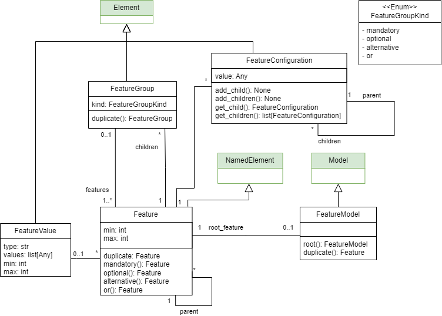

Feature model
==============

This metamodel allows the definition of feature models.

Feature models in software product lines are structured representations of the features (functionalities or characteristics)
of a system, capturing their variability and dependencies. They are used to model the commonalities and differences among
products in a product line, typically organized hierarchically with constraints to specify valid combinations of features.

Feature configurations are specific selections of features from a feature model that represent a valid product within
the software product line. They are created by choosing features while adhering to the constraints and dependencies
defined in the model, such as mandatory or optional features.

   Example Feature Model

In BESSER, you can create Feature Models with the following properties:

- Cardinality-based features: set the minimum and/or maximum number of instances of a feature
- Attributes: a feature can have an associated value to be filled during the configuration definition
- Modularity: attach feature models into other feature models, allowing reusability of existing feature models.

The following figure shows the metamodel diagram:

.. note::

  The classes highlighted in green originate from the :doc:`structural metamodel <structural>`.
