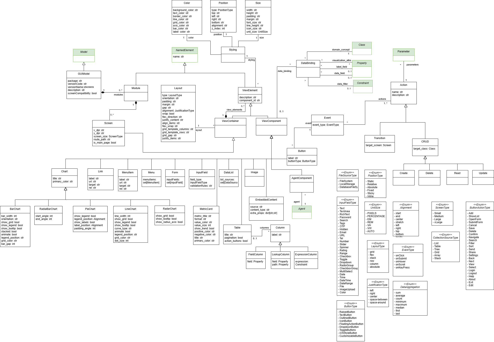

GUI model
=========

This section presents the **GUI Metamodel**, which provides a framework for specifying,
structuring, and organizing graphical user interface (GUI) components within the BESSER platform.  
The metamodel builds upon concepts inspired by the *Interaction Flow Modeling Language (IFML)*,
ensuring interoperability with standard UI modeling tools and supporting integration with B-UML
structural models. This new metamodel introduces a modular structure, new UI element types,
layout and style definitions, and finer control of positioning and hierarchy.

.. note::

  The classes highlighted in green originate from the :doc:`structural metamodel <structural>`.

Overview
--------

A **GUIModel** represents the complete user interface specification of an application.  
It is organized into **modules** and **screens**, each describing specific application areas and their visual composition.  
Screens contain one or more **view containers**, which define the layout and structure of visual elements.

**1. Structural organization**  
The upper level of the metamodel defines the organization of the interface:
- ``GUIModel`` contains multiple ``Modules``
- Each ``Module`` defines several ``Screens``
- Each ``Screen`` hosts one or more ``ViewContainers`` arranged with specific ``Layouts``

**2. Visual composition**  
View containers hold collections of ``ViewElements`` that represent visible components such as buttons, menus, forms, lists, images, links, or embedded content.  
These elements can be combined and nested to compose complex user interfaces.

**3. Presentation and layout**  
Dedicated classes like ``Layout``, ``Position``, and ``Size`` describe how components are arranged and styled.  
Enumerations such as ``Alignment``, ``UnitSize``, and ``PositionType`` offer standardized visual options for spacing, orientation, and alignment.

**4. Interaction and behavior**  
Interactive elements—such as ``Button``, ``Form``, and ``Menu``, can be linked to application logic or data bindings.  
Attributes like ``ButtonType`` and ``ButtonActionType`` define common actions (e.g., *Submit*, *Cancel*, *Navigate*, *Edit*) in a platform-independent way.

Supported Notations
-------------------

You can create and manipulate GUI models using:

* :doc:`Coding in Python Using the B-UML python library <../model_building/buml_core>`
* :doc:`Web Modeling Editor <../../web_editor>`

Component Types
---------------

The GUI metamodel provides a rich set of view components for building user interfaces:

- **Button**: A clickable control. Configured via ``ButtonType`` (``submit``, ``reset``, ``button``)
  and ``ButtonActionType`` (``navigate``, ``submit``, ``reset``, ``custom``).
- **Text**: A static or dynamic text element for displaying labels, headings, or paragraphs.
- **Image**: Displays an image resource within the interface.
- **InputField**: A data-entry control. Configured via ``InputFieldType`` which supports:
  ``text``, ``number``, ``email``, ``password``, ``date``, ``time``, ``checkbox``, ``radio``,
  ``select``, ``textarea``, and ``file``.
- **Form**: A container that groups related input fields and buttons for data submission.
- **Menu** and **MenuItem**: Navigation components for organizing links and actions
  into hierarchical menus.
- **DataList**: Displays a collection of data records, typically bound to a domain model class.
- **Link**: A hyperlink element for navigation between screens or to external URLs.
- **EmbeddedContent**: Embeds external content (e.g., iframes, media players) within a screen.

Dashboard Components
--------------------

For data visualization and dashboard-style interfaces, the metamodel includes:

- **LineChart**, **BarChart**, **PieChart**, **RadarChart**, **RadialBarChart**: Chart
  components for visualizing data series in various formats.
- **Table**: A tabular data display with support for typed columns:

  - ``Column``: A basic table column.
  - ``FieldColumn``: A column bound to a specific class attribute.
  - ``LookupColumn``: A column that resolves values through an association.

- **AgentComponent**: A component that integrates a BESSER Agent Framework (BAF) agent
  into the user interface, enabling conversational or AI-driven interactions.

Layout and Styling
------------------

The metamodel provides fine-grained control over how components are arranged and styled:

- **LayoutType**: Defines the arrangement strategy for child components within a container.
  Supported values: ``vertical``, ``horizontal``, ``grid``, ``stack``.
- **Alignment**: Controls how components are aligned within their container
  (e.g., start, center, end).
- **UnitSize**: Specifies the unit of measurement for size values (e.g., pixels, percentages).
- **PositionType**: Determines how a component is positioned (e.g., ``static``, ``relative``,
  ``absolute``, ``fixed``).
- **Style**: A dedicated class for visual customization that allows setting properties such as
  colors, fonts, borders, padding, and margins on any view component.

Python Code Example
-------------------

The following example demonstrates how to create a simple GUI model programmatically:

.. code-block:: python

    from besser.BUML.metamodel.gui import *

    screen = Screen(name="MainScreen")
    button = Button(name="submitBtn", button_type=ButtonType.submit)
    text = Text(name="welcomeText")
    screen.add_component(button)
    screen.add_component(text)
    gui_model = GUIModel(name="MyApp", screens={screen})
