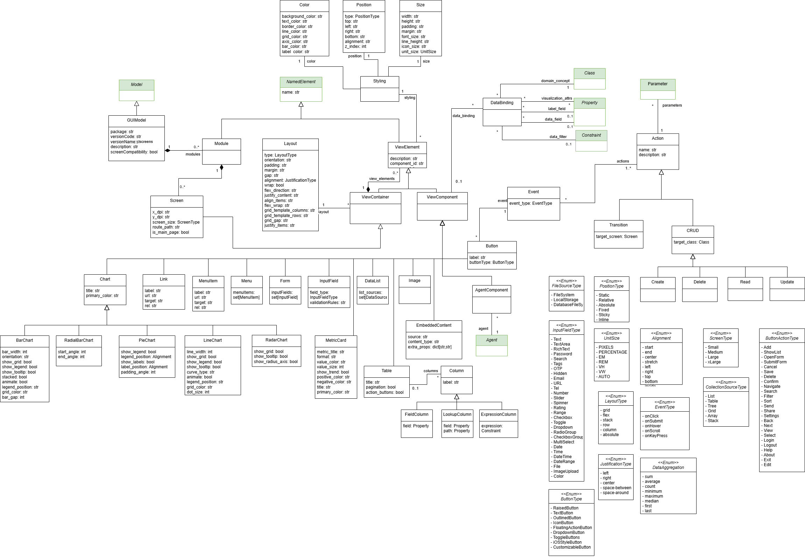

GUI model
=========

This section presents the **GUI Metamodel**, which provides a framework for specifying,
structuring, and organizing graphical user interface (GUI) components within the BESSER platform.
The metamodel builds upon concepts inspired by the *Interaction Flow Modeling Language (IFML)*,
ensuring interoperability with standard UI modeling tools and supporting integration with B-UML
structural models. This new metamodel introduces a modular structure, new UI element types,
layout and style definitions, and finer control of positioning and hierarchy.

.. note::

  The classes highlighted in green originate from the :doc:`structural metamodel <structural>`.

Overview
--------

A **GUIModel** represents the complete user interface specification of an application.
It is organized into **modules** and **screens**, each describing specific application areas and their visual composition.
Screens contain one or more **view containers**, which define the layout and structure of visual elements.

**1. Structural organization**
The upper level of the metamodel defines the organization of the interface:
- ``GUIModel`` contains multiple ``Modules``
- Each ``Module`` defines several ``Screens``
- Each ``Screen`` hosts one or more ``ViewContainers`` arranged with specific ``Layouts``

**2. Visual composition**
View containers hold collections of ``ViewElements`` that represent visible components such as buttons, menus, forms, lists, images, links, or embedded content.
These elements can be combined and nested to compose complex user interfaces.

**3. Presentation and layout**
Dedicated classes like ``Layout``, ``Position``, and ``Size`` describe how components are arranged and styled.
Enumerations such as ``Alignment``, ``UnitSize``, and ``PositionType`` offer standardized visual options for spacing, orientation, and alignment.

**4. Interaction and behavior**
Interactive elements—such as ``Button``, ``Form``, and ``Menu``, can be linked to application logic or data bindings.
Attributes like ``ButtonType`` and ``ButtonActionType`` define common actions (e.g., *Submit*, *Cancel*, *Navigate*, *Edit*) in a platform-independent way.

Supported Notations
-------------------

You can create and manipulate GUI models using:

* :doc:`Coding in Python Using the B-UML python library <../model_building/buml_core>`
* :doc:`Web Modeling Editor <../../web_editor>`

Component Types
---------------

The GUI metamodel provides a rich set of view components for building user interfaces:

- **Button**: A clickable control. Configured via ``ButtonType`` (``submit``, ``reset``, ``button``)
  and ``ButtonActionType`` (``navigate``, ``submit``, ``reset``, ``custom``).
- **Text**: A static or dynamic text element for displaying labels, headings, or paragraphs.
- **Image**: Displays an image resource within the interface.
- **InputField**: A data-entry control. Configured via ``InputFieldType`` — see `Input Fields`_ below.
- **Form**: A container that groups related ``InputField`` instances — see `Forms`_ below.
- **Alert**: An inline message banner for status feedback — see `Alert`_ below.
- **Menu** and **MenuItem**: Navigation components for organizing links and actions
  into hierarchical menus.
- **DataList**: Displays a collection of data records, typically bound to a domain model class.
- **Link**: A hyperlink element for navigation between screens or to external URLs.
- **EmbeddedContent**: Embeds external content (e.g., iframes, media players) within a screen.

Input Fields
------------

``InputFieldType`` selects the widget used to capture a value. It covers 29 kinds grouped by
data category: text (``Text``, ``TextArea``, ``RichText``, ``Password``, ``Search``, ``Tags``,
``OTP``, ``Hidden``), formatted text (``Email``, ``URL``, ``Tel``), numeric (``Number``,
``Slider``, ``Spinner``, ``Rating``), boolean (``Checkbox``, ``Toggle``), selection
(``Dropdown``, ``RadioGroup``, ``CheckboxGroup``, ``MultiSelect``), date/time (``Date``,
``Time``, ``DateTime``, ``DateRange``), file (``File``, ``ImageUpload``), and ``Color``.
``Range`` is kept as a backward-compatible alias for ``Slider``.

``InputField`` also exposes optional form-metadata attributes: ``label``, ``placeholder``,
``required``, ``default_value``, ``options`` (``list[SelectOption]``), ``min_value``,
``max_value``, ``step``, ``help_text``, ``disabled``, ``readonly``, and ``multiple``.
All default to ``None`` / ``False`` / ``""`` so existing code is unaffected.

``SelectOption`` (``label: str``, ``value: str``) provides the individual choices for
``Dropdown``, ``RadioGroup``, ``CheckboxGroup``, and ``MultiSelect`` fields.

Forms
-----

``Form`` gains five new optional attributes alongside the existing ``inputFields``:
``title`` (heading above the form), ``submit_label`` (default ``"Submit"``),
``show_cancel`` / ``cancel_label`` (optional cancel button), and ``columns`` (1–4
uniform grid layout, default ``1``). All have backward-compatible defaults.

Alert
-----

``Alert`` is a new ``ViewComponent`` for inline status messages — useful when agents
generate GUIs and need to surface feedback alongside a form. It carries ``content: str``,
``severity: AlertSeverity`` (``Info`` | ``Success`` | ``Warning`` | ``Error``),
an optional ``title``, and a ``dismissible`` flag.

Dashboard Components
--------------------

For data visualization and dashboard-style interfaces, the metamodel includes:

- **LineChart**, **BarChart**, **PieChart**, **RadarChart**, **RadialBarChart**: Chart
  components for visualizing data series in various formats.
- **Table**: A tabular data display with support for typed columns:

  - ``Column``: A basic table column.
  - ``FieldColumn``: A column bound to a specific class attribute.
  - ``LookupColumn``: A column that resolves values through an association.

- **Map**: An interactive multi-layer map backed by `OpenStreetMap <https://www.openstreetmap.org/>`_
  via the Leaflet library. Supports static and data-bound layers of types: ``points``,
  ``geojson``, ``choropleth``, ``heatmap`` — see `Map Component`_ below and :ref:`maps`.

- **AgentComponent**: A component that integrates a BESSER Agent Framework (BAF) agent
  into the user interface, enabling conversational or AI-driven interactions.

Map Component
-------------

``Map`` is a ``ViewComponent`` that renders an interactive OpenStreetMap tile layer
with one or more **typed data layers** stacked on top.  It requires no API key.
See :ref:`maps` for full documentation including the column contract table,
auto-detection rules, and the generated-code guide.

**Map constructor parameters**

.. list-table::
   :header-rows: 1
   :widths: 22 12 66

   * - Parameter
     - Default
     - Description
   * - ``name``
     - (required)
     - Unique component name.
   * - ``title``
     - ``None``
     - Optional heading displayed above the map.
   * - ``center_latitude``
     - ``0.0``
     - Initial map centre latitude (decimal degrees).
   * - ``center_longitude``
     - ``0.0``
     - Initial map centre longitude (decimal degrees).
   * - ``zoom``
     - ``10``
     - Initial zoom level (1 = world, 18 = street).
   * - ``layers``
     - ``[]``
     - List of ``MapLayer`` instances to render on this map.

``WorldMap`` and ``LocationMap`` are thin subclasses of ``Map`` that forward all
keyword arguments unchanged.

**MapLayerType**

.. code-block:: python

   from besser.BUML.metamodel.gui.dashboard import MapLayerType

   MapLayerType.points     # lat/lng markers
   MapLayerType.geojson    # GeoJSON polygons or lines
   MapLayerType.choropleth # value-coloured GeoJSON + auto legend
   MapLayerType.heatmap    # density heat layer

When ``layer_type`` is ``None``, ``effective_layer_type()`` infers the type from the
configured field references and, as a final fallback, from the bound class's attribute
names and types. See :ref:`maps` for the full auto-detection rules.

**MapLayer constructor parameters**

.. list-table::
   :header-rows: 1
   :widths: 22 12 66

   * - Parameter
     - Default
     - Description
   * - ``name``
     - (required)
     - Unique layer name.
   * - ``layer_type``
     - ``None``
     - ``MapLayerType`` value; ``None`` → auto-detect.
   * - ``data_binding``
     - ``None``
     - ``DataBinding`` linking this layer to a domain ``Class``.
   * - ``latitude_field``
     - ``None``
     - ``Property`` for row latitude (``points`` / ``heatmap``).
   * - ``longitude_field``
     - ``None``
     - ``Property`` for row longitude (``points`` / ``heatmap``).
   * - ``label_field``
     - ``None``
     - ``Property`` shown in the popup (all types, optional).
   * - ``weight_field``
     - ``None``
     - ``Property`` used as heat intensity (``heatmap``, optional).
   * - ``geojson_field``
     - ``None``
     - ``Property`` containing a GeoJSON string (``geojson`` / ``choropleth``).
   * - ``value_field``
     - ``None``
     - ``Property`` used to colour regions (``choropleth``).

**Python code example — multi-layer map**

.. code-block:: python

    from besser.BUML.metamodel.structural import (
        Class, Property, DomainModel, FloatType, StringType,
    )
    from besser.BUML.metamodel.gui import GUIModel, Module, Screen, DataBinding
    from besser.BUML.metamodel.gui.dashboard import Map, MapLayer, MapLayerType

    # Domain model
    lat        = Property(name="latitude",   type=FloatType)
    lng        = Property(name="longitude",  type=FloatType)
    store_name = Property(name="name",       type=StringType)
    store = Class(name="Store", attributes={lat, lng, store_name})

    geometry   = Property(name="geometry",   type=StringType)
    population = Property(name="population", type=FloatType)
    canton = Class(name="Canton", attributes={geometry, population})

    domain = DomainModel(name="LuxMap", types={store, canton})

    # Layers
    store_layer = MapLayer(
        name="stores",
        layer_type=MapLayerType.points,
        data_binding=DataBinding(name="store_binding", domain_concept=store),
        latitude_field=lat,
        longitude_field=lng,
        label_field=store_name,
    )
    canton_layer = MapLayer(
        name="cantons",
        layer_type=MapLayerType.choropleth,
        data_binding=DataBinding(name="canton_binding", domain_concept=canton),
        geojson_field=geometry,
        value_field=population,
    )

    # Map
    lux_map = Map(
        name="LuxMap",
        title="Luxembourg — Stores & Cantons",
        center_latitude=49.8153,
        center_longitude=6.1296,
        zoom=9,
        layers=[store_layer, canton_layer],
    )
    screen = Screen(name="MapScreen", description="", view_elements={lux_map},
                    is_main_page=True)
    module = Module(name="AppModule", screens={screen})
    gui = GUIModel(name="LuxApp", package="com.example.lux",
                   versionCode="1", versionName="1.0", modules={module})

Layout and Styling
------------------

The metamodel provides fine-grained control over how components are arranged and styled:

- **LayoutType**: Defines the arrangement strategy for child components within a container.
  Supported values: ``vertical``, ``horizontal``, ``grid``, ``stack``.
- **Alignment**: Controls how components are aligned within their container
  (e.g., start, center, end).
- **UnitSize**: Specifies the unit of measurement for size values (e.g., pixels, percentages).
- **PositionType**: Determines how a component is positioned (e.g., ``static``, ``relative``,
  ``absolute``, ``fixed``).
- **Style**: A dedicated class for visual customization that allows setting properties such as
  colors, fonts, borders, padding, and margins on any view component.

Python Code Example
-------------------

The following example demonstrates how to create a simple GUI model programmatically:

.. code-block:: python

    from besser.BUML.metamodel.gui import *

    screen = Screen(name="MainScreen")
    button = Button(name="submitBtn", button_type=ButtonType.submit)
    text = Text(name="welcomeText")
    screen.add_component(button)
    screen.add_component(text)
    gui_model = GUIModel(name="MyApp", screens={screen})
