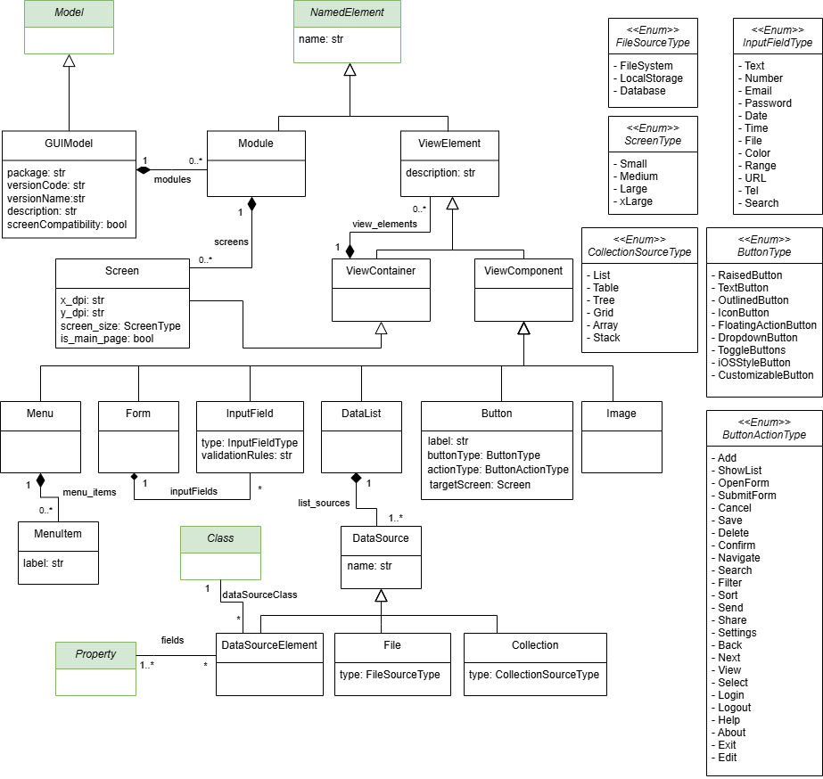

GUI model
=========

This section presents the **GUI Metamodel**, which provides a framework for specifying,
structuring, and organizing graphical user interface (GUI) components within the BESSER platform.  
The metamodel builds upon concepts inspired by the *Interaction Flow Modeling Language (IFML)*,
ensuring interoperability with standard UI modeling tools and supporting integration with B-UML
structural models. This new metamodel introduces a modular structure, new UI element types,
layout and style definitions, and finer control of positioning and hierarchy.

.. note::

  The classes highlighted in green originate from the :doc:`structural metamodel <structural>`.

Overview
--------

A **GUIModel** represents the complete user interface specification of an application.  
It is organized into **modules** and **screens**, each describing specific application areas and their visual composition.  
Screens contain one or more **view containers**, which define the layout and structure of visual elements.

**1. Structural organization**  
The upper level of the metamodel defines the organization of the interface:
- ``GUIModel`` contains multiple ``Modules``
- Each ``Module`` defines several ``Screens``
- Each ``Screen`` hosts one or more ``ViewContainers`` arranged with specific ``Layouts``

**2. Visual composition**  
View containers hold collections of ``ViewElements`` that represent visible components such as buttons, menus, forms, lists, images, links, or embedded content.  
These elements can be combined and nested to compose complex user interfaces.

**3. Presentation and layout**  
Dedicated classes like ``Layout``, ``Position``, and ``Size`` describe how components are arranged and styled.  
Enumerations such as ``Alignment``, ``UnitSize``, and ``PositionType`` offer standardized visual options for spacing, orientation, and alignment.

**4. Interaction and behavior**  
Interactive elements—such as ``Button``, ``Form``, and ``Menu``, can be linked to application logic or data bindings.  
Attributes like ``ButtonType`` and ``ButtonActionType`` define common actions (e.g., *Submit*, *Cancel*, *Navigate*, *Edit*) in a platform-independent way.

Supported Notations
-------------------

You can create and manipulate GUI models using:

* :doc:`Coding in Python Using the B-UML python library <../model_building/buml_core>`
* :doc:`Web Modeling Editor <../../web_modeling_editor/use_the_wme>`