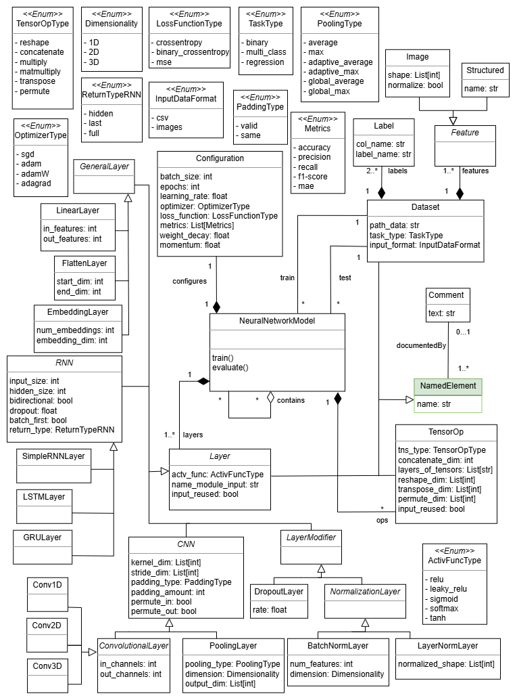

Neural Network model
====================

The NN metamodel enables to represent neural networks.
The key concepts in the NN metamodel are represented using meta-classes and 
their associations. Our design was heavily inspired by the two popular deep 
learning frameworks PyTorch and TensorFlow. Specifically, we compared concepts 
from the two frameworks to come up with a metamodel design that is general to 
represent neural network components and allows the definition of both sequential
and non-sequential architectures. This approach ensures that the metamodel 
remains versatile and adaptable across different contexts within neural networks
development.

.. note::

  The class highlighted in green originates from the :doc:`structural metamodel <structural>`.

Supported notations
-------------------

To create an NN model, you can use the following notations:

* :doc:`Coding in Python Using the B-UML python library <../model_building/buml_core>`
* :doc:`Using a textual notation supported by the NN grammar <../model_building/nn_grammar>`