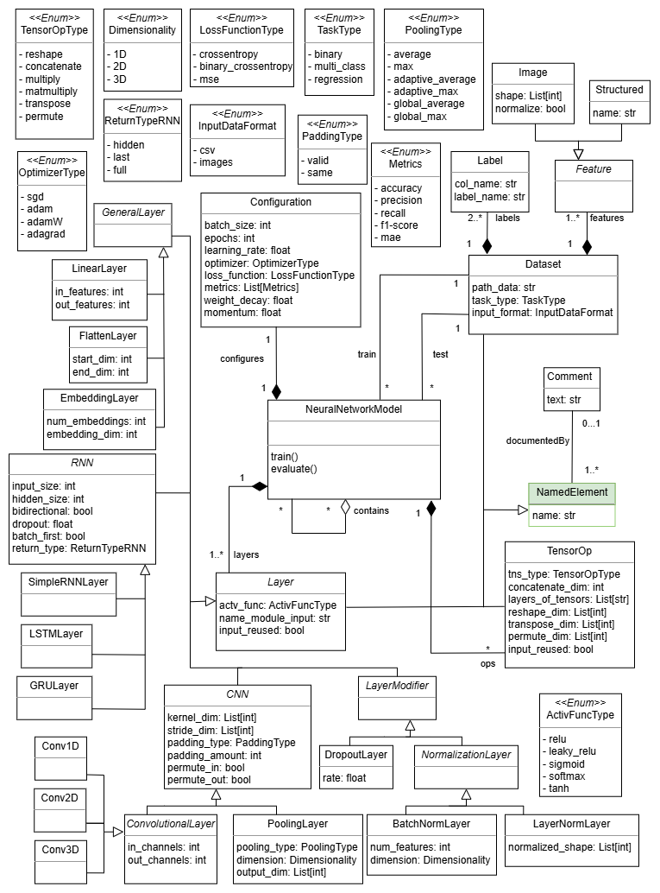

Neural Network model
====================

The NN metamodel enables to represent neural networks.
The key concepts in the NN metamodel are represented using meta-classes and 
their associations. Our design was heavily inspired by the two popular deep 
learning frameworks PyTorch and TensorFlow. Specifically, we compared concepts 
from the two frameworks to come up with a metamodel design that is general to 
represent neural network components and allows the definition of both sequential
and non-sequential architectures. This approach ensures that the metamodel 
remains versatile and adaptable across different contexts within neural networks
development.

.. note::

  The class highlighted in green originates from the :doc:`structural metamodel <structural>`.

Core Concepts
-------------

* **NN**: the top-level neural network. Owns the ordered modules (layers,
  tensor operations, and nested NNs), a Configuration, and Training and
  Test Datasets.
* **Layer**: the abstract base for individual layers. Concrete subclasses
  include the convolutional layers (``Conv1D``, ``Conv2D``, ``Conv3D``),
  ``PoolingLayer``, the recurrent layers (``SimpleRNNLayer``,
  ``LSTMLayer``, ``GRULayer``), ``LinearLayer``, ``FlattenLayer``,
  ``EmbeddingLayer``, ``DropoutLayer``, ``BatchNormLayer``, and
  ``LayerNormLayer``.
* **TensorOp**: an operation applied to one or more tensors. Supported
  types are ``concatenate``, ``multiply``, ``matmultiply``, ``reshape``,
  ``transpose``, and ``permute``.
* **Configuration**: hyperparameters used during training and evaluation,
  such as ``batch_size``, ``epochs``, ``learning_rate``, ``optimizer``,
  ``loss_function``, ``metrics``, plus optional ``weight_decay`` and
  ``momentum``.
* **Dataset**: a data collection used for training or evaluation. Carries
  a ``name``, ``path_data``, ``task_type``, ``input_format``, an optional
  Image, and a set of Labels.
* **Image**: a specification attached to a Dataset when ``input_format``
  is ``images``, holding the ``shape`` and a ``normalize`` flag.

Validation
----------

The NN metamodel performs validation when ``NN.validate()`` is called:

- **Module name uniqueness**: each layer, tensor operation, and sub-NN
  reference within the same NN must have a distinct name.
- **Cross-references**: a layer's ``name_module_input`` and the string
  entries in a tensor operation's ``layers_of_tensors`` must match modules
  defined in the same NN.
- **Entry point**: the first module of an NN must not declare a
  ``name_module_input``.
- **Module names**: the NN's name and every module name must be a valid
  Python identifier and not a Python reserved keyword.
- **Sub-NN cycles**: an NN cannot directly or transitively contain itself.
  Sub-NNs are validated recursively and their errors and warnings are
  merged into the parent's.
- **Numerical bounds**: configuration hyperparameters and layer sizes must
  be positive (``batch_size``, ``epochs``, ``learning_rate``,
  ``hidden_size``, ``out_features``, ``out_channels``, ``num_features``,
  ``num_embeddings``, ``embedding_dim``, plus entries of ``kernel_dim``,
  ``stride_dim``, ``normalized_shape``, and image ``shape``);
  ``weight_decay`` must be non-negative; ``DropoutLayer.rate`` and RNN
  ``dropout`` must lie in ``[0, 1)``.
- **Dataset consistency** (warnings): training and test datasets should
  declare matching ``input_format`` and ``image.shape``; a test dataset
  without a training dataset, and an NN with training data but no
  configuration, are also flagged.
- **Empty NN** (warning): an NN with no modules is flagged.

.. code-block:: python

    result = my_nn.validate()
    # result = {"success": True/False, "errors": [...], "warnings": [...]}

Example Usage
-------------

.. code-block:: python

    from besser.BUML.metamodel.nn import (
        NN, Conv2D, PoolingLayer, FlattenLayer, LinearLayer,
        Configuration, Dataset, Image,
    )

    nn_model = NN(name="my_model")
    nn_model.add_layer(Conv2D(name="l1", actv_func="relu",
                              in_channels=3, out_channels=32, kernel_dim=[3, 3]))
    nn_model.add_layer(PoolingLayer(name="l2", pooling_type="max",
                                    dimension="2D", kernel_dim=[2, 2]))
    nn_model.add_layer(FlattenLayer(name="l3"))
    nn_model.add_layer(LinearLayer(name="l4", out_features=10))

    nn_model.add_configuration(Configuration(
        batch_size=32, epochs=10, learning_rate=0.001, optimizer="adam",
        loss_function="crossentropy", metrics=["accuracy"],
    ))

    nn_model.add_train_data(Dataset(
        name="train_data", path_data="dataset/train",
        task_type="multi_class", input_format="images",
        image=Image(shape=[32, 32, 3]),
    ))
    nn_model.add_test_data(Dataset(
        name="test_data", path_data="dataset/test",
        task_type="multi_class", input_format="images",
        image=Image(shape=[32, 32, 3]),
    ))

Additional examples covering nested NNs, RNN/LSTM models, TensorOp usage,
and regression tasks are available in ``tests/BUML/metamodel/nn/``.

Supported notations
-------------------

To create an NN model, you can use the following notations:

* :doc:`Coding in Python Using the B-UML python library <../model_building/buml_core>`
* :doc:`Using a textual notation supported by the NN grammar <../model_building/nn_grammar>`