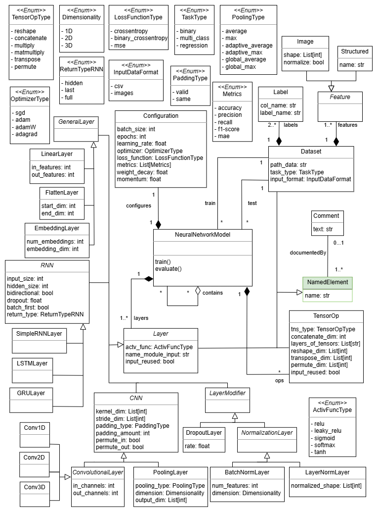

Neural Network model
====================

The NN metamodel enables to represent neural networks.
The key concepts in the NN metamodel are represented using meta-classes and 
their associations. Our design was heavily inspired by the two popular deep 
learning frameworks PyTorch and TensorFlow. Specifically, we compared concepts 
from the two frameworks to come up with a metamodel design that is general to 
represent neural network components and allows the definition of both sequential
and non-sequential architectures. This approach ensures that the metamodel 
remains versatile and adaptable across different contexts within neural networks
development.

.. note::

  The class highlighted in green originates from the :doc:`structural metamodel <structural>`.

Core Concepts
-------------

* **NN**: the top-level neural network. Owns the ordered modules (layers,
  tensor operations, and nested NNs), a Configuration, and Training and
  Test Datasets. The optional ``input_var`` attribute names the forward
  method's input variable (default ``x``); ``return_vars`` is a
  comma-separated string naming the output variables returned by the
  forward method.

* **Layer**: the abstract base for individual layers. Concrete subclasses
  include the convolutional layers (``Conv1D``, ``Conv2D``, ``Conv3D``),
  ``PoolingLayer``, the recurrent layers (``SimpleRNNLayer``,
  ``LSTMLayer``, ``GRULayer``), ``LinearLayer``, ``FlattenLayer``,
  ``EmbeddingLayer``, ``DropoutLayer``, ``BatchNormLayer``, and
  ``LayerNormLayer``.
* **TensorOp**: an operation applied to one or more tensors. Supported
  types are ``concatenate``, ``multiply``, ``matmultiply``, ``reshape``,
  ``transpose``, ``permute``, ``mean``, ``max``, ``squeeze``, ``unsqueeze``,
  ``binop_add``, ``binop_subtract``, ``binop_multiply``, ``binop_divide``,
  ``binop_floor_divide``, ``subscript``, ``shape_dim``, ``normalize``,
  ``repeat``, ``interpolate``, ``pad``, ``dropout``, ``zeros_like``,
  ``split``, and ``identity``.
* **Configuration**: hyperparameters used during training and evaluation,
  such as ``batch_size``, ``epochs``, ``learning_rate``, ``optimizer``,
  ``loss_function``, ``metrics``, plus optional ``weight_decay`` and
  ``momentum``.
* **Dataset**: a data collection used for training or evaluation. Carries
  a ``name``, ``path_data``, ``task_type``, ``input_format``, an optional
  Image, and a set of Labels.
* **Image**: a specification attached to a Dataset when ``input_format``
  is ``images``, holding the ``shape`` and a ``normalize`` flag.

TensorOp Parameters
-------------------

Each ``TensorOp`` requires a ``name`` and a ``tns_type``. Additional
parameters depend on the type:

* ``reshape``: requires ``reshape_dim`` (list[int]) as the target shape.

* ``concatenate``: requires ``concatenate_dim`` (int) as the axis to
  concatenate along, and either ``layers_of_tensors`` or ``input_var``
  to specify the inputs.

* ``transpose``: requires ``transpose_dim`` (list[int], exactly 2 values)
  as the two dimension indices to swap. For arbitrary permutations over
  any number of dimensions use ``permute`` instead.

* ``permute``: requires ``permute_dim`` (list[int]) as the full
  permutation over any number of dimensions.

* ``mean``, ``max``, ``squeeze``, ``unsqueeze``, ``normalize``,
  ``shape_dim``: require ``reduce_dim`` (int) as the dimension to operate
  on. ``max`` additionally accepts ``reduce_keepdims`` (bool) to keep 
  the reduced dimension in the output.

* ``split``: requires ``split_sizes`` (int or list[int]) as either the
  number of equal chunks or a list of size per chunk, and ``split_dim``
  (int) as the dimension to split along.

* ``repeat``: requires ``repeat_dim`` (list[int | str]) as the
  repetition counts for repeat operation. Each element specifies
  how many times to repeat along that dimension. Elements can be
  integers for fixed counts (e.g., 2, 3) or strings representing
  variable/tensorop names that evaluate to integers at
  runtime (e.g., 'batch_size', 'n').

* ``pad``: requires ``pad_amount`` (list[list[int]]) as padding 
  amounts in the form of a nested list. Each inner list contains
  [before, after] padding for one dimension.
  Example: [[1, 1], [2, 2]] pads first dim by 1 on each side,
  second dim by 2.
  Accepts ``pad_mode`` (str, default ``'constant'``) as one of
  ``'constant'``, ``'reflect'``, or ``'replicate'``, and ``pad_value``
  (float, default ``0.0``) as the fill value, which is only used when
  ``pad_mode='constant'``.

* ``dropout``: requires ``dropout_rate`` (float in ``[0, 1)``) and
  ``dropout_training_aware`` (bool) to control whether dropout is tied
  to the training flag.

* ``interpolate``: requires either ``interpolate_size`` (Tuple[int, ...]) 
  (representing target dimensions)or ``interpolate_scale`` (float), but
  not both. Accepts ``interpolate_mode`` (str) as the resampling mode,
  with valid values: 'nearest', 'linear', 'bilinear', 'bicubic', 'trilinear',
  'area', 'nearest-exact', 'lanczos3', 'lanczos5', 'gaussian', 'mitchellcubic'.
  It defaults to 'bilinear'.

* ``subscript``: requires ``subscript_indices`` (list[dict]) as a list of
  index or slice descriptors, one per dimension being subscripted. Each
  element is a dict with a required ``"type"`` key that is either ``"index"``
  or ``"slice"``. An ``"index"`` element requires a ``"value"`` key (int)
  representing a single position. A ``"slice"`` element accepts ``"start"``,
  ``"stop"``, and ``"step"`` keys, each either an int or ``None``.
  For example, the subscript ``[:, -1, :]`` would be represented as

.. code-block:: python

  [
      {"type": "slice", "start": None, "stop": None, "step": None},
      {"type": "index", "value": -1},
      {"type": "slice", "start": None, "stop": None, "step": None},
  ]

* ``shape_dim``: requires ``reduce_dim`` (int) as the index into the
  tensor shape to extract, and ``layers_of_tensors`` to specify the
  source tensor.

* ``binop_add``, ``binop_subtract``, ``binop_multiply``,
  ``binop_divide``, ``binop_floor_divide``, ``multiply``,
  ``matmultiply``: require ``layers_of_tensors`` (list[str | float |
  int]) as the two operands, given as layer name strings or scalar
  constants.

* ``zeros_like``, ``identity``: no additional parameters required.

In addition to the type-specific parameters above, ``TensorOp`` supports
the following attributes:

* ``input_var`` (str) and ``output_var`` (str) to explicitly name the
  input and output tensor variables in the generated forward method.
* ``input_var`` (str) and ``layers_of_tensors`` (list[str | float | int])
  both specify the input source for an operation. ``input_var`` takes
  priority over ``layers_of_tensors``; if neither is set the generator
  falls back to the previous module's output variable. ``layers_of_tensors``
  is required for binary and multiply operations, and either
  ``layers_of_tensors`` or ``input_var`` is required for ``concatenate``.
  For all other types both are optional.
* ``output_vars`` (list[str]), only for ``split``, to name each of its
  multiple output variables individually.
* ``input_reused`` (bool) to indicate that the input tensor is reused
  across multiple operations, which triggers variable preservation in
  the generated code.
* ``actual_vars`` (list[str]), only relevant for ``concatenate``,
  ``binop_add``, ``binop_subtract``, ``binop_multiply``,
  ``binop_divide``, ``binop_floor_divide``, and ``multiply`` when one
  of the entries in ``layers_of_tensors`` references an RNN layer with
  ``return_type='both'``. Each element specifies which component to
  consume from the corresponding input, either ``"output"`` for the
  output sequence or ``"hidden"`` for the hidden state.
* ``permute_in`` (bool) and ``permute_out`` (bool) to add a channel
  permutation before and after the operation respectively, used when
  mixing channel-first and channel-last conventions between frameworks.

Layer Parameters
----------------

Each layer class accepts the standard parameters expected from
the equivalent layer in a deep learning framework. Beyond those, all
layers share the following BESSER-specific attributes:

* ``input_var`` (str) and ``output_var`` (str) to explicitly name the
  input and output tensor variables in the generated forward method.
  When not set, the generator resolves them automatically from the
  module order.
* ``is_layer_call`` (bool) to indicate that this is a call to an already
  defined layer rather than a new layer definition. When True, the
  generator only emits a call in the forward method and skips the layer
  definition in the init method, enabling layer reuse across the network.
* ``permute_in`` (bool) and ``permute_out`` (bool) to add a channel
  permutation before and after the layer respectively, used when the
  expected channel ordering of consecutive modules differs.
* ``name_module_input`` (str) to explicitly reference the name of the
  module whose output this layer consumes, used in non-sequential
  architectures.

For RNN layers (``SimpleRNNLayer``, ``LSTMLayer``, ``GRULayer``),
``hx_source`` (str) names the encoder layer whose hidden state is passed
as the initial hidden state, enabling encoder-decoder architectures.
``hidden_state_var`` (str) names the hidden state variable in the
generated forward method. ``hidden_unused`` (bool) indicates that the
hidden state output is not consumed by any subsequent layer.
``hidden_subscript_source`` (str) and ``hidden_subscript_target`` (str)
define a variable assignment of the form ``target = source`` applied to
the hidden state in the generated forward method. For ``LSTMLayer``
specifically, ``cell_state_var`` (str) names the cell state variable in
the generated forward method, and ``cell_unused`` (bool) indicates that
the cell state is not consumed by any subsequent layer.

Validation
----------

The NN metamodel performs validation when ``NN.validate()`` is called:

- **Module name uniqueness**: each layer, tensor operation, and sub-NN
  reference within the same NN must have a distinct name.
- **Cross-references**: a layer's ``name_module_input`` and the string
  entries in a tensor operation's ``layers_of_tensors`` must match modules
  defined in the same NN.
- **Entry point**: the first module of an NN must not declare a
  ``name_module_input``.
- **Module names**: the NN's name and every module name must be a valid
  Python identifier. Python reserved keywords (``class``, ``return``, ...)
  surface as warnings rather than errors, matching the warn-not-error
  stance applied elsewhere in the BUML metamodel.
- **Sub-NN cycles**: an NN cannot directly or transitively contain itself.
  Sub-NNs are validated recursively and their errors and warnings are
  merged into the parent's.
- **Numerical bounds**: layer sizes must be positive (``out_features``,
  ``in_features``, ``out_channels``, ``in_channels``, ``hidden_size``,
  ``num_features``, ``num_embeddings``, ``embedding_dim``, plus entries
  of ``kernel_dim``, ``stride_dim``, and ``normalized_shape``);
  ``DropoutLayer.rate`` and RNN ``dropout`` must lie in ``[0, 1)``.
  For tensor operations, ``interpolate_scale`` must be positive;
  ``pad_amount`` entries must be non-negative; ``dropout_rate`` on a
  ``dropout`` tensor operation must lie in ``[0.0, 1.0]``; and
  ``split_sizes`` must contain only positive integers. Configuration
  hyperparameters ``batch_size``, ``epochs``, and ``learning_rate``
  must be positive; ``weight_decay`` must be non-negative. Dataset
  image ``shape`` entries must all be positive.
- **Dataset consistency** (warnings): training and test datasets should
  declare matching ``input_format`` and ``image.shape``; a test dataset
  without a training dataset, and an NN with training data but no
  configuration, are also flagged.
- **Empty NN** (warning): an NN with no modules is flagged.
- **TensorOp required parameters**: each tensor operation type is checked
  for its required parameters (e.g. ``reshape_dim`` for ``reshape``,
  ``transpose_dim`` for ``transpose``, ``pad_amount`` for ``pad``).
  Missing required parameters are collected as errors.
- **Variable chain consistency**: if ``NN.input_var`` is set, the first
  module's ``input_var`` must match it. ``NN.resolve_var_chain()`` is called
  before generation to propagate these values automatically when the modules
  have no explicit ``input_var`` and ``output_var`` set.

.. code-block:: python

    result = my_nn.validate()
    # result = {"success": True/False, "errors": [...], "warnings": [...]}

Example Usage
-------------

.. code-block:: python

    from besser.BUML.metamodel.nn import (
        NN, Conv2D, PoolingLayer, FlattenLayer, LinearLayer,
        Configuration, Dataset, Image,
    )

    nn_model = NN(name="my_model")
    nn_model.add_layer(Conv2D(name="l1", actv_func="relu",
                              in_channels=3, out_channels=32, kernel_dim=[3, 3]))
    nn_model.add_layer(PoolingLayer(name="l2", pooling_type="max",
                                    dimension="2D", kernel_dim=[2, 2]))
    nn_model.add_layer(FlattenLayer(name="l3"))
    nn_model.add_layer(LinearLayer(name="l4", out_features=10))

    nn_model.add_configuration(Configuration(
        batch_size=32, epochs=10, learning_rate=0.001, optimizer="adam",
        loss_function="crossentropy", metrics=["accuracy"],
    ))

    nn_model.add_train_data(Dataset(
        name="train_data", path_data="dataset/train",
        task_type="multi_class", input_format="images",
        image=Image(shape=[32, 32, 3]),
    ))
    nn_model.add_test_data(Dataset(
        name="test_data", path_data="dataset/test",
        task_type="multi_class", input_format="images",
        image=Image(shape=[32, 32, 3]),
    ))

Additional examples covering nested NNs, RNN/LSTM models, TensorOp usage,
and regression tasks are available in ``tests/BUML/metamodel/nn/``.

Supported notations
-------------------

To create an NN model, you can use the following notations:

* :doc:`Coding in Python Using the B-UML python library <../model_building/buml_core>`
* :doc:`Using a textual notation supported by the NN grammar <../model_building/nn_grammar>`