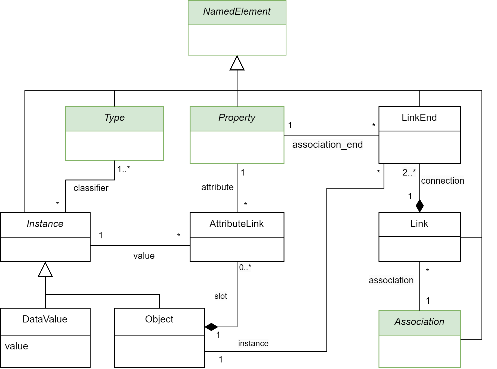

Object model
=============

While the structural metamodel centers on classes and their static structures, the object diagram metamodel enables the 
representation of how these classes are instantiated into objects and interact with each other. The *Object* class 
in the metamodel represents the instances of a *Class* from the structural metamodel. Its object attributes are defined using 
the *AttributeLink* class, and associations with other classes are established using the *LinkEnd* class. In BESSER, 
the object diagram metamodel is primarily utilized for conducting validations or tests on the model. For instance, 
validating OCL rules over instances of the B-UML model.

.. note::

  The classes highlighted in green originate from the :doc:`structural metamodel <structural>`.

Supported notations
-------------------

To create an object model, you can use any of these notations:

* :doc:`Coding in Python Using the B-UML python library <../model_building/buml_core>`
* :doc:`Using PlantUML to design you object model <../model_building/plantuml_object>`

Why Object Models?
------------------

Object models serve several important purposes in the BESSER platform:

- **Validate OCL constraints on concrete instances**: By creating specific object instances,
  you can evaluate Object Constraint Language (OCL) rules against real data to verify that
  your constraints behave as expected.
- **Test metamodel behavior with specific data**: Object models let you exercise your
  structural model with concrete values, catching design issues early before code generation.
- **Demonstrate expected system state**: Object diagrams provide concrete examples of how
  classes are instantiated and related at runtime, making them valuable for documentation
  and communication with stakeholders.

Python Code Example
-------------------

The following example shows how to create object instances from a structural model:

.. code-block:: python

    from besser.BUML.metamodel.object import *
    from besser.BUML.metamodel.structural import DomainModel, Class, Property, StringType

    # Assuming a Person class with name attribute
    person_class = Class(name="Person", attributes={Property(name="name", type=StringType)})

    # Create an instance
    john = Object(name="john", classifier=person_class)
    john_name = DataValue(classifier=person_class, attribute=name_attr, value="John")
    john.add_slot(AttributeLink(attribute=name_attr, value=john_name))

    object_model = ObjectModel(name="TestInstances", instances={john})

Supported Notations (additional)
---------------------------------

Object models can be created and manipulated using:

- B-UML Python library (as shown above)
- PlantUML Object notation (see :doc:`../model_building/plantuml_object`)