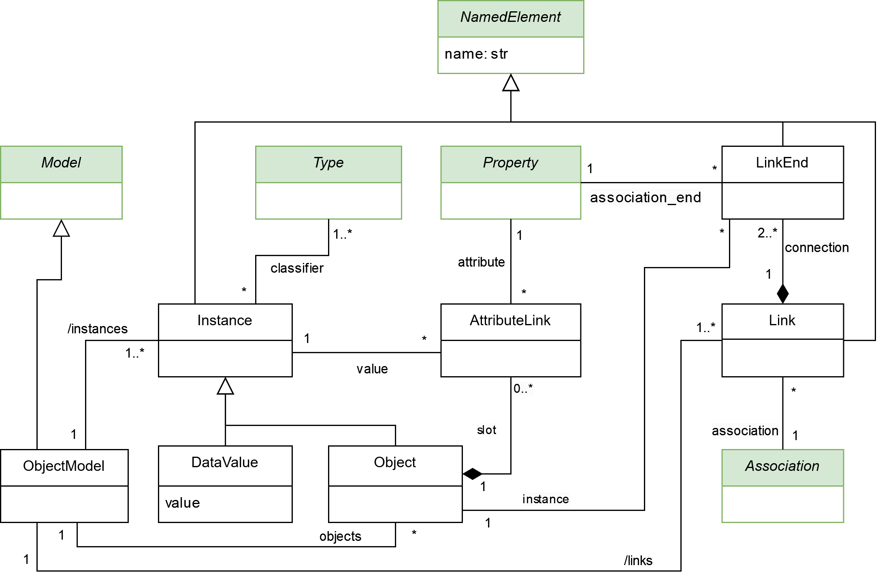

Object model
=============

While the structural metamodel centers on classes and their static structures, the object diagram metamodel enables the 
representation of how these classes are instantiated into objects and interact with each other. The *Object* class 
in the metamodel represents the instances of a *Class* from the structural metamodel. Its object attributes are defined using 
the *AttributeLink* class, and associations with other classes are established using the *LinkEnd* class. In BESSER, 
the object diagram metamodel is primarily utilized for conducting validations or tests on the model. For instance, 
validating OCL rules over instances of the B-UML model.

.. note::

  The classes highlighted in green originate from the :doc:`structural metamodel <structural>`.

Supported notations
-------------------

To create an object model, you can use any of these notations:

* :doc:`Coding in Python Using the B-UML python library <../model_building/buml_core>`
* :doc:`Using PlantUML to design you object model <../model_building/plantuml_object>`