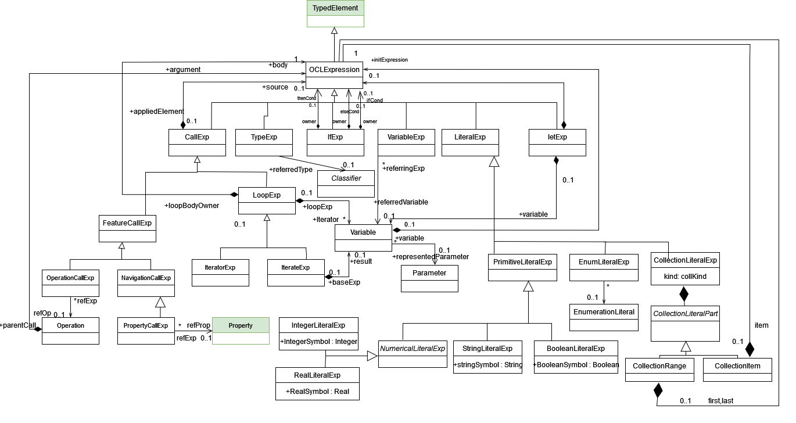

OCL specification
=================

We have added support for defining OCL constraints (e.g. to specify invariants or business rules) on the B-UML models.
OCL expressions can be written in plain text and then automatically parsed to create the abstract syntax tree (AST) 
for expression according to the OCL metamodel shown below

.. note::

  The classes highlighted in green originate from the :doc:`structural metamodel <structural>`.

The BOCL supports invariants, initialisation constraints, preconditions and postconditions.
You can define OCL constraints for structural models using the web modeling editor such as:

.. code-block:: python
  :linenos:

  context library inv inv1: self.books>0

.. note::

  B-OCL Interpreter is available at https://github.com/BESSER-PEARL/B-OCL-Interpreter. With this interpreter you can validate your OCL constraints defined on B-UML models.

Supported notations
-------------------

To create an object model, you can use any of these notations:

* :doc:`Coding in Python Using the B-UML python library <../model_building/buml_core>`
* :doc:`Using the grammar to create the OCL specification <../model_building/ocl_grammar>`