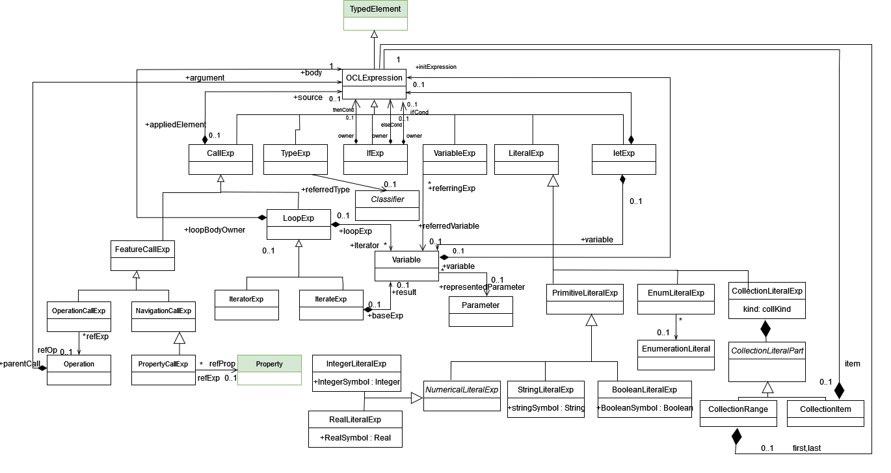

OCL specification
=================

We have added support for defining OCL constraints (e.g. to specify invariants or business rules) on the B-UML models.
OCL expressions can be written in plain text and then automatically parsed to create the abstract syntax tree (AST)
for expression according to the OCL metamodel shown below.

.. note::

  The classes highlighted in green originate from the :doc:`structural metamodel <structural>`.

BOCL supports four constraint kinds. Each has its own header shape — the
parser routes on the keyword that follows ``context``:

.. list-table::
  :header-rows: 1
  :widths: 12 88

  * - Kind
    - Header form (and a one-line example)
  * - ``inv``
    - ``context Class inv [name]: expression``
      — e.g. ``context Library inv at_least_one_book: self.books->size() > 0``
  * - ``pre``
    - ``context Class::method(p: Type) pre: expression``
      — e.g. ``context Account::deposit(amount: Integer) pre: amount > 0``
  * - ``post``
    - ``context Class::method(p: Type) post: expression``
      — e.g. ``context Account::deposit(amount: Integer) post: self.balance >= 0``
  * - ``init``
    - ``context Class::attribute : Type init: expression``
      — e.g. ``context Account::balance : Integer init: 0``

Invariants attach to the :class:`DomainModel`'s constraint set. Preconditions
and postconditions attach to a specific :class:`Method` via ``add_pre`` /
``add_post`` (see below). Initialisation constraints attach to a specific
attribute.

.. note::

  B-OCL Interpreter is available at https://github.com/BESSER-PEARL/B-OCL-Interpreter. With this interpreter you can validate your OCL constraints defined on B-UML models.

Authoring constraints in the Web Modeling Editor
------------------------------------------------

Inside the editor's OCL constraint box, type the **complete** BOCL block —
header plus body. The editor renders an italic stereotype badge above the
body derived from the header keyword:

* ``«inv»`` — invariant
* ``«pre» <method-name>`` — precondition (the box draws a link to the method it constrains)
* ``«post» <method-name>`` — postcondition

The optional **description** field next to the textbox accepts a plain-language
explanation; the validator surfaces that text as the violation reason instead
of the raw OCL when the constraint fails.

Anchoring preconditions and postconditions on a method (Python API)
-------------------------------------------------------------------

Preconditions and postconditions are first-class fields on :class:`Method` —
``method.pre`` and ``method.post``. Use ``add_pre`` / ``add_post`` to attach
parsed OCL constraints to the operation they govern, instead of relying on
naming conventions:

.. code-block:: python

  from besser.BUML.metamodel.structural import (
      DomainModel, Class, Property, Method, Parameter, IntegerType, BooleanType,
  )
  from besser.BUML.notations.ocl.api import parse_ocl

  account = Class("Account", attributes={
      Property("balance", IntegerType),
      Property("is_active", BooleanType),
  })
  model = DomainModel("BankingModel", types={account})

  deposit = Method(
      name="deposit",
      parameters=[Parameter("amount", IntegerType)],
      type=IntegerType,
  )

  pre  = parse_ocl(
      "context Account::deposit(amount: Integer) pre: self.is_active and amount > 0",
      model, context_class=account,
  )
  post = parse_ocl(
      "context Account::deposit(amount: Integer) post: self.balance >= 0",
      model, context_class=account,
  )
  pre.name, post.name = "deposit_pre_active_and_positive", "deposit_post_nonneg"

  deposit.add_pre(pre)
  deposit.add_post(post)

.. note::

  ``parse_ocl``'s auto-detect regex only matches the simple ``context Class
  inv|pre|post|init`` shape, not ``Class::method(...)``, so when parsing pre /
  post / init you must pass ``context_class`` explicitly (as above).

Working with parsed constraints
-------------------------------

If you are writing a tool that walks the OCL AST — to evaluate
constraints, encode them into another formalism, or transform them —
the following sub-pages cover the public surface:

.. toctree::
   :maxdepth: 1

   ocl/parsing
   ocl/ast
   ocl/normalization

For a runnable end-to-end example, see :doc:`../../examples/ocl`.

Supported notations
-------------------

To create an object model, you can use any of these notations:

* :doc:`Coding in Python Using the B-UML python library <../model_building/buml_core>`
* :doc:`Using the grammar to create the OCL specification <../model_building/ocl_grammar>`
