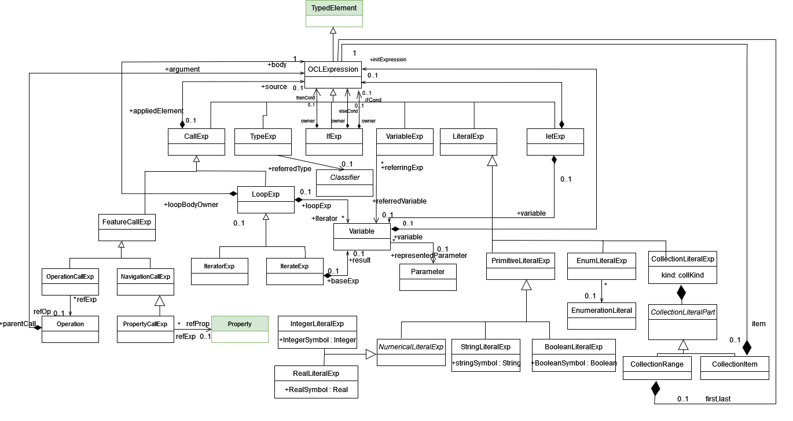

OCL specification
=================

We have added support for defining OCL constraints (e.g. to specify invariants or business rules) on the B-UML models.
OCL expressions can be written in plain text and then automatically parsed to create the abstract syntax tree (AST) 
for expression according to the OCL metamodel shown below

.. note::

  The classes highlighted in green originate from the :doc:`structural metamodel <structural>`.

We are able to parse all the queries from the metamodel. The work on OCL interpreter is ongoing however we are able to interpret basic OCL queries for example:

.. code-block:: python
  :linenos:

  context library inv inv1: self.books>0