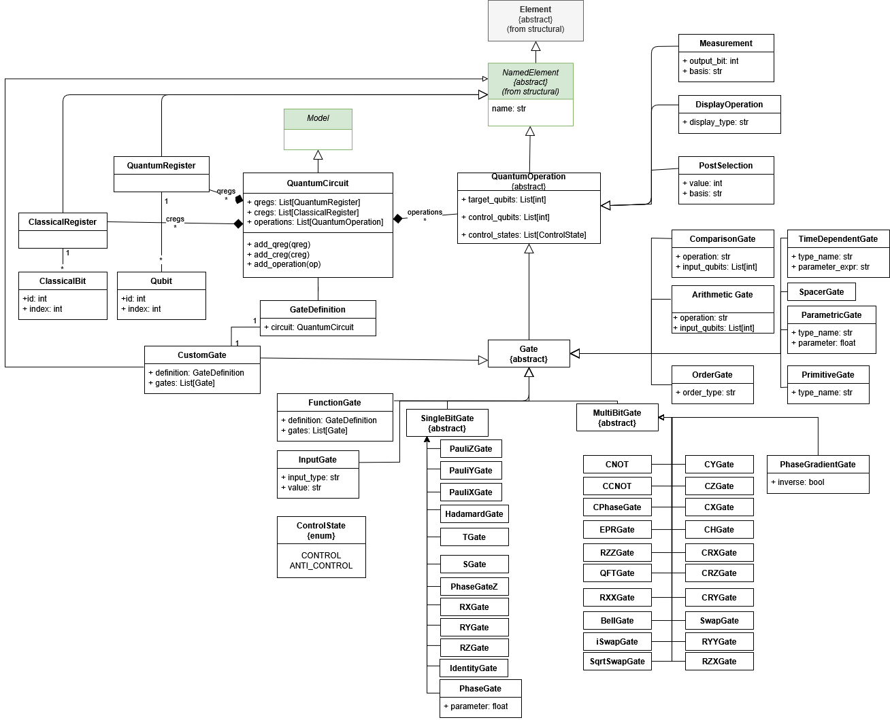

Quantum Metamodel
=================

The Quantum Metamodel allows for the definition of quantum circuits, including quantum registers, classical registers, and a comprehensive set of quantum gates. This metamodel serves as the foundation for modeling quantum algorithms and generating code for quantum computing frameworks like Qiskit.

Core Concepts
-------------

* **QuantumCircuit**: The main container for quantum operations. It manages quantum and classical registers and the sequence of operations.
* **QuantumRegister**: A named collection of qubits.
* **ClassicalRegister**: A named collection of classical bits used for storing measurement results.
* **Qubit**: The fundamental unit of quantum information.
* **ClassicalBit**: A unit of classical information.

Supported Gates
---------------

The metamodel supports a wide range of quantum gates, categorized as follows:

Single-Qubit Gates
~~~~~~~~~~~~~~~~~~

* **Pauli Gates**: ``PauliXGate`` (NOT), ``PauliYGate``, ``PauliZGate``
* **Hadamard Gate**: ``HadamardGate`` (Superposition)
* **Phase Gates**: ``SGate`` (Phase $\pi/2$), ``TGate`` (Phase $\pi/4$), ``PhaseGate`` (Arbitrary phase)
* **Rotation Gates**: ``RXGate``, ``RYGate``, ``RZGate`` (Rotation around X, Y, Z axes)
* **Identity**: ``IdentityGate``

Multi-Qubit Gates
~~~~~~~~~~~~~~~~~

* **Controlled Gates**: ``CNOT`` (Controlled-NOT), ``CXGate``, ``CYGate``, ``CZGate``, ``CHGate`` (Controlled-Hadamard), ``CPhaseGate``, ``CRXGate``, ``CRYGate``, ``CRZGate``
* **Swap Gates**: ``SwapGate``, ``iSwapGate``, ``SqrtSwapGate``
* **Two-Qubit Rotations**: ``RXXGate``, ``RYYGate``, ``RZZGate``, ``RZXGate``
* **Bell State**: ``BellGate`` (Bell state preparation)

Advanced Operations
~~~~~~~~~~~~~~~~~~~

* **QFT**: ``QFTGate`` (Quantum Fourier Transform)
* **Arithmetic**: ``ArithmeticGate``, ``ModularArithmeticGate``
* **Comparison**: ``ComparisonGate``
* **Function Gates**: ``FunctionGate`` (Encapsulates a nested quantum circuit as a single gate)
* **Custom Gates**: ``CustomGate`` (User-defined gates)
* **Time-Dependent**: ``TimeDependentGate`` (Gates with time-varying parameters)
* **Display**: ``DisplayOperation`` (Bloch sphere, Density matrix, Probabilities)
* **Measurement**: ``Measurement`` (Measure qubit state into classical bit)
* **Post-Selection**: ``PostSelection``

Example Usage
-------------

.. code-block:: python

    from besser.BUML.metamodel.quantum import QuantumCircuit, QuantumRegister, ClassicalRegister, HadamardGate, CNOT

    # Create a quantum circuit with 2 qubits and 2 classical bits
    qreg = QuantumRegister(name="q", size=2)
    creg = ClassicalRegister(name="c", size=2)
    circuit = QuantumCircuit(name="BellState", quantum_registers=[qreg], classical_registers=[creg])

    # Add gates
    circuit.add_gate(HadamardGate(target=qreg.qubits[0]))
    circuit.add_gate(CNOT(control=qreg.qubits[0], target=qreg.qubits[1]))

    # Measure
    circuit.measure(qreg.qubits[0], creg.bits[0])
    circuit.measure(qreg.qubits[1], creg.bits[1])
