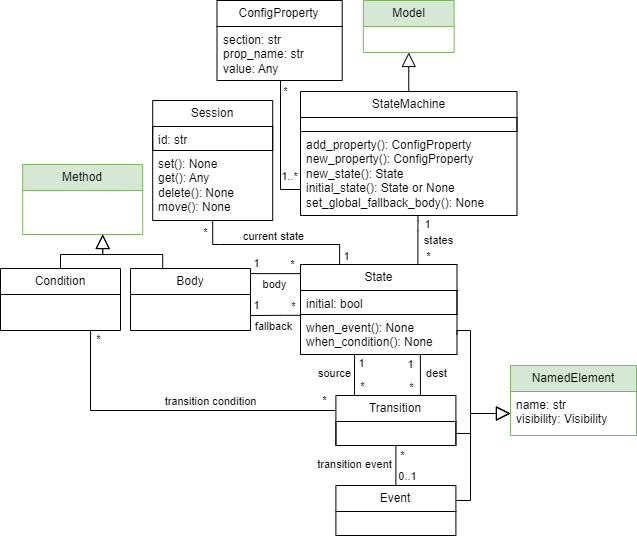

State Machine model
====================

.. _state-machine-metamodel:

State Machine metamodel
-----------------------

This metamodel allows the definition of state machines (also known as finite state machines or FSM), which are computational
models used to design and analyze the behaviour of systems. A state machine is characterized by:

- States: A finite set of conditions or statuses that the system can be in at any given time.
- Transitions: Rules that describe how the system moves from one state to another, often triggered by events or conditions.
- Events: External or internal stimuli (inputs) that cause transitions between states.
- Actions: Activities or responses (outputs) that occur due to transitions or when the system is in a specific state. In our
  state machines vision, each state has a **Body**, which defines the sequence of actions to be executed when an event causes the transition to a state
  (and a **fallback body** that defines the actions to be executed in case of error in the machine).

A state machine can have multiple **sessions** running simultaneously (e.g., one for each user interacting with the system).
A Session is always located in one of the states. If there are multiple sessions, each can store data privately (with respect to the other sessions).
When modelling a state machine, a session is only used as an argument for the events and bodies.

.. note::

  The classes highlighted in green originate from the :doc:`structural metamodel <structural>`.
