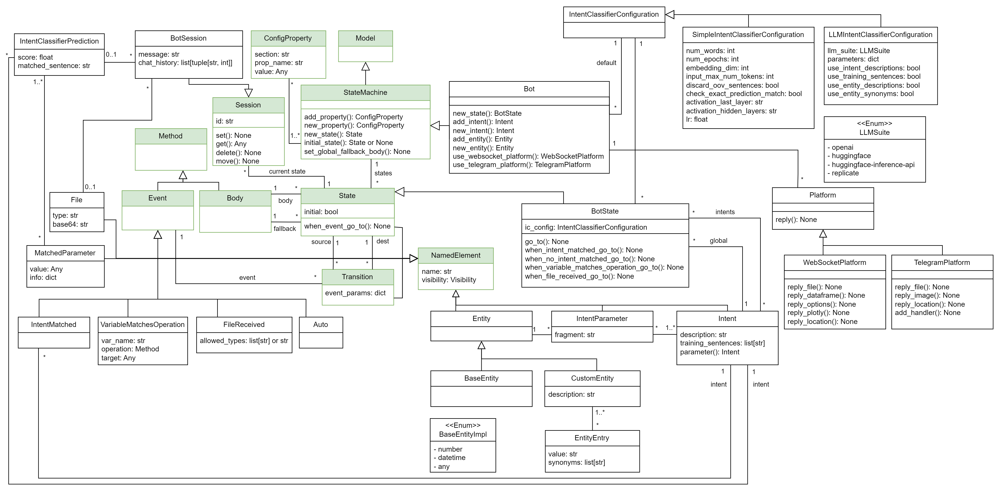

State Machine / Bot
===================

.. _state-machine-metamodel:

State Machine metamodel
-----------------------

This metamodel allows the definition of state machines (also known as finite state machines or FSM), which are computational
models used to design and analyze the behaviour of systems. A state machine is characterized by:

- States: A finite set of conditions or statuses that the system can be in at any given time.
- Transitions: Rules that describe how the system moves from one state to another, often triggered by events or conditions.
- Events: External or internal stimuli (inputs) that cause transitions between states.
- Actions: Activities or responses (outputs) that occur due to transitions or when the system is in a specific state. In our
  state machines vision, each state has a **Body**, which defines the sequence of actions to be executed when an event causes the transition to a state
  (and a **fallback body** that defines the actions to be executed in case of error in the machine).

A state machine can have multiple **sessions** running simultaneously (e.g., one for each user interacting with the system).
A Session is always located in one of the states. If there are multiple sessions, each can store data privately (with respect to the other sessions).
When modelling a state machine, a session is only used as an argument for the events and bodies.

.. image:: ../../img/state_machine_mm.png
  :width: 800
  :alt: State machine metamodel
  :align: center

.. note::

  The classes highlighted in green originate from the :doc:`structural metamodel <structural>`.

.. _bot-metamodel:

Bot metamodel
-------------

The bot metamodel is an extension of the state machine metamodel that adds the necessary components of bots, chatbots and voicebots
that are 'state machine' and 'intent' based. Some relevant extensions are:

- **Intents**: An intent is a purpose or goal behind the user input. A bot definition can contain a set of intents. Each intent can
  embed multiple parameters, which are defined by the bot entities.
- **Entities**: An entity contains a set of values that the bot can use to understand or extract them from the user inputs. An entity can have
  either explicit values (**CustomEntity**) or can be one of the pre-defined entities (**BaseEntity**) that are intended to recognize full domain of values (e.g., numbers)
- A **BotSession** now stores information about the **IntentClassifierPrediction** (if any) and **File** received (if any)
- Each **BotState** has an intent classifier, defined by an **IntentClassifierConfiguration**.
- A bot can send and receive data (e.g., messages, files, images, etc.) through **Platforms**.

.. note::

  You can visit the `BESSER Bot Framework documentation <https://besserbot-framework.readthedocs.io/en/latest/>`_ for a
  complete understanding about bots

Supported notations
-------------------

To create a state machine or bot model, you can use the following notation:

* :doc:`Coding in Python Using the B-UML python library <../model_building/buml_core>`
