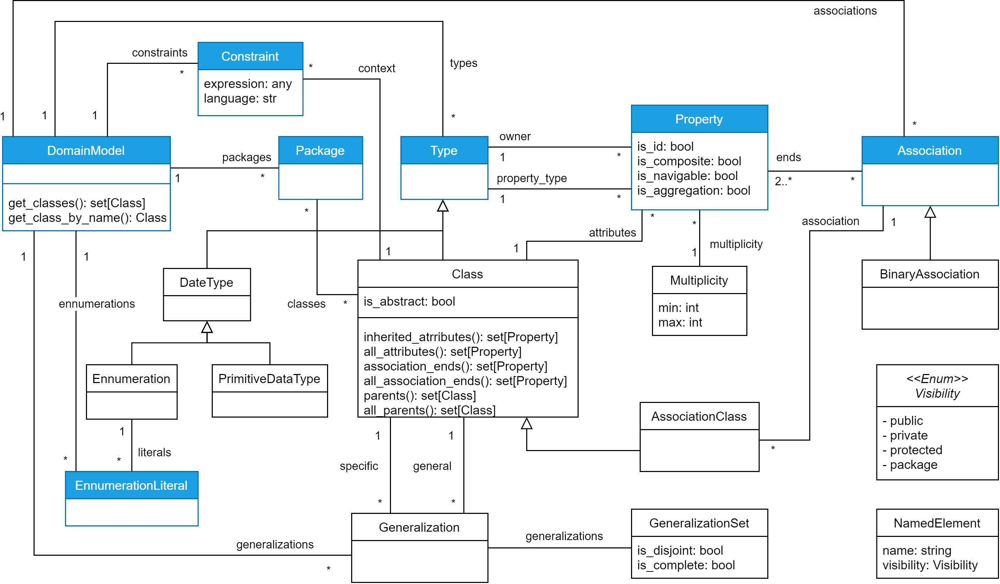

Structural model
================

The structural metamodel enables the specification of a domain model using the typical concepts of a class diagram. 
Elements such as *Classes*, *Properties*, *Associations*, and *Generalizations* can be instantiated to define the static 
structure of a system or application. While this metamodel is rooted in the UML specification, certain modifications and 
additions have been implemented to provide additional modeling capabilities. For instance, the *is_id* attribute 
has been introduced in the *Property* class to specify whether a property serves as an identifier for the instances of that
class, a common need in many code generation scenarios.

.. note::

  This figure contains only the main classes, attributes, and methods of the B-UML language. For a detailed 
  description please refer to the :doc:`API documentation <../../api>`.

Available Data Types
-----------------------

BESSER provides a comprehensive set of primitive data types for modeling. The available types include ``StringType``, 
``IntegerType``, ``FloatType``, ``BooleanType``, ``DateType``, ``TimeType``, ``DateTimeType``, ``TimeDeltaType`` 
and ``AnyType``. These types can be used to define properties and attributes in your structural models.

Method Implementations
----------------------

A ``Method`` can declare how its behavior is implemented through ``implementation_type``
(a ``MethodImplementationType``):

- ``NONE``: signature only (plain UML).
- ``CODE``: Python code stored in ``code``.
- ``BAL``: :doc:`BESSER Action Language <../../besser_action_language>` code stored in ``code``.
- ``STATE_MACHINE``: behavior defined by a :doc:`state machine <state_machine>` (``state_machine``).
- ``QUANTUM_CIRCUIT``: behavior defined by a :doc:`quantum circuit <quantum>` (``quantum_circuit``).
- ``NEURAL_NETWORK``: behavior defined by a :doc:`neural network <nn>` (``neural_network``);
  calling the method runs the NN.

When a behavior model is passed and ``implementation_type`` is omitted, the type is detected
automatically:

.. code-block:: python

    from besser.BUML.metamodel.nn import NN

    classifier = NN(name="ImageClassifier")
    predict = Method(name="predict", parameters={Parameter(name="image", type=StringType)},
                     type=StringType, neural_network=classifier)
    assert predict.implementation_type == MethodImplementationType.NEURAL_NETWORK

In the web modeling editor, choose the implementation type in the method's popup, then pick
the linked diagram from the project (the NN option lists the project's NN diagrams).
The :doc:`Backend <../../generators/backend>` and :doc:`Web App <../../generators/full_web_app>`
generators turn NN-implemented methods into endpoints that run the network.

Association Navigability
------------------------

Each end of a ``BinaryAssociation`` is a ``Property`` whose ``is_navigable`` flag (``True`` by
default) states whether the associated class can be reached through that end. Both ends navigable
gives a bidirectional association; one non-navigable end gives a one-way association. Two rules apply:

- at least one end must be navigable;
- in a composition, the non-composite (part) end must be navigable. The composite (whole) end may be
  non-navigable.

Creating an association that breaks either rule raises a ``ValueError``. Ends changed afterwards
(e.g. ``end.is_navigable = False``) are reported as errors by ``DomainModel.validate()``.

.. code-block:: python

    from besser.BUML.metamodel.structural import (
        BinaryAssociation, Class, DomainModel, Multiplicity, Property,
    )

    order = Class(name="Order")
    line = Class(name="OrderLine")

    # Composition: Order (whole) owns its lines; the line -> order direction is not navigable
    order_end = Property(name="order", type=order, multiplicity=Multiplicity(1, 1),
                         is_composite=True, is_navigable=False)
    lines_end = Property(name="lines", type=line, multiplicity=Multiplicity(0, "*"))
    order_lines = BinaryAssociation(name="Order_Lines", ends={order_end, lines_end})

    model = DomainModel(name="Shop", types={order, line}, associations={order_lines})
    assert model.validate(raise_exception=False)["success"]

    lines_end.is_navigable = False  # now no end is navigable, and the part end of the composition is not
    for error in model.validate(raise_exception=False)["errors"]:
        print(error)
    # Association 'Order_Lines': at least one end must be navigable, but both 'lines' (OrderLine) and 'order' (Order) are non-navigable
    # Association 'Order_Lines': the non-composite end 'lines' (OrderLine) of a composition must be navigable

In the web modeling editor, every plain association is drawn as an *Association* whose ends each carry
a *Navigable* toggle; compositions and aggregations carry the same per-end toggle. Diagrams saved with the
former *Unidirectional* association type are loaded as an *Association* whose source end is not navigable.

Validation
----------

The structural metamodel performs validation at multiple levels:

- **Construction validation**: ``NamedElement.name`` setters reject ``None``, empty, or
  whitespace-only names and warn when the name is a Python keyword.
- **Attribute shadowing**: ``DomainModel.validate()`` checks that subclass attributes do not
  shadow inherited attributes from parent classes. A warning is raised if a subclass defines
  an attribute with the same name as one already present in a superclass.
- **Association navigability**: ``DomainModel.validate()`` reports binary associations with no
  navigable end, and compositions whose part end is not navigable (see
  `Association Navigability`_).

.. code-block:: python

    result = domain_model.validate()
    # result contains errors and warnings about the model structure

Supported notations
-------------------

To create a structural model, you can use any of these notations:

* :doc:`Coding in Python Using the B-UML python library <../model_building/buml_core>`
* :doc:`Using PlantUML to design you structural model <../model_building/plantuml_structural>`
* :doc:`Providing an image (e.g., a photo of yor class diagram model) <../model_building/buml_core>`