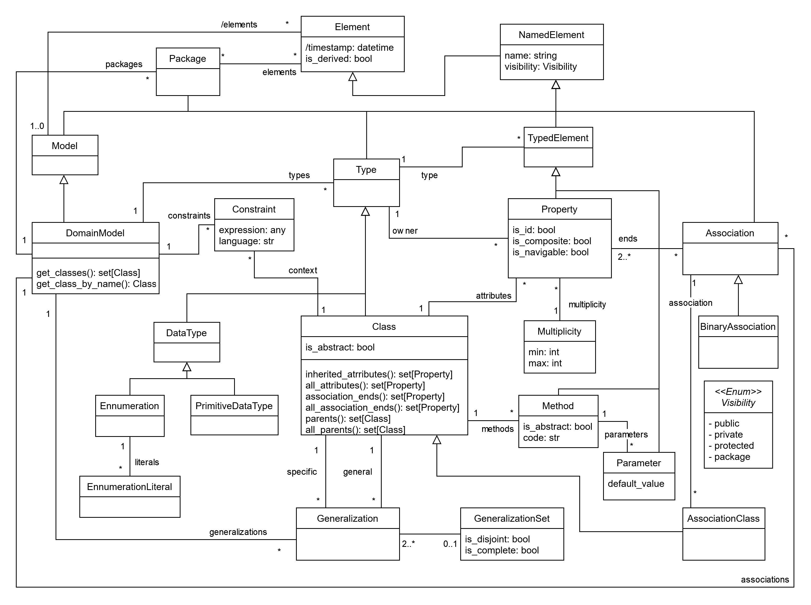

Structural model
================

The structural metamodel enables the specification of a domain model using the typical concepts of a class diagram. 
Elements such as *Classes*, *Properties*, *Associations*, and *Generalizations* can be instantiated to define the static 
structure of a system or application. While this metamodel is rooted in the UML specification, certain modifications and 
additions have been implemented to provide additional modeling capabilities. For instance, the *is_id* attribue 
has been introduced in the *Property* class to specify whether a property serves as an identifier for the instances of that
class, a common need in many code generation scenarios.

.. note::

  This figure contains only the main classes, attributes, and methods of the B-UML language. For a detailed 
  description please refer to the :doc:`API documentation <../../api>`.

Available Data Types
-----------------------

BESSER provides a comprehensive set of primitive data types for modeling. The available types include ``StringType``, 
``IntegerType``, ``FloatType``, ``BooleanType``, ``DateType``, ``TimeType``, ``DateTimeType``, ``TimeDeltaType`` 
and ``AnyType``. These types can be used to define properties and attributes in your structural models.

Supported notations
-------------------

To create a structural model, you can use any of these notations:

* :doc:`Coding in Python Using the B-UML python library <../model_building/buml_core>`
* :doc:`Using PlantUML to design you structural model <../model_building/plantuml_structural>`
* :doc:`Providing an image (e.g., a photo of yor class diagram model) <../model_building/buml_core>`