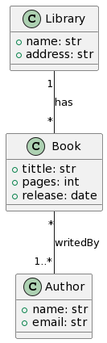

From PlantUML to B-UML
======================

A B-UML model can also be generated from a class model built with `PlantUML <https://plantuml.com/>`_ .
All you need is to provide the textual model (PlantUML) and our T2M transformation will produce the B-UML 
based model, including the source code to build the model, in case you want to modify any part of your model 
that is not possible with PlantUML.

Let's see an example with the classic library model. The textual model writed in PlantUML is shown below.

.. literalinclude:: ../../../tests/library_test/library.plantuml
   :language: console
   :linenos:

And the diagram produced by PlantUML is as follows.

Save the PlantUML textual model in a file, e.g. ``library.plantuml``. (``.txt`` extension is also allowed)

Then, load and process the model using our grammar and apply the transformation to obtain the B-UML based model.

.. code-block:: python

    # Import methods and classes
    from BUML.notations.plantUML import plantuml_to_buml
    from BUML.metamodel.structural import DomainModel

    # PlantUML to B-UML model
    library_buml: DomainModel = plantuml_to_buml(plantUML_model_path='library.plantuml')

.. note::
    
    The ``model_path`` parameter contains the path and name of the ``.plantuml`` model to be transformed

``library_buml`` is the BUML model containing the domain specification. You can look up the classes, attributes, relationships, 
etc. For example, the following is the way to get the class names.

.. code-block:: python

    # Print class names
    for cls in library_buml.get_classes():
        print(cls.name)

You should get output like this:

.. code-block:: console

    Library
    Book
    Author

.. warning::

    Although the PlantUML notation allows the definition of unnamed associations, for the BESSER platform it is necessary that all 
    associations have a unique name.

BUML model source code
----------------------

When you run this PlantUML to BUML transformation, the file ``buml/buml_model.py`` will be created with the python code of your BUML model definition. 
You could directly reuse this code to make quick modifications to your model. For example, you could add more classes, properties, or update the name 
of the ends of an association.

The BUML model source code generated by the transformation from the ``library.plantuml`` model is as follows.

.. literalinclude:: ../../../tests/library_test/buml/buml_model.py
   :language: python
   :linenos: