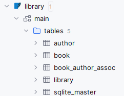
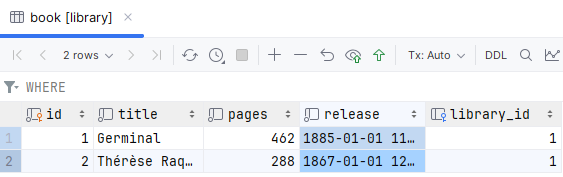

Backend example
==================

This example showcases the BESSER backend generator's capability to produce essential components for a backend service, based on the Library example B-UML model.

The generator creates three primary files, which together form the backbone of the backend system, here's a snippet from the generated files:

``main_api.py``:Contains the REST API endpoints that define how the server responds to client requests:

.. code-block:: python
   
   ############################################
   #   Initialize the database
   ############################################

   SQLALCHEMY_DATABASE_URL = "sqlite:///./Library model.db"
   engine = create_engine(
       SQLALCHEMY_DATABASE_URL, connect_args={"check_same_thread": False}
   )
   SessionLocal = sessionmaker(autocommit=False, autoflush=False, bind=engine)
   Base.metadata.create_all(bind=engine)

   app = FastAPI()

   # Initialize database session
   def get_db():
       database = SessionLocal()
       yield database
       database.close()
   ############################################
   #   Library functions
   ############################################

   @app.get("/book/", response_model=None)
  def get_all_book(database: Session = Depends(get_db)) -> list[Book]:
    book_list = database.query(Book).all()
    return book_list

``sql_alchemy.py``:  This file includes the SQLAlchemy ORM models that map Python classes to database tables:

.. code-block:: python

   class Book(Base):
    __tablename__ = "book"
    id: Mapped[int] = mapped_column(primary_key=True)
    pages: Mapped[int] = mapped_column(Integer)
    title: Mapped[str] = mapped_column(String(100))
    release: Mapped[datetime] = mapped_column(DateTime)

   #--- Foreign keys and relationships of the library table
   Library.has: Mapped[List["Book"]] = relationship("Book", back_populates="locatedIn")

``pydantic_classes.py`` : Comprises Pydantic models for data validation and serialization:

.. code-block:: python

  class BookCreate(BaseModel):
    pages: int
    title: str
    release: datetime
    library_id: int
    authors: Optional[List[Union["AuthorCreate", int]]] = None

After launching the main_api.py file, the server will be up and running, and the client can interact with the backend service through the defined REST API endpoints.
It will create a SQLite database according to the defined models in the sql_alchemy.py file.

After doing POST request to the endpoint, the database will be updated with the new book information:

.. note::
    It is important to note that the generated code is a starting point and can be further customized to meet the specific requirements of the backend service.

