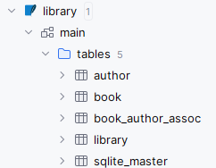
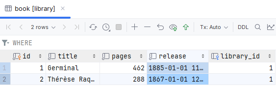

Backend example
==================

This example showcases the BESSER backend generator's capability to produce a layered FastAPI backend service, based on the Library example B-UML model.

The generator creates a structured project under ``output_backend/app/`` with per-entity files for models, schemas, and routers.
Here's a snippet from the generated files:

``app/main.py``: The FastAPI application with middleware, exception handlers, and system endpoints:

.. code-block:: python

   from app.config import API_TITLE, API_DESCRIPTION, API_VERSION, PORT
   from app.database import get_db
   from app.models import *
   from app.routers import all_routers

   app = FastAPI(
       title=API_TITLE,
       description=API_DESCRIPTION,
       version=API_VERSION,
   )

   # Include all entity routers
   for router in all_routers:
       app.include_router(router)

``app/models/book.py``: Per-entity SQLAlchemy ORM model:

.. code-block:: python

   from app.models._base import Base

   class Book(Base):
       __tablename__ = "book"
       id: Mapped[int] = mapped_column(primary_key=True)
       pages: Mapped[int] = mapped_column(Integer)
       title: Mapped[str] = mapped_column(String(100))
       release: Mapped[datetime] = mapped_column(DateTime)

``app/schemas/book.py``: Per-entity Pydantic schema for data validation:

.. code-block:: python

   class BookCreate(BaseModel):
       pages: int
       title: str
       release: datetime
       library_id: int
       authors: Optional[List[Union["AuthorCreate", int]]] = None

``app/routers/book.py``: Per-entity FastAPI router with CRUD endpoints:

.. code-block:: python

   router = APIRouter(prefix="/book", tags=["Book"])

   @router.get("/", response_model=None)
   def get_all_book(database: Session = Depends(get_db)) -> list:
       return database.query(Book).all()

To run the generated backend:

.. code-block:: bash

   cd output_backend
   pip install -r requirements.txt
   python app/main.py

The server will start and create a SQLite database according to the defined models.
The OpenAPI docs are available at ``http://localhost:8000/docs``.

After doing POST request to the endpoint, the database will be updated with the new book information:

.. note::
    It is important to note that the generated code is a starting point and can be further customized to meet the specific requirements of the backend service.

