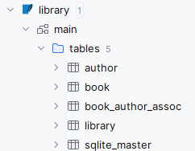
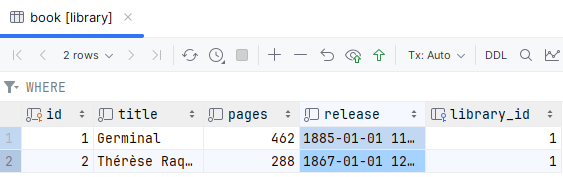

Backend example
==================

This example showcases the BESSER backend generator's capability to produce essential components for a backend service, based on the Library example B-UML model.

The generator creates a modular backend — a slim ``main_api.py`` entry point, one router module
per class under ``routers/``, the shared ``database.py`` session setup, plus the ORM and
validation models. Here's a snippet from the generated files:

``main_api.py``: The FastAPI application entry point that wires in one router per class:

.. code-block:: python

   app = FastAPI(title="Library model API", ...)

   ############################################
   #   Routers
   ############################################

   app.include_router(library_router.router)
   app.include_router(book_router.router)
   app.include_router(author_router.router)

``routers/book.py``: All of the ``Book`` endpoints live in their own router module:

.. code-block:: python

   from database import get_db

   router = APIRouter()

   @router.get("/book/", response_model=None, tags=["Book"])
   def get_all_book(detailed: bool = False, database: Session = Depends(get_db)) -> list:
       book_list = database.query(Book).all()
       return book_list

``database.py``: The shared engine and session setup (the SQLite file defaults to
``data/Library model.db`` and can be overridden with the ``DATABASE_URL`` environment variable):

.. code-block:: python

   def init_db():
       SQLALCHEMY_DATABASE_URL = os.getenv("DATABASE_URL", "sqlite:///./data/Library model.db")
       ...
       SessionLocal = sessionmaker(autocommit=False, autoflush=False, bind=engine)
       Base.metadata.create_all(bind=engine)
       return SessionLocal

``sql_alchemy.py``:  This file includes the SQLAlchemy ORM models that map Python classes to database tables:

.. code-block:: python

   class Book(Base):
    __tablename__ = "book"
    id: Mapped[int] = mapped_column(primary_key=True)
    pages: Mapped[int] = mapped_column(Integer)
    title: Mapped[str] = mapped_column(String(100))
    release: Mapped[datetime] = mapped_column(DateTime)

   #--- Foreign keys and relationships of the library table
   Library.has: Mapped[List["Book"]] = relationship("Book", back_populates="locatedIn")

``pydantic_classes.py`` : Comprises Pydantic models for data validation and serialization:

.. code-block:: python

  class BookCreate(BaseModel):
    pages: int
    title: str
    release: datetime
    library_id: int
    authors: Optional[List[Union["AuthorCreate", int]]] = None

After launching the main_api.py file, the server will be up and running, and the client can interact with the backend service through the defined REST API endpoints.
It will create a SQLite database according to the defined models in the sql_alchemy.py file.

After doing POST request to the endpoint, the database will be updated with the new book information:

.. note::
    It is important to note that the generated code is a starting point and can be further customized to meet the specific requirements of the backend service.

