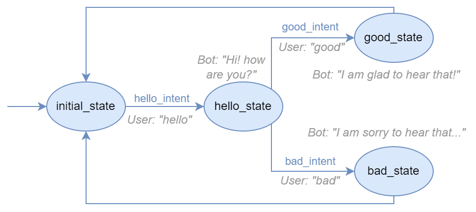

Bot example
===========

This is an example usage of the full process of modeling and generating a bot.

To do it, we need to:

- Create the :any:`bot model <bot-metamodel>`
- Use a code generator (:doc:`BESSER Bot Framework generator <../generators/besser_bot_framework>`)

The next figure shows a diagram of the bot we will implement in this example: a 'greetings bot'.

Creating the bot model
----------------------

.. code-block:: python

    from besser.BUML.metamodel.state_machine.bot import Bot, BotSession
    from besser.BUML.metamodel.state_machine.state_machine import Body, ConfigProperty
    from besser.generators.besser_bot_framework.bbf_generator import BBFGenerator

    bot = Bot('bot')
    bot.add_property(ConfigProperty('websocket_platform', 'websocket.host', 'localhost'))
    bot.add_property(ConfigProperty('websocket_platform', 'websocket.port', 8765))
    bot.add_property(ConfigProperty('websocket_platform', 'streamlit.host', 'localhost'))
    bot.add_property(ConfigProperty('websocket_platform', 'streamlit.port', 5000))

    bot.add_property(ConfigProperty('nlp', 'nlp.language', 'en'))
    bot.add_property(ConfigProperty('nlp', 'nlp.region', 'US'))
    bot.add_property(ConfigProperty('nlp', 'nlp.timezone', 'Europe/Madrid'))
    bot.add_property(ConfigProperty('nlp', 'nlp.pre_processing', True))
    bot.add_property(ConfigProperty('nlp', 'nlp.intent_threshold', 0.4))

    websocket_platform = bot.use_websocket_platform()

    # INTENTS

    hello_intent = bot.new_intent('hello_intent', [
        'hello',
        'hi',
        'whats up?'
    ])

    good_intent = bot.new_intent('good_intent', [
        'good',
        'fine',
    ])

    bad_intent = bot.new_intent('bad_intent', [
        'bad',
        'awful',
    ])

    # STATES

    initial_state = bot.new_state('initial_state', initial=True)
    hello_state = bot.new_state('hello_state')
    good_state = bot.new_state('good_state')
    bad_state = bot.new_state('bad_state')

    # STATES BODIES' DEFINITION + TRANSITIONS

    initial_state.when_intent_matched_go_to(hello_intent, hello_state)

    def hello_body(session: BotSession):
        session.reply('Hi! How are you?')

    hello_state.set_body(Body('hello_body', hello_body))

    hello_state.when_intent_matched_go_to(good_intent, good_state)
    hello_state.when_intent_matched_go_to(bad_intent, bad_state)

    def good_body(session: BotSession):
        session.reply('I am glad to hear that!')

    good_state.set_body(Body('good_body', good_body))
    good_state.go_to(initial_state)

    def bad_body(session: BotSession):
        session.reply('I am sorry to hear that...')

    bad_state.set_body(Body('bad_body', bad_body))

    bad_state.go_to(initial_state)

Generating the bot using the BBF generator
------------------------------------------

.. code-block:: python

    generator = BBFGenerator(bot)
    generator.generate()

Output
------

.. note::
    It is important to note that the generated code is a starting point and can be further customized.

``config.ini``: Contains the bot's configuration properties. When the bot is executed, it will read this file to load all its properties

.. literalinclude:: ../../../tests/generators/besser_bot_framework/output/config.ini
   :linenos:

``<bot-name>.py``: Contains the BBF bot code. As you can see, the generated bot's code is very similar to the model's code.
The syntax of BBF is based on the B-UML metamodel, since it is our implementation of a bot framework. Nevertheless, we could
create other bot generators that use other bot frameworks and therefore the generated code could be different.

.. literalinclude:: ../../../tests/generators/besser_bot_framework/output/bot.py
   :language: python
   :linenos:
