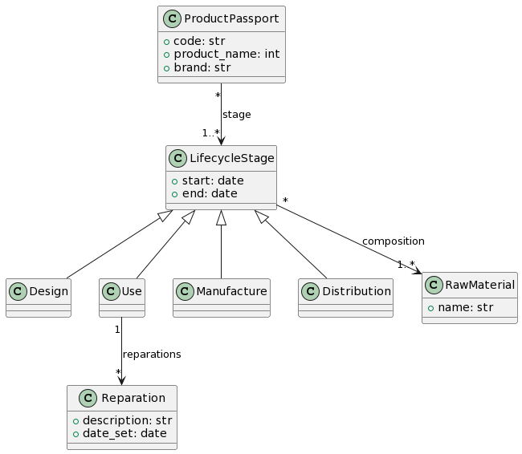
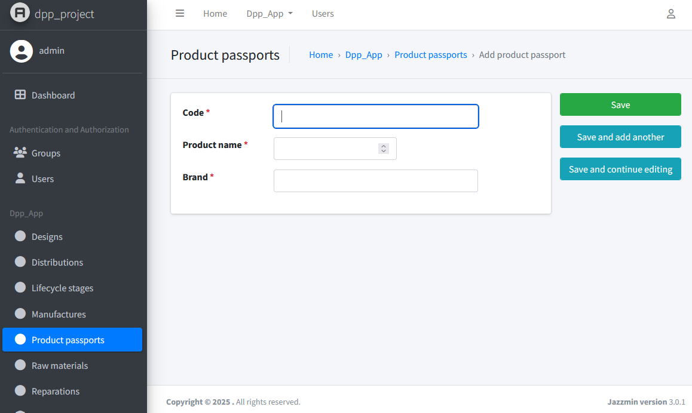

Digital Product Passport (DPP)
==============================

`Digital Product Passport (DPP) <https://hadea.ec.europa.eu/calls-proposals/digital-product-passport_en>`_ is a European 
initiative that seeks to improve the circular economy by optimizing the design, manufacture, and use of products. 
This initiative consists of collecting and disseminating information on products during the different stages of their life cycle.

In this example, we show how from a plantUML model (which describes a reduced DPP domain) it is possible to obtain 
a B-UML model, serialize it, and use it as input to our `Django <https://www.djangoproject.com/>`_ code generator to produce 
the web application for DPP.

The PlantUML model (code and graphic representation) that describes the domain is as follows. Copy this code into a new file and 
store it as ``dpp.plantuml``. 

.. literalinclude:: ../code_eg/dpp/dpp.plantuml
   :language: console
   :linenos:

To transform this PlantUML model to B-UML and use the Django code generator, you can run the following code.

.. literalinclude:: ../code_eg/dpp/dpp.py
   :language: python
   :linenos:

The generated code for the model layer of the Django application will be stored in the ``output/models.py`` file. 
Additionally, the code to define the B-UML model is generated in ``buml/buml_model`` (this code can be used if you
want to modify your model directly from the base code).

Now you can create your Django application and use the generated code. Below is the admin panel of a Django 
web application that uses the code generated for the data layer or model layer.

