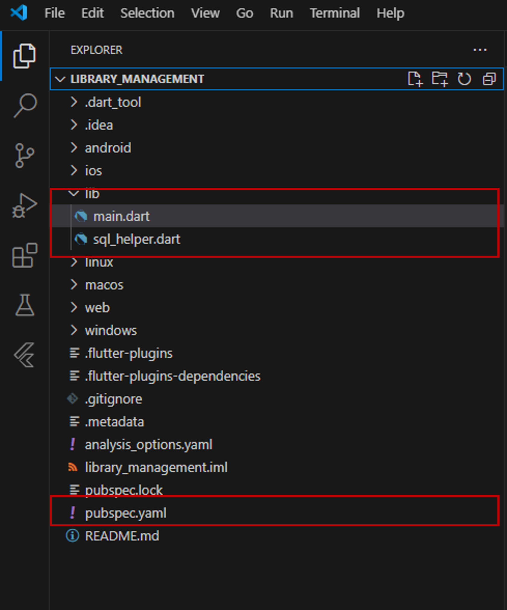

GUI example
=================

To provide clarity on the capabilities of the Flutter Code Generator, we have included an example that demonstrates its usage. This example consists of detailed instructions and code snippets, guiding you through the seamless integration of the generated code into your Flutter application. By following this example, you will gain a solid understanding of how to utilize the code generator effectively.

The example showcases a common domain involving libraries, books, and authors. The :doc:`../examples/library_example` presents a UML diagram illustrating the relationships between these entities. 
Additionally, the Python code for specifying the B-UML model, including classes, attributes, and relationships, is provided in the same section.

The Python code to specify the GUI model, including various elements such as lists, buttons, screens, and view components is presented in the following code. Additionally, the FlutterMainDartGenerator,
FlutterSQLHelperGenerator, and FlutterPubspecGenerator
code generators are implemented in this example (lines 95_102). Running this script will generate the output/ folder with the main.dart, sql_helper.dart, and pubspec.yaml files produced by each of the Generators respectively.

.. literalinclude:: ../../../tests/gui/gui_model.py
   :language: python
   :linenos:

After generating these files, you will need to incorporate them into your Flutter application. 
Please ensure that you create an app with the same name as specified in the GUI model. To do so, follow these steps:

1. Create a new Flutter application with the desired app name.
2. Locate the sql_helper.dart file generated by the Flutter Code Generator.
3. Copy the sql_helper.dart file into the lib folder of your Flutter application.
4.	Locate the existing main.dart file in the lib folder of your Flutter application.
5.	Replace the existing main.dart file with the generated main.dart file from the Flutter Code Generator.
6.	Locate the existing pubspec.yaml file in the root directory of your Flutter application.
7.	Replace the existing pubspec.yaml file with the generated pubspec.yaml file.

After completing these steps, your Flutter application should have the following structure:

