Mobile Application example
==========================

To develop mobile applications with BESSER, you can use our :doc:`Flutter Code Generator <../generators/flutter>`. In the following example
we will create a mobile application for the :doc:`Library example<../examples/library_example>` domain. This example consists of detailed
instructions and code snippets, guiding you through the seamless integration of the generated code into your Flutter application.

The Flutter Code Generator requires two different B-UML models as input: the :doc:`structural<../buml_language/model_types/structural>`
and the :doc:`GUI<../buml_language/model_types/gui>` models.

Input models definition
-----------------------

* Structural model: For the structural model, we will reuse the model defined in our :doc:`Library example<../examples/library_example>`.
* GUI model: the GUI model to define the GUI elements such as lists, buttons, screens, and view components that will interact with our library structural model.
  The following code demonstrates how we connect these models:

.. code-block:: python

  from besser.BUML.metamodel.gui import *

  # The GUI will use the Library structural model classes
  # to create views and handle data operations
  from library import *

  ##################################
  #      GUI model definition      #
  ##################################

  #ViewComponent definition
  viewComponent: ViewComponent=ViewComponent(name="my_component", description= "Detailed Information at a Glance")

  #####  Elements for Library Screen   #####
  # Button4
  libraryAddingButton: Button = Button(name="Library Add Button", description="Add a library", label="", buttonType= ButtonType.FloatingActionButton, actionType= ButtonActionType.Add)

  #LibraryDataSource definition
  datasource_library: DataSourceElement = DataSourceElement(name="Library Data Source", dataSourceClass=library, fields=[library_name, address])

  #Library List definition
  libraryList: DataList=DataList(name="LibraryList", description="A diverse group of libraries", list_sources={datasource_library})

  # Library directory screen definition
  LibraryListScreen: Screen = Screen(name="LibraryListScreen", description="Explore a collection of libraries",
                          x_dpi="x_dpi", y_dpi="y_dpi", screen_size="Small", view_elements={libraryAddingButton, libraryList})

  #####  Elements for Author Screen   #####
  # Button5:
  authorAddingButton: Button = Button(name="Author Add Button", description="Add an author", label="", buttonType= ButtonType.FloatingActionButton, actionType=ButtonActionType.Add)

  #Author DataSource definition
  datasource_author: DataSourceElement = DataSourceElement(name="Author Data Source", dataSourceClass= author, fields=[author_name, email])

  # Author List definition
  authorList: DataList=DataList(name="AuthorList", description="A diverse group of authors", list_sources={datasource_author})

  # Author directory screen definition
  AuthorListScreen: Screen = Screen(name="AuthorListScreen", description="Explore a collection of authors",
                          x_dpi="x_dpi", y_dpi="y_dpi", screen_size="Small", view_elements={authorAddingButton, authorList})

  #####  Elements for Book Screen   #####
  # Button6:
  bookAddingButton: Button = Button(name="Book Add Button", description="Add a book", label="", buttonType= ButtonType.FloatingActionButton, actionType=ButtonActionType.Add)

  #Book DataSource definition
  datasource_book: DataSourceElement = DataSourceElement(name="Book Data Source", dataSourceClass= book, fields=[title, pages, release])

  # Book List definition
  BookList: DataList=DataList(name="BookList", description="A diverse group of books", list_sources={datasource_book})

  # Book directory screen definition
  BookListScreen: Screen = Screen(name="BookListScreen", description="Explore a collection of books",
                          x_dpi="x_dpi", y_dpi="y_dpi", screen_size="Small", view_elements={bookAddingButton, BookList})

  #####  Elements for Home page Screen   #####

  # Button1:
  libraryButton: Button = Button(name="Library List Button", description="Explore the libraries", label="Library List", buttonType= ButtonType.RaisedButton, actionType=ButtonActionType.Navigate, targetScreen=LibraryListScreen)

  # Button2:
  authorButton: Button = Button(name="Author List Button", description="Explore the authors", label="Author List", buttonType= ButtonType.RaisedButton, actionType=ButtonActionType.Navigate, targetScreen=AuthorListScreen)

  # Button3:
  bookButton: Button = Button(name="Book List Button", description="Explore the books", label="Book List", buttonType= ButtonType.RaisedButton, actionType=ButtonActionType.Navigate, targetScreen=BookListScreen)

  # Home page Screen definition
  MyHomeScreen: Screen = Screen(name="Book Library Manager", description="Effortlessly manage your books, libraries, and authors, with the ability to view and update their information.",
                          x_dpi="x_dpi", y_dpi="y_dpi", screen_size="Small", view_elements={libraryButton, authorButton, bookButton}, is_main_page= True)

  # Module definition:
  MyModule: Module = Module(name="module_name", screens={MyHomeScreen, LibraryListScreen, AuthorListScreen, BookListScreen})

  # GUI model definition:
  library_gui_model: GUIModel = GUIModel(name="Library Management", package="com.example.librarymanagement", versionCode="1",
                                 versionName="1.0", description="This is a comprehensive Flutter application for managing a library.",
                                 screenCompatibility=True, modules={MyModule})

Code Generation
---------------

To use the Flutter code generator, simply provide the input models and use the ``generate()`` method, as follows:

.. code-block:: python

  from besser.generators.flutter import FlutterGenerator
  from library import library_model # Structural model
  from gui import library_gui_model, MyHomeScreen # GUI model

  code_gen = FlutterGenerator(model=library_model, gui_model=library_gui_model, main_page=MyHomeScreen)
  code_gen.generate()

The ``output/`` folder with the ``main.dart``, ``sql_helper.dart``, and ``pubspec.yaml`` files will be produced.

Application running
-------------------

After generating these files, you will need to incorporate them into your Flutter application.
Please ensure that you create an app with the same name as specified for the ``GUIModel`` object in the GUI model
(``Library Management`` for this example). To do so, follow these steps:

1. Create a new Flutter application with the desired app name.
2. Locate the ``sql_helper.dart`` file generated by the Flutter Code Generator.
3. Copy the ``sql_helper.dart`` file into the lib folder of your Flutter application.
4. Locate the existing ``main.dart`` file in the lib folder of your Flutter application.
5. Replace the existing ``main.dart`` file with the generated main.dart file from the Flutter Code Generator.
6. Locate the existing ``pubspec.yaml`` file in the root directory of your Flutter application.
7. Replace the existing ``pubspec.yaml`` file with the generated pubspec.yaml file.

After completing these steps, your Flutter application should have the following structure:

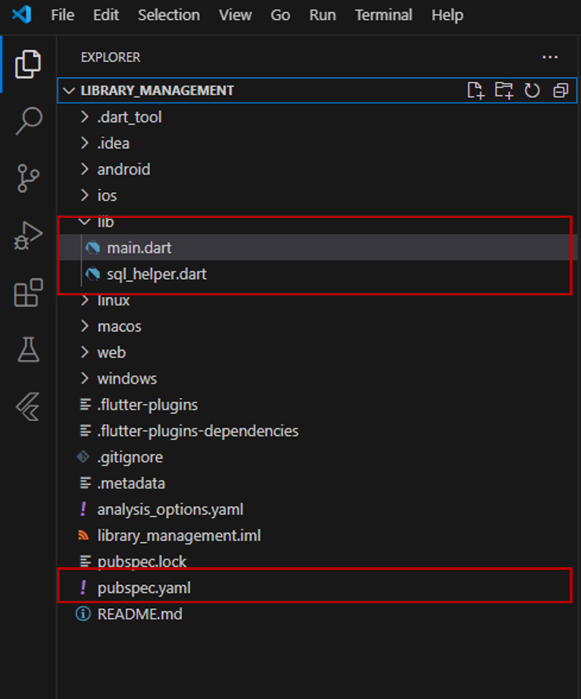

Upon running your Flutter code, the main page of your application should resemble the following figure:

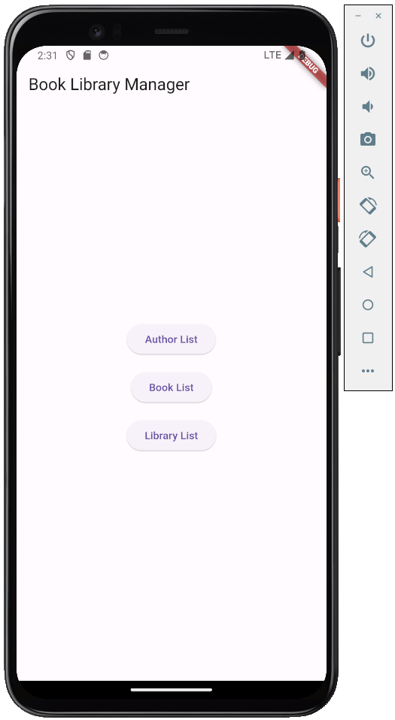

According to the main page specifications, three buttons are present: "Library List," "Author List," and "Book List."
For example, on the "Library Directory" page, you can enter multiple libraries along with their associated information based on the attributes specified in the structural model.
The figure below demonstrates the required steps to enter a library with all its information:

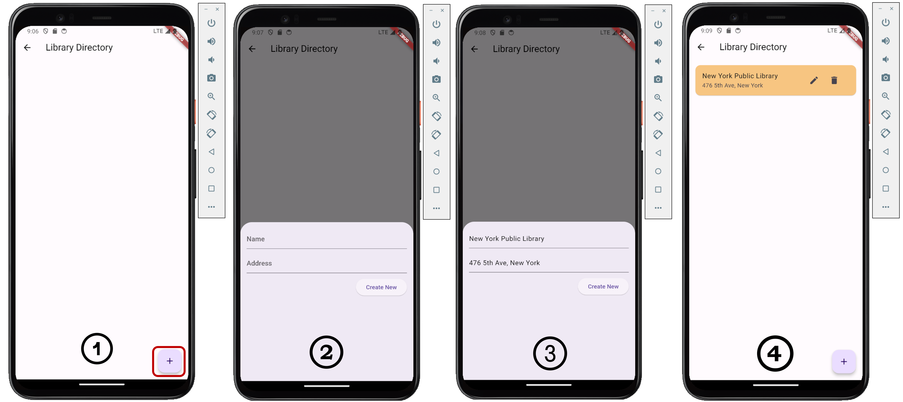

After entering three libraries, the "Library Directory" page would appear as shown below:

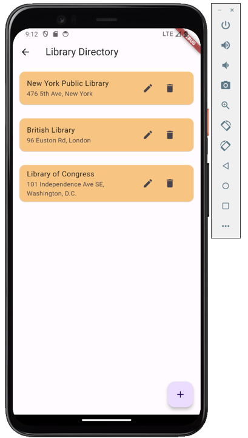

Each library entry is accompanied by two icons: a pen icon for performing update operations and a delete icon for deletion operations.

Similarly, on the "Author Directory" page, you can enter multiple authors along with their respective information.
The figure below showcases the content of this page after entering three authors:

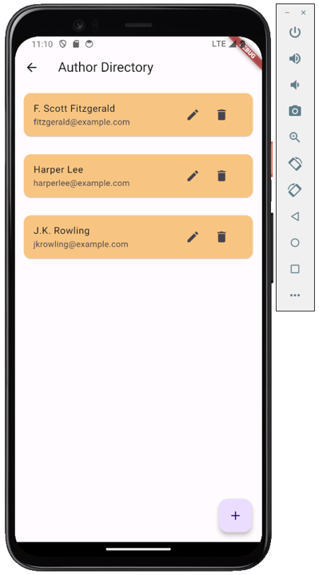

On the "Book Directory" page, you can enter multiple books along with their corresponding information.
The figure below illustrates the steps required to enter a book with the following details: title = "The Great Gatsby", pages = "180", library = "New York Public Library", and author = "F. Scott Fitzgerald".

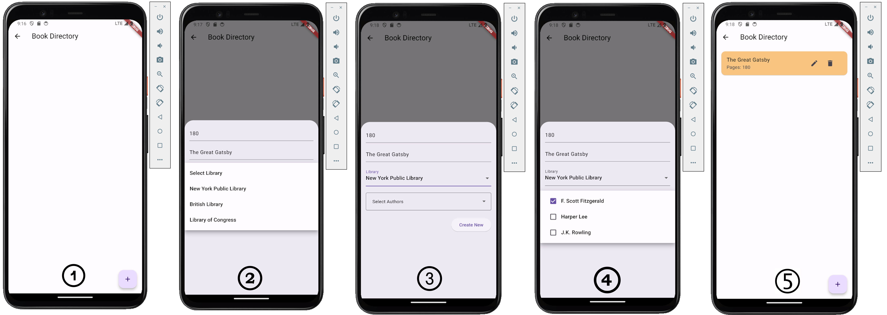

Upon entering three books, the "Book Directory" page would appear as follows:

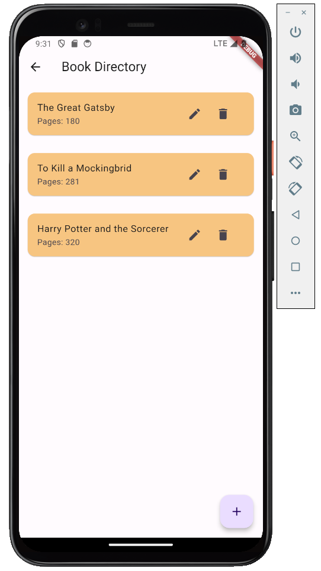

Additionally, you can view the entered elements in the database for the following tables:

"Library" table:

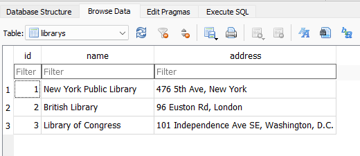

"Author" table:

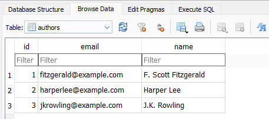

"Book" table:

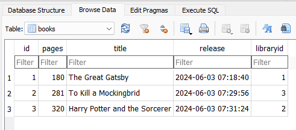

"book_author_assoc" table:

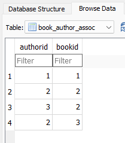
