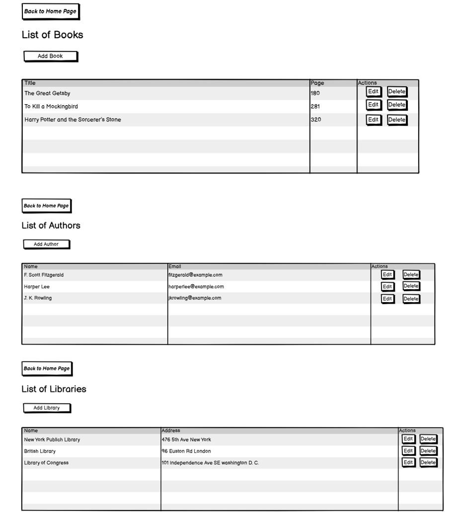
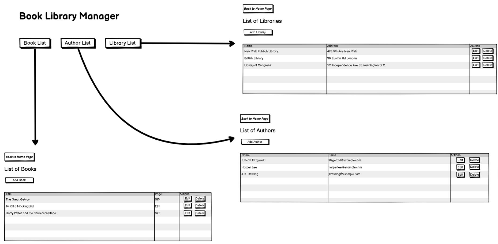

UI Mock-Up to B-UML Example
===========================

To generate B-UML model from UI mock-up(s) using BESSER, you can utilize our :doc:`UI Mock-Up to B-UML Generator <../buml_language/model_building/mockup_to_buml>`.
In this example, we demonstrate the complete process for the :doc:`Library example<../examples/library_example>`, including detailed instructions and generated code snippets to help you effectively utilize the transformer.

Required Input Files
---------------------

The UI Mock-Up to B-UML transformer for applications with multiple pages requires several input files:

1. UI Mock-Ups: For the Library example, we have created three UI mock-ups representing the main pages of the web application:

2. Navigation Image File: For buttons with the action type ``navigation``, users must provide a simple image to illustrate the navigation between pages.
An example navigation image is shown below:

3. Page Order File (.txt): To specify the sequence of pages in the application, users need to provide a simple ``.txt`` file with the following format:

::

    1. Main Page
    2. Book Screen
    3. Author Screen
    4. Library Screen

.. note::

   Create a plain text file that lists the sequence of UI pages in your application.
   This **page order** file guides the transformer by defining the order in which mock-up pages are processed
   and helps construct the navigation flow of the application.

   The first entry in the file should always be the ``main`` page, as it represents the entry point of the UI.
   Based on the navigation structure shown in the image, the other pages — ``author``, ``library``, and ``book`` —
   can appear in **any order** after the main page.

   Valid examples include:

   - ``main, author, library, book``
   - ``main, library, book, author``
   - ``main, book, author, library``

4. Additional Information File (.txt): To define associations between the main concepts of the application, along with their cardinalities, an input ``.txt`` file is required.
For this example, the file contains the following information:

::

    1. Author relates to Book as an association with cardinality '1..1' to '0..*'
       (One author can write zero or more books).
    2. Book relates to Library as an association with cardinality '0..*' to '1..1'
       (Each book is associated with one library, and a library can have multiple books).

Model Generation
------------------

To generate the B-UML model for this example, follow the instructions outlined in the :doc:`UI Mock-Up to B-UML <../buml_language/model_building/mockup_to_buml>` section.
Once all steps are completed:

+ The Structural Model will be generated in the ``output/buml`` folder, organized as follows:

.. code-block:: python

    # Generated B-UML Model
    from besser.BUML.metamodel.structural import (Class, Property, Method, Parameter, BinaryAssociation, Generalization, DomainModel, Enumeration, EnumerationLiteral, Multiplicity, StringType, IntegerType, FloatType, BooleanType, TimeType, DateType, DateTimeType, TimeDeltaType, Constraint)

    # Classes
    Book = Class(name="Book")
    Library = Class(name="Library")
    Author = Class(name="Author")

    # Book class attributes and methods
    Book_title: Property = Property(name="title", type=StringType)
    Book_pageCount: Property = Property(name="pageCount", type=IntegerType)
    Book.attributes = {Book_title, Book_pageCount}

    # Library class attributes and methods
    Library_name: Property = Property(name="name", type=StringType)
    Library_address: Property = Property(name="address", type=StringType)
    Library.attributes = {Library_name, Library_address}

    # Author class attributes and methods
    Author_name: Property = Property(name="name", type=StringType)
    Author_email: Property = Property(name="email", type=StringType)
    Author.attributes = {Author_name, Author_email}

    # Relationships
    writes: BinaryAssociation = BinaryAssociation(name="writes", ends={Property(name="Author", type=Author, multiplicity=Multiplicity(1, 1)), Property(name="Book", type=Book, multiplicity=Multiplicity(0, 9999))})
    contains: BinaryAssociation = BinaryAssociation(name="contains", ends={Property(name="Book", type=Book, multiplicity=Multiplicity(0, 9999)), Property(name="Library", type=Library, multiplicity=Multiplicity(1, 1))})
    employs: BinaryAssociation = BinaryAssociation(name="employs", ends={Property(name="Library", type=Library, multiplicity=Multiplicity(1, 1)), Property(name="Author", type=Author, multiplicity=Multiplicity(0, 9999))})

    # Domain Model
    domain_model = DomainModel(name="Domain Model", types={Book, Library, Author}, associations={writes, contains, employs}, generalizations={})

+ The GUI Model will be generated in the ``output/gui_model`` folder, organized as follows:

.. code-block:: python

    from buml.model import *
    from besser.BUML.metamodel.structural import *
    from besser.BUML.metamodel.gui import *

    # Define data sources
    datasource_author = DataSourceElement(name="Author Data Source", dataSourceClass=Author, fields=[Author_name, Author_email])
    datasource_book = DataSourceElement(name="Book Data Source", dataSourceClass=Book, fields=[Book_title, Book_pageCount])
    datasource_library = DataSourceElement(name="Library Data Source", dataSourceClass=Library, fields=[Library_name, Library_address])

    # Define lists
    authorList = DataList(name="AuthorList", description="A list of authors", list_sources={datasource_author})
    bookList = DataList(name="BookList", description="A list of books", list_sources={datasource_book})
    libraryList = DataList(name="LibraryList", description="A list of libraries", list_sources={datasource_library})

    # Define buttons
    addAuthorButton = Button(name="Add Author Button", description="Add a new author", label="Add Author", buttonType=ButtonType.RaisedButton, actionType=ButtonActionType.Add)
    editAuthorButton = Button(name="Edit Author Button", description="Edit an existing author", label="Edit", buttonType=ButtonType.RaisedButton, actionType=ButtonActionType.OpenForm)
    deleteAuthorButton = Button(name="Delete Author Button", description="Delete an existing author", label="Delete", buttonType=ButtonType.RaisedButton, actionType=ButtonActionType.Delete)
    addBookButton = Button(name="Add Book Button", description="Add a new book", label="Add Book", buttonType=ButtonType.RaisedButton, actionType=ButtonActionType.Add)
    editBookButton = Button(name="Edit Book Button", description="Edit an existing book", label="Edit", buttonType=ButtonType.OutlinedButton, actionType=ButtonActionType.OpenForm)
    deleteBookButton = Button(name="Delete Book Button", description="Delete an existing book", label="Delete", buttonType=ButtonType.OutlinedButton, actionType=ButtonActionType.Delete)
    addLibraryButton = Button(name="Add Library Button", description="Add a new library", label="Add Library", buttonType=ButtonType.RaisedButton, actionType=ButtonActionType.Add)
    editLibraryButton = Button(name="Edit Library Button", description="Edit an existing library", label="Edit", buttonType=ButtonType.TextButton, actionType=ButtonActionType.OpenForm)
    deleteLibraryButton = Button(name="Delete Library Button", description="Delete an existing library", label="Delete", buttonType=ButtonType.TextButton, actionType=ButtonActionType.Delete)

     # Define screens
    AuthorListScreen = Screen(name="AuthorListScreen", description="View and manage authors", x_dpi="x_dpi", y_dpi="y_dpi", screen_size="Medium", view_elements={addAuthorButton, editAuthorButton, deleteAuthorButton, authorList})
    BookListScreen = Screen(name="BookListScreen", description="Screen displaying a list of books", x_dpi="x_dpi", y_dpi="y_dpi", screen_size="Medium", view_elements={addBookButton, editBookButton, deleteBookButton, bookList})
    LibraryListScreen = Screen(name="LibraryListScreen", description="Screen displaying list of libraries", x_dpi="x_dpi", y_dpi="y_dpi", screen_size="Medium", view_elements={addLibraryButton, editLibraryButton, deleteLibraryButton, libraryList})

    # Define navigation buttons
    authorListButton = Button(name="Author List Button", description="Navigate to Author List", label="Author List", buttonType=ButtonType.TextButton, actionType=ButtonActionType.Navigate, targetScreen=AuthorListScreen)
    bookListButton = Button(name="Book List Button", description="Navigate to Book List", label="Book List", buttonType=ButtonType.TextButton, actionType=ButtonActionType.Navigate, targetScreen=BookListScreen)
    libraryListButton = Button(name="Library List Button", description="Navigate to Library List", label="Library List", buttonType=ButtonType.TextButton, actionType=ButtonActionType.Navigate, targetScreen=LibraryListScreen)

    # Define home screen
    MyHomeScreen = Screen(name="Book Library Manager", description="Effortlessly manage your books, libraries, and authors, with the ability to view and update their information.", x_dpi="x_dpi", y_dpi="y_dpi", screen_size="Small", view_elements={authorListButton, bookListButton, libraryListButton})

    # Define module and application
    MyModule = Module(name="module_name", screens={MyHomeScreen, LibraryListScreen, AuthorListScreen, BookListScreen})
    gui_model = GUIModel(name="Library Management", package="com.example.librarymanagement", versionCode="1", versionName="1.0", description="This is a comprehensive application for managing a library.", screenCompatibility=True, modules={MyModule})

By adhering to these instructions, you can seamlessly create both Structural and GUI models for your application.
You can then use these models to build a Django web application.

To learn how to utilize this generator for Django web development, refer to the :doc:` Django Web App Generator<../generators/django>`.
