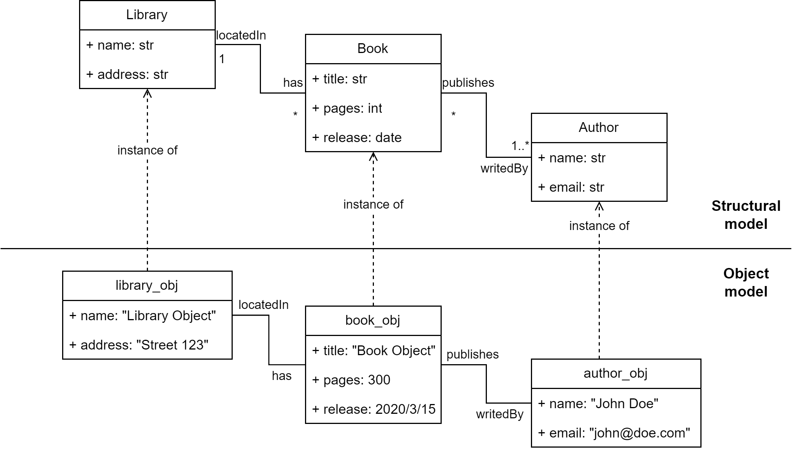

Object model example
====================

This example present the Python code to specify a model (illustrated in the following figure) consisting of a 
:doc:`../buml_language/model_types/structural` and a :doc:`../buml_language/model_types/object`.

The Python code to specify the structural and object models (using the B-UML libraries) is presented below., including its classes, attributes, and relationships, is presented in the following
code (lines 1-44).

.. literalinclude:: ../../../tests/BUML/metamodel/object/library_object.py
   :language: python
   :linenos:
