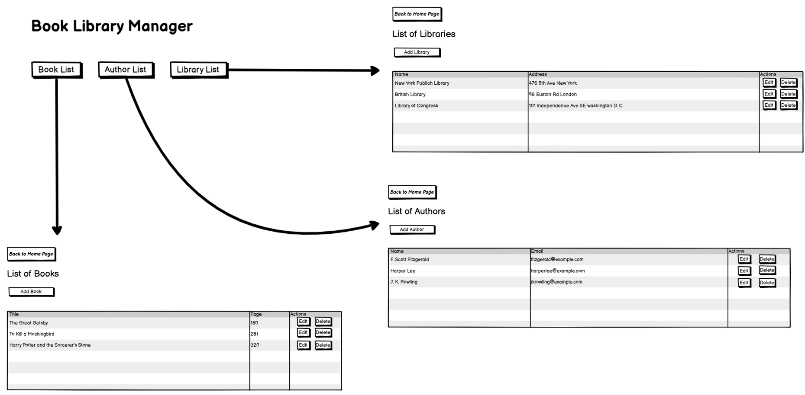

Source Code to B-UML Example
===========================

To generate B-UML models directly from source code using BESSER, you can use the
:doc:`Source Code to B-UML Generator <../buml_language/model_building/source_code_to_buml>`.

In this example, we demonstrate the complete transformation pipeline using a :doc:`Library example<../examples/library_example>`.
The example covers both **single-page** and **multi-page** scenarios and includes the required inputs,
processing steps, and generated outputs to help you effectively use the generator.

Required Input Files
--------------------

Depending on whether the application consists of a single page or multiple pages,
the Source Code to B-UML pipeline requires the following inputs.

1. Source Code Files
~~~~~~~~~~~~~~~~~~~

Place the source code files (e.g., ``.html``, ``.css``) inside a single folder.
For the Library example, the folder contains the source code corresponding to the main pages
of the web application. In this example, we include a fragment of HTML
code corresponding to the book page:

.. code-block:: html
   :linenos:

   <!-- Add Book Modal -->
   

     

       <h2 class="text-xl font-bold mb-4 text-gray-800">Add Book</h2>
     

   

   <!-- Book Table -->
   <table class="min-w-full shadow-md rounded-lg overflow-hidden border bg-white">
     <thead class="bg-[#0C4B33] text-white">
       <tr>
         <th class="w-1/3 text-left py-3 px-4 uppercase font-semibold text-sm">Title</th>
         <th class="w-1/3 text-left py-3 px-4 uppercase font-semibold text-sm">Pages</th>
         <th class="text-left py-3 px-4 uppercase font-semibold text-sm">Actions</th>
       </tr>
     </thead>
     <tbody>
       <tr class="border-b hover:bg-gray-100 transition">
         <td class="w-1/3 text-left py-3 px-4">The Great Gatsby</td>
         <td class="w-1/3 text-left py-3 px-4">180</td>
         <td class="flex gap-5 py-3 px-4">
           <a href="edit_book.html"
              class="font-bold py-2 px-4 rounded-lg bg-blue-500 text-white hover:bg-blue-600 transition">
             Edit
           </a>
           <a href="#"
              class="font-bold py-2 px-4 rounded-lg bg-red-500 text-white hover:bg-red-600 transition">
             Delete
           </a>
         </td>
       </tr>

       <tr class="border-b hover:bg-gray-100 transition">
         <td class="w-1/3 text-left py-3 px-4">The Pragmatic Programmer</td>
         <td class="w-1/3 text-left py-3 px-4">352</td>
         <td class="flex gap-5 py-3 px-4">
           <a href="edit_book.html"
              class="font-bold py-2 px-4 rounded-lg bg-blue-500 text-white hover:bg-blue-600 transition">
             Edit
           </a>
           <a href="#"
              class="font-bold py-2 px-4 rounded-lg bg-red-500 text-white hover:bg-red-600 transition">
             Delete
           </a>
         </td>
       </tr>
     </tbody>
   </table>

2. Navigation Image File (Optional – Multi-page Only)
~~~~~~~~~~~~~~~~~~~~~~~~~~~~~~~~~~~~~~~~~~~~~~~~~~~~~

For multi-page applications, buttons with navigation-related actions require a **navigation image**
that visually describes page transitions.

An example navigation image is shown below:

3. Page Order File (.txt) (Multi-page Only)
~~~~~~~~~~~~~~~~~~~~~~~~~~~~~~~~~~~~~~~~~~~

To define the execution and navigation order of pages, provide a plain text file with
the following format:

::

    1. Main Page
    2. Book Screen
    3. Author Screen
    4. Library Screen

.. note::

   The first entry must always represent the **main (entry) page** of the application.
   The remaining pages can appear in any order, as long as they are consistent with
   the navigation structure.

   Valid examples include:

   - ``main, author, library, book``
   - ``main, library, book, author``
   - ``main, book, author, library``

4. Additional Information File (.txt) (Optional – Multi-page Only)
~~~~~~~~~~~~~~~~~~~~~~~~~~~~~~~~~~~~~~~~~~~~~~~~~~~~~~~~~~~~~~~~~

To enrich the structural model with domain semantics, you may provide an additional
text file describing associations and cardinalities between core concepts.

Example content:

::

    1. Author relates to Book as an association with cardinality '1..1' to '0..*'
       (One author can write zero or more books).
    2. Book relates to Library as an association with cardinality '0..*' to '1..1'
       (Each book belongs to one library, and a library can contain multiple books).

Model Generation
----------------

Follow the instructions described in the
:doc:`Source Code to B-UML <../buml_language/model_building/source_code_to_buml>` section
to execute the pipeline.

Once the process completes, the following artifacts are generated:

Structural B-UML Model
~~~~~~~~~~~~~~~~~~~~~~

The Structural B-UML model is generated in the ``output/buml`` directory.

.. code-block:: python
   :linenos:

   # Generated B-UML Model
   from besser.BUML.metamodel.structural import *

   # Classes
   Library = Class(name="Library")
   Book = Class(name="Book")
   Author = Class(name="Author")

   # Library class attributes
   Library_name: Property = Property(name="name", type=StringType)
   Library_address: Property = Property(name="address", type=StringType)
   Library.attributes = {Library_address, Library_name}

   # Book class attributes
   Book_title: Property = Property(name="title", type=StringType)
   Book_pages: Property = Property(name="pages", type=IntegerType)
   Book.attributes = {Book_title, Book_pages}

   # Author class attributes
   Author_name: Property = Property(name="name", type=StringType)
   Author_email: Property = Property(name="email", type=StringType)
   Author.attributes = {Author_email, Author_name}

   # Relationships
   contains: BinaryAssociation = BinaryAssociation(
       name="contains",
       ends={
           Property(name="Library", type=Library, multiplicity=Multiplicity(1, 1)),
           Property(name="Book", type=Book, multiplicity=Multiplicity(0, 9999))
       }
   )

   authoredBy: BinaryAssociation = BinaryAssociation(
       name="authoredBy",
       ends={
           Property(name="Book", type=Book, multiplicity=Multiplicity(0, 9999)),
           Property(name="Author", type=Author, multiplicity=Multiplicity(1, 1))
       }
   )

   # Domain Model
   domain_model = DomainModel(
       name="DomainModel",
       types={Library, Book, Author},
       associations={contains, authoredBy},
       generalizations={},
       metadata=None
   )

GUI Model
~~~~~~~~~

The IFML-like GUI model is generated in the ``output/gui_model`` directory.

.. code-block:: python

    from besser.BUML.metamodel.gui import *
    from buml.model import *
    from besser.BUML.metamodel.structural import *

    # Define styling for buttons and lists
    buttonSize = Size(width="120", height="40", padding="10", unit_size="px")
    buttonPosition = Position(type="relative", z_index=10)
    addButtonStyling = Styling(size=buttonSize, position=buttonPosition, color=Color(background_color="#4B0C38", text_color="#FFFFFF", border_color=""))
    editButtonStyling = Styling(size=buttonSize, position=buttonPosition, color=Color(background_color="#3B82F6", text_color="#FFFFFF", border_color=""))
    deleteButtonStyling = Styling(size=buttonSize, position=buttonPosition, color=Color(background_color="#EF4444", text_color="#FFFFFF", border_color=""))
    listStyling = Styling(size=Size(width="100%", height="auto", padding="10px"), position=Position(type="relative", top="50px", left="20px"), color=Color(background_color="#F8F9FA", text_color="#343A40", border_color=""))

    # Define screen layout
    screenLayout = Layout(type=LayoutType.Flex, orientation="vertical", gap="15px", alignment=JustificationType.Center)

    # Define data sources
    datasource_author = DataSourceElement(name="Author Data Source", dataSourceClass=Author, fields=[Author_name, Author_email])
    datasource_book = DataSourceElement(name="Book Data Source", dataSourceClass=Book, fields=[Book_title, Book_pages])
    datasource_library = DataSourceElement(name="Library Data Source", dataSourceClass=Library, fields=[Library_name, Library_address])

    # Define lists
    authorList = DataList(name="AuthorList", description="A list of authors", list_sources={datasource_author}, styling=listStyling)
    bookList = DataList(name="BookList", description="A list of books", list_sources={datasource_book}, styling=listStyling)
    libraryList = DataList(name="LibraryList", description="A list of libraries", list_sources={datasource_library}, styling=listStyling)

    # Define buttons
    addAuthorButton = Button(name="Add Author Button", description="Add a new author", label="Add Author", buttonType=ButtonType.RaisedButton, actionType=ButtonActionType.Add, styling=addButtonStyling)
    editAuthorButton = Button(name="Edit Author Button", description="Edit an existing author", label="Edit", buttonType=ButtonType.RaisedButton, actionType=ButtonActionType.OpenForm, styling=editButtonStyling)
    deleteAuthorButton = Button(name="Delete Author Button", description="Delete an existing author", label="Delete", buttonType=ButtonType.RaisedButton, actionType=ButtonActionType.Delete, styling=deleteButtonStyling)
    addBookButton = Button(name="Add Book Button", description="Add a new book", label="Add Book", buttonType=ButtonType.RaisedButton, actionType=ButtonActionType.Add, styling=addButtonStyling)
    editBookButton = Button(name="Edit Book Button", description="Edit an existing book", label="Edit", buttonType=ButtonType.OutlinedButton, actionType=ButtonActionType.OpenForm, styling=editButtonStyling)
    deleteBookButton = Button(name="Delete Book Button", description="Delete an existing book", label="Delete", buttonType=ButtonType.OutlinedButton, actionType=ButtonActionType.Delete, styling=deleteButtonStyling)
    addLibraryButton = Button(name="Add Library Button", description="Add a new library", label="Add Library", buttonType=ButtonType.RaisedButton, actionType=ButtonActionType.Add, styling=addButtonStyling)
    editLibraryButton = Button(name="Edit Library Button", description="Edit an existing library", label="Edit", buttonType=ButtonType.TextButton, actionType=ButtonActionType.OpenForm, styling=editButtonStyling)
    deleteLibraryButton = Button(name="Delete Library Button", description="Delete an existing library", label="Delete", buttonType=ButtonType.TextButton, actionType=ButtonActionType.Delete, styling=deleteButtonStyling)

     # Define screens
    AuthorListScreen = Screen(name="AuthorListScreen", description="View and manage authors", x_dpi="x_dpi", y_dpi="y_dpi", screen_size="Medium", view_elements={addAuthorButton, editAuthorButton, deleteAuthorButton, authorList}, layout=screenLayout)
    BookListScreen = Screen(name="BookListScreen", description="Screen displaying a list of books", x_dpi="x_dpi", y_dpi="y_dpi", screen_size="Medium", view_elements={addBookButton, editBookButton, deleteBookButton, bookList}, layout=screenLayout)
    LibraryListScreen = Screen(name="LibraryListScreen", description="Screen displaying list of libraries", x_dpi="x_dpi", y_dpi="y_dpi", screen_size="Medium", view_elements={addLibraryButton, editLibraryButton, deleteLibraryButton, libraryList}, layout=screenLayout)

    # Define navigation buttons
    authorListButton = Button(name="Author List Button", description="Navigate to Author List", label="Author List", buttonType=ButtonType.TextButton, actionType=ButtonActionType.Navigate, targetScreen=AuthorListScreen)
    bookListButton = Button(name="Book List Button", description="Navigate to Book List", label="Book List", buttonType=ButtonType.TextButton, actionType=ButtonActionType.Navigate, targetScreen=BookListScreen)
    libraryListButton = Button(name="Library List Button", description="Navigate to Library List", label="Library List", buttonType=ButtonType.TextButton, actionType=ButtonActionType.Navigate, targetScreen=LibraryListScreen)

    # Define home screen
    MyHomeScreen = Screen(name="Book Library Manager", description="Effortlessly manage your books, libraries, and authors, with the ability to view and update their information.", x_dpi="x_dpi", y_dpi="y_dpi", screen_size="Small", view_elements={authorListButton, bookListButton, libraryListButton})

    # Define module and application
    MyModule = Module(name="module_name", screens={MyHomeScreen, LibraryListScreen, AuthorListScreen, BookListScreen})
    gui_model = GUIModel(name="Library Management", package="com.example.librarymanagement", versionCode="1", versionName="1.0", description="This is a comprehensive application for managing a library.", screenCompatibility=True, modules={MyModule})

Next Steps
----------

By following this example, you can automatically derive both **Structural** and **GUI**
B-UML models directly from source code.

These models can then be used to generate a fully functional web application.
To learn how to do this, refer to the
:doc:`Django Web App Generator <../generators/django>`.
