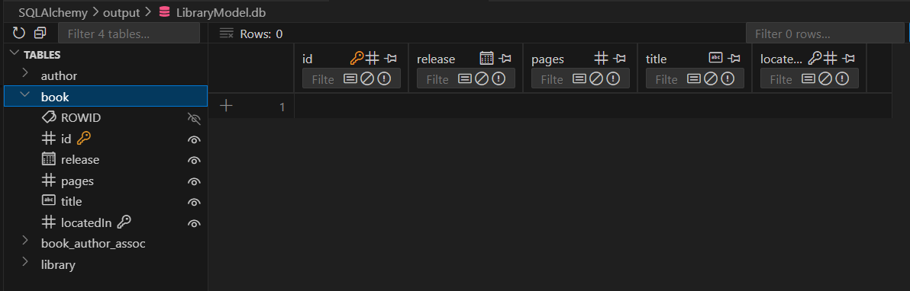

SQLAlchemy Generator
====================

BESSER provides a code generator that creates `SQLAlchemy <https://www.sqlalchemy.org/>`_ models to 
define the structure of a relational database. This structure (known as 
`Declarative Mapping <https://docs.sqlalchemy.org/en/20/orm/mapping_styles.html#orm-declarative-mapping>`_) 
defines the database metadata (using a Python object model) that will represent the input structural B-UML model.

Now, let's generate the code for SQLAlchemy of our :doc:`../examples/library_example`. 
For this, you should create the generator, provide the :doc:`../buml_language/model_types/structural`, and use 
the ``generate`` method as follows:

.. code-block:: python
    
    from besser.generators.sql_alchemy import SQLAlchemyGenerator
    
    generator: SQLAlchemyGenerator = SQLAlchemyGenerator(model=library_model)
    generator.generate(dbms="sqlite")

The ``dbms`` parameter specifies the target database management system. 
In this example, we use ``sqlite``, but you can also specify ``postgresql``, ``mysql``, ``mssql``, or ``mariadb``.

Generated Output
----------------

The ``sql_alchemy.py`` file will be generated inside the ``<<current_directory>>/output`` 
folder and it will look as follows.

.. literalinclude:: ../../../tests/BUML/metamodel/structural/library/output/sql_alchemy.py
   :language: python
   :linenos:

Creating the Database
---------------------

The generated code contains the SQLAlchemy classes that represent the database metadata. If you are using SQLite as DBMS,
you can create the database and the tables by running the file as follows:

.. code-block:: bash

    python sql_alchemy.py

This will create a SQLite database named ``Librarymodel.db`` in the same directory where the file is executed. The database
looks like this:

.. note::

  If you want to use another DBMS such as ``postgresql`` or ``mysql``, you should change the connection string in the 
  generated code, providing the necessary information to connect to the database: username, password, host, port, and database name.