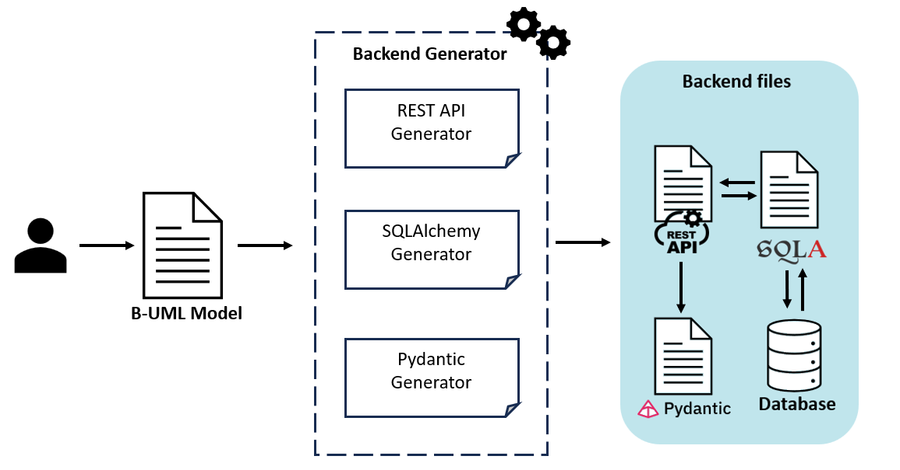

Backend Generator
=====================

BESSER provides a code generator for backend services, utilizing the FastAPI framework, SQL Alchemy for database interactions,
and Pydantic for data validation. This tool enables developers to seamlessly transform classes and relationships defined in a B-UML model 
into a fully functional backend service.

The BESSER backend generator streamlines the development process by leveraging multiple specialized generators within the BESSER suite to automatically produce:

- **A RESTful API Service**: Utilizes the BESSER REST API Generator to create dynamic, scalable API endpoints.
- **Database Models**: Integrates BESSER's SQL Alchemy Generator to construct efficient ORM-based models for database interactions.
- **Data Validation Models**: Employs BESSER's Pydantic Generator to ensure that data conforms to the defined schemas, enhancing the integrity and security of the backend.

To generate the complete backend for a B-UML model, follow the steps below. The example uses the ``library`` example B-UML model as a reference.

.. code-block:: python
    
    from besser.generators.backend import BackendGenerator
    
    backend = BackendGenerator(model=library_model, http_methods=['GET', 'POST', 'PUT', 'DELETE'], nested_creations = True, docker_image = True)
    backend.generate()

You can customize the code generation patterns by selecting specific HTTP methods such as ``GET``, ``POST``, ``PUT``, and ``DELETE``.
This selection allows for targeted code generation tailored to only the necessary components of the API.
If specified in the B-UML model with read_only attributes, the generator will automatically exclude the ``PUT`` and ``DELETE`` methods.
Additionally, the ``nested_creations`` parameter configures how the API manages entity relationships in requests. If set to True, the API allows both 
the linking of existing entities via identifiers and the nested creation of new entities. If set to False, the API only permits linking existing 
entities using their identifiers. The default setting is False, which restricts the functionality to linking by identifiers. Finally, the 
``docker_image`` parameter is there to assist you in `creating a Docker image <#docker-image-generation>`_ for your application.

Invoke the generate method to produce the backend code.The generated files will be placed in the ``<<current_directory>>/output_backend``.
This method will generate several files:

   + ``main_api.py``: Contains the REST API endpoints.
   + ``sql_alchemy.py``: Includes SQL Alchemy database models.
   + ``pydantic_classes.py``: Consists of Pydantic validation models.
   + ``database.db``: A SqlLite database file.

The REST API communicates with the database through SQLAlchemy, and Pydantic validates the data before it's sent or after it's received by the REST API.
This setup encapsulates a modern backend architecture where each piece serves a specific role in data handling and processing.
When you run the code generated, a SqlLite database and the OpenAPI specifications will be generated.

We have an example demonstrating how this generator works, which you can find here: :doc:`../examples/backend_example`.
This example showcases the usage of the Backend Generator with our :doc:`../examples/library_example` Example, illustrating its application in generating a fully functional backend from a B-UML model.

Docker Image Generation
-----------------------
The Backend Generator offers the ``docker_image`` boolean parameter, designed to streamline the creation and uploading of Docker images for the generated backend. When 
you set this parameter to *True*, you have two options for creating your image:

1. Automated DockerHub Integration
^^^^^^^^^^^^^^^^^^^^^^^^^^^^^^^^^^
Our code generator can create and upload the Docker image to your `DockerHub <https://hub.docker.com>`_ in one step. Provide a configuration file through the ``docker_config_file`` parameter, which 
enables the generator to automatically create and upload the image in your DockerHub accout using the provided configurations.

To create the configuration file, use the following template and save it as a .conf file:

.. code-block:: ini
    
    [DEFAULT]
    docker_username = dockerhub_username
    docker_password = dockerhub_password
    docker_image_name = image_name
    docker_repository = dockerhub_repository
    docker_tag = image_tag
    docker_port = port

2. Custom Dockerfile Generation
^^^^^^^^^^^^^^^^^^^^^^^^^^^^^^^
The second option is to generate the Dockerfile with the instructions to create your Docker image and then run it yourself to build the image and upload it to 
your repository. To follow this option, just don't use the ``docker_image_file`` parameter in the code generator. BESSER will then assume that you will handle 
running the Dockerfile and uploading the image to the repository yourself.

The generator will create two files:

- ``Dockerfile``: Contains the necessary instructions to build the Docker image.
- ``create_docker_image.py``: A Python script that automates the process of building and uploading the Docker image.

By providing this script and the Dockerfile, users can build and upload their Docker images by executing the script with their DockerHub credentials.

.. warning::
   
   If you use the generator to generate and load the Docker image in DockerHub, you must make sure you have a Docker engine installed on your computer. 
   For example `Docker desktop <https://www.docker.com/products/docker-desktop>`_.
