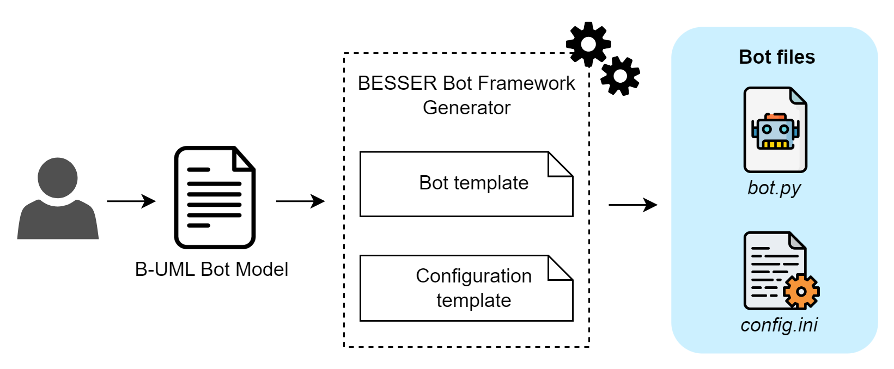

BESSER Bot Framework Generator
==============================

This code generator takes as input a :any:`bot model <bot-metamodel>` and generates a `BBF <https://github.com/BESSER-PEARL/BESSER-Bot-Framework>`_ bot.

The generated code consists of a python script containing the bot implementation with BBF and a *.ini* file containing all
the  configuration properties of the bot. When the bot is executed, it reads this file to load all its properties.

We only need to provide the :any:`bot model <bot-metamodel>` to a :class:`BBFGenerator <besser.generators.besser_bot_framework.bbf_generator.BBFGenerator>` as follows:

.. code-block:: python

    from besser.generators.besser_bot_framework.bbf_generator import BBFGenerator

    generator = BBFGenerator(model=bot)
    generator.generate()

The bot files will be generated in the ``<<current_directory>>/output`` folder. Check the :doc:`example bot <../examples/bot_example>` to see a real bot generation.

.. note::

  You need to install BBF in order to use the generated bots. To do it, simply:

  ``pip install besser-bot-framework``

  More details in the official `BBF documentation <https://besserbot-framework.readthedocs.io/>`_
