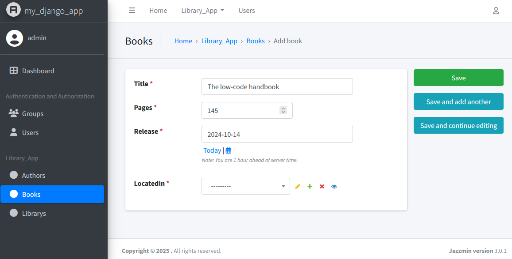

Django Generator
================

BESSER provides a code generator for `Django web applications <https://www.djangoproject.com/>`_.
Let's generate a Django web app taking as input our :doc:`../examples/library_example` structural model example.
The following is an example of how to implement the code generator:

.. code-block:: python
    
    from besser.generators.django import DjangoGenerator
    
    generator: DjangoGenerator = DjangoGenerator(model=library_model,
                                                project_name="my_django_app",
                                                app_name="library_app",
                                                containerization=False)
    generator.generate()

The configuration parameters for the `DjangoGenerator` are as follows:

- **model**: The structural model to be used for generating the Django application.
- **project_name**: The name of the Django project to be created.
- **app_name**: The name of the Django app to be created within the project.
- **containerization**: A boolean flag indicating whether to generate containerization files to deploy the app using containers.

Different files will be generated in the folder ``<<current_directory>>/<<project_name>>`` including `models.py`, 
`settings.py`, `admin.py`, etc.

How to Run the Web Application
------------------------------

There are two ways to excecute the web application, depending on how the `containerization` parameter was configured in the code 
generator. Follow the steps below based on your setup:

1. If containerization is set to `False`
~~~~~~~~~~~~~~~~~~~~~~~~~~~~~~~~~~~~~~~~

**Requirement**: Python 3.12 or higher

Enter the project folder and run the following commands:

.. code-block:: bash
    
    # Install the dependencies
    pip install -r requirements.txt  

    # Prepare the database
    python manage.py makemigrations  
    python manage.py migrate  

    # Create a superuser account
    python manage.py createsuperuser  

    # Start the development server
    python manage.py runserver  

2. If containerization is set to `True`
~~~~~~~~~~~~~~~~~~~~~~~~~~~~~~~~~~~~~~~

**Requirement**: `Docker Compose <https://docs.docker.com/compose/>`_

Enter the project folder and run this command:

.. code-block:: bash
    
    # Run docker-compose
    docker-compose up  

Accessing the Admin Panel
~~~~~~~~~~~~~~~~~~~~~~~~~

Once the application is running, you can access the admin panel by opening a browser and navigating to:

**http://localhost:8000/admin**

- **If containerized**: The default username and password are both ``admin``.
- **If not containerized**: Use the username and password you set during step 1 (``createsuperuser``).

