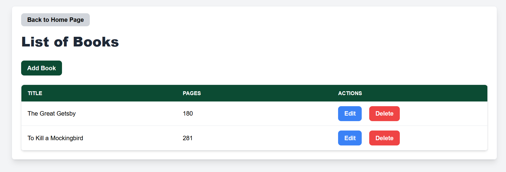
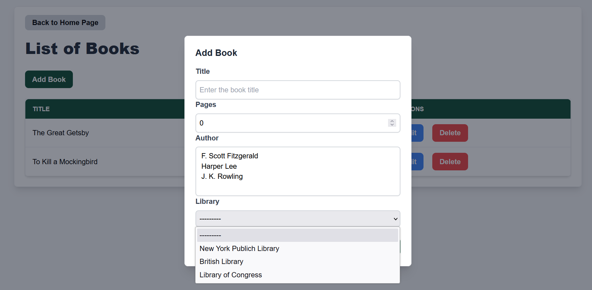

Django Generator
================

BESSER provides a code generator for `Django web applications <https://www.djangoproject.com/>`_.
You can create the application in two ways:

1. **Minimal Django Web App:** A Django application with database models and CRUD functionality, accessible via Django’s admin panel.
2. **Full Django Web App:** a full Django application with predefined user interfaces, including forms and templates.

1. Minimal Django Web App
-------------------------
This approach creates a Django application with database models and basic CRUD functionality. It does not generate custom UI
components beyond Django’s built-in admin panel.

**B-UML Model required**

- :doc:`../buml_language/model_types/structural`: This model defines the data structure (classes, relationships, and attributes) that will be used to generate the Django application.

**Getting started**

Let's generate a Django web app taking as input our :doc:`../examples/library_example`.
Below is an example of how to implement the code generator with Python (alternatively,
you can use the :doc:`../web_editor` to generate the code):

.. code-block:: python

    from besser.generators.django import DjangoGenerator

    generator: DjangoGenerator = DjangoGenerator(model=library_model,
                                                project_name="my_django_app",
                                                app_name="library_app",
                                                containerization=False)
    generator.generate()

**Configuration Parameters**

- ``model``: The structural model to be used for generating the Django application.
- ``project_name``: The name of the Django project to be created.
- ``app_name``: The name of the Django app to be created within the project.
- ``containerization``: A boolean flag to enable/disable containerization for deployment.

**Output**

After running the generator, the following files will be created:

- A project folder containing essential Django files such as `settings.py`, `urls.py`, etc.
- An application folder including `models.py` and `admin.py`.
- `manage.py` and `requirements.txt` for managing the application.

If `containerization=True`, the following files will also be generated for Docker deployment:

- `docker-compose.yml`
- `Dockerfile`
- `entrypoint.sh`

To run the application, follow the steps in :ref:`deploy`.

2. Full Django Web App
----------------------
This approach generates a fully functional Django application with both database models and
predefined UI components (forms, templates, views, etc.).

**B-UML Models required**

- :doc:`../buml_language/model_types/structural`: This model defines the data structure (classes, relationships, and attributes) that will be used to generate the Django application.

- :doc:`../buml_language/model_types/gui`: Specifies the user interface components (forms, layouts, navigation) that will be generated as part of the application.

**Getting Started**

To generate a Django web app using this approach, follow these steps. You can use our :doc:`../examples/library_example` 
and our :doc:`../examples/mobile_app_example` as input to test the generator.

.. code-block:: python

    from besser.generators.django import DjangoGenerator

    generator: DjangoGenerator = DjangoGenerator(model=library_model,
                                                project_name="my_django_app",
                                                app_name="library_app",
                                                gui_model=library_gui_model,
                                                containerization=False)
    generator.generate()

**Configuration Parameters**

- ``model``: The structural model to be used for generating the Django application.
- ``project_name``: The name of the Django project to be created.
- ``app_name``: The name of the Django app to be created within the project.
- ``gui_model`` The GUI model to be used for generating the Django application.
- ``containerization``: A boolean flag indicating whether to generate containerization files to deploy the app using containers.

**Output**

Add here the files.....

Once the application is generated, follow the steps in :ref:deploy to set it up.

.. _deploy:

3. How to Run the Web Application
---------------------------------

You can run the application in two ways, depending on whether ``containerization`` is enabled or not.

3.1 Running without containerization (``containerization = False``)
~~~~~~~~~~~~~~~~~~~~~~~~~~~~~~~~~~~~~~~~~~~~~~~~~~~~~~~~~~~~~~~~~~~

**Recommendation**: Use Python 3.12 or higher for optimal performance.

Enter the project folder and run the following commands:

.. code-block:: bash

    # Install the dependencies
    pip install -r requirements.txt

    # Prepare the database
    python manage.py makemigrations
    python manage.py migrate

    # Create a superuser account
    python manage.py createsuperuser

    # Start the development server
    python manage.py runserver

3.2 Running with containerization (``containerization = True``)
~~~~~~~~~~~~~~~~~~~~~~~~~~~~~~~~~~~~~~~~~~~~~~~~~~~~~~~~~~~~~~~

**Requirement**: `Docker Compose <https://docs.docker.com/compose/>`_

Enter the project folder and run this command:

.. code-block:: bash

    # Run docker-compose
    docker-compose up

Access the Web Application
--------------------------

To access the admin panel of your web app, open your browser and navigate to:

**http://localhost:8000/admin**

Login Credentials:
    + **If containerized**: The default username and password are both ``admin``.
    + **If not containerized**: Use the username and password you set in Section 3.1 (``createsuperuser``).

This is the admin panel for a minimal Django web app generated using this :doc:`../buml_language/model_types/structural`:

.. image:: ../img/django-lib.png
   :alt: Application screenshot
   :align: center

On the other hand, if you generate the full web app, you can check the home page and different forms at:

**http://127.0.0.1:8000/**

The following is an screenshoot of the application generated using the :doc:`../buml_language/model_types/structural`
and the GUI model from :doc:`../examples/mobile_app_example`:

