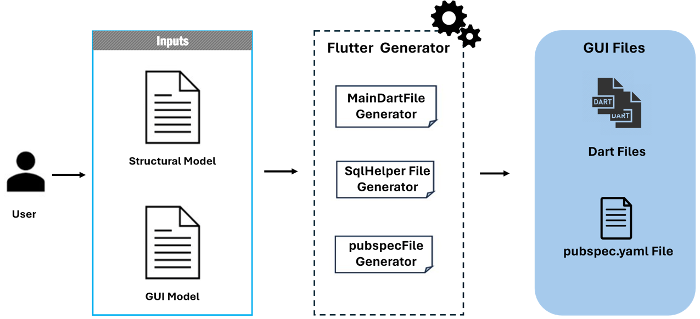

Flutter Generator (deprecated)
==============================

.. warning::

   This code generator is **deprecated** and may be discontinued in future versions.

BESSER introduces a code generator for `Flutter <https://flutter.dev/>`_ applications. By supplying
a :doc:`structural model <../buml_language/model_types/structural>` and a :doc:`GUI model <../buml_language/model_types/gui>`,
the generator will produce code for the Flutter mobile application. This inlcudes generating the user interface
(screens, buttons, lists, etc.) according to the GUI input model, and the management of CRUD operations with a relational database
according to the structural input model. The generated code adheres to established Flutter best practices.

Getting Started
---------------

To start using the Flutter Code Generator, follow these steps:

1. Prepare your :doc:`structural model <../buml_language/model_types/structural>` and :doc:`GUI model <../buml_language/model_types/gui>` according to the B-UML metamodel.
2. Run the code generator, providing your structural model and GUI model as input. The generator will analyze the models and generate the required code files for your Flutter application.
3. To generate the complete Flutter code for a structural model and a GUI model, simply follow this step:

.. code-block:: python

    from besser.generators.flutter import FlutterGenerator

    # Create an instance of the FlutterGenerator class, providing the necessary parameters:
    # - model: An object representing the structural model.
    # - gui_model: An object representing the GUI model.
    # - main_page: An object representing the main page of the Flutter application.
    code_gen = FlutterGenerator(model=library_model, gui_model=library_gui_model, main_page=MyHomeScreen)

    # Generate the code files for your Flutter application by calling the 'generate' method:
    code_gen.generate()

The code generator will produce several files, which will be located in the ``<<current_directory>>/output`` directory. These files include:

   + ``main.dart``: This file serves as the entry point for your Flutter application, providing the initial configuration and structure. It includes the necessary dependencies and imports to utilize Flutter's UI components and other functionalities. With main.dart, you can easily customize the starting point of your app, define its visual style, and import essential packages for building a robust and engaging user interface.
   + ``sql_helper.dart``: This file contains helpful functions for managing a SQLite database within your Flutter application. It facilitates operations such as table creation, data retrieval, and data manipulation. With ``sql_helper.dart``, you can seamlessly interact with a database in your Flutter app, enabling efficient data storage and retrieval operations.
   + ``pubspec.yaml``: This file is crucial for dependency management and project configuration in a Flutter application. It allows you to control dependencies, versioning, and other important details. With ``pubspec.yaml``, you can ensure a smooth development process for your Flutter app by easily managing dependencies and defining project-specific information.

By incorporating these generated files into your Flutter project, you'll have a solid foundation for building your application, including the necessary configuration, database management capabilities, and dependency management.

You can check our :doc:`../examples/mobile_app_example`, which ilustrates the usage of the Flutter code generator.