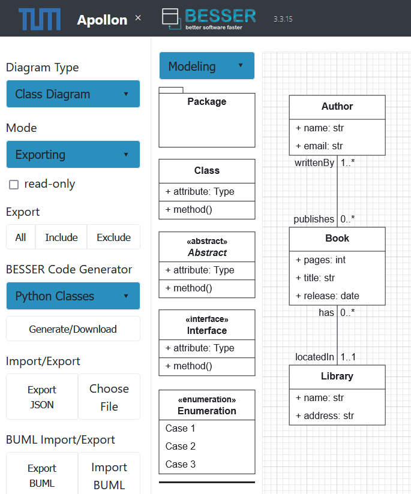

Visual Modeling with Apollon
======================================

BESSER provides integration with `Apollon <https://apollon-library.readthedocs.io/en/latest/>`_ for visual UML modeling and code generation. 
Apollon is an open-source, modern UML editor supporting various diagram types.

Key Features
------------

Visual Modeling
^^^^^^^^^^^^^^^^
- Interactive UML diagram creation
- Supports B-UML for:

  - Class diagrams (structural models)
  - State machine diagrams
  - More diagram types coming soon

.. image:: ./img/GUI_Apollon_HDV2.gif
   :width: 900
   :alt: 
   :align: center

Prerequisites
-------------

Before using Apollon with BESSER, ensure you have:

* **Docker** installed (Docker Desktop or standalone Docker Engine with Docker Compose)
* Basic familiarity with command-line interfaces (CLI)

Getting Started
---------------

You can integrate Apollon with BESSER in two ways:

1. **Using the Submodule Approach**: Directly integrate Apollon as a submodule within the BESSER repository.
2. **Running Apollon and BESSER Separately**: Set up and run both components independently, either manually or using their Dockerfiles.

.. note::

   Both Apollon and BESSER include their own `Dockerfile`, allowing you to containerize and deploy them individually if preferred.

Submodule Integration
---------------------

1. **Clone BESSER**

   - Clone the BESSER repository with the Apollon submodule:

   .. code-block:: bash

      git clone https://github.com/BESSER-PEARL/BESSER.git
      cd BESSER
      git submodule init
      git submodule update

2. **Launch Services**

   - Use Docker Compose to start both BESSER and Apollon:

   .. code-block:: bash

      docker-compose up

3. **Access Apollon**

   - Open your browser and navigate to ``http://localhost:8888``.

Running Components Independently
--------------------------------

If you'd prefer more control, you can run Apollon and BESSER independently.

Running Manually
^^^^^^^^^^^^^^^^

1. **Apollon Frontend**:

   - Ensure Node.js is installed on your system

   - Clone the `Apollon Forked repository <https://github.com/BESSER-PEARL/Apollon>`_:

     .. code-block:: bash

        git clone https://github.com/BESSER-PEARL/Apollon.git
        cd Apollon

   - Install dependencies and start the frontend:

     .. code-block:: bash

        npm install
        npm start

   - Access Apollon at ``http://localhost:3000``.

2. **BESSER Backend**:

   - Navigate to the backend directory:

     .. code-block:: bash

        cd besser.utilities.besser_backend

   - Install dependencies and start the backend:

     .. code-block:: bash

        python main.py

   - The backend will be accessible on its configured port.

Using Apollon
-------------

Creating Diagrams
^^^^^^^^^^^^^^^^^
1. Open Apollon in your browser (based on the chosen setup: ``http://localhost:8888`` or ``http://localhost:3000``).
2. Select the diagram type (Class or State Machine).
3. Use the toolbar to add elements and relationships.
4. Models are automatically saved and synchronized.
5. Export/Import the diagram as a B-UML or JSON file.

Generating Code
^^^^^^^^^^^^^^^^
1. Create your UML diagram in Apollon.
2. Select your BESSER Generator (e.g., Python classes, Backend).
3. Click "Generate/Download" in the toolbar.
4. Download the generated code.

References
----------

* `BESSER Documentation <https://besser.readthedocs.io/>`_
* `Apollon Documentation <https://apollon-library.readthedocs.io/en/latest/>`_
* `Apollon Fork Repository <https://github.com/BESSER-PEARL/Apollon>`_
