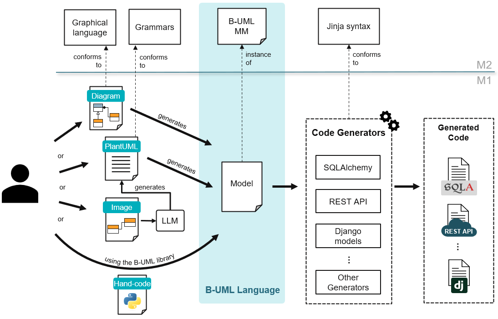

Welcome to BESSER's Documentation
=================================

**BESSER** is a `low-modeling <https://modeling-languages.com/welcome-to-the-low-modeling-revolution/>`_ 
`low-code <https://modeling-languages.com/low-code-vs-model-driven/>`_ open-source platform built on top 
of our Python-based personal interpretation of a "Universal Modeling Language" (yes, heavily inspired and 
a simplified version of the better known UML, the Unified Modeling Language).

.. note::
   BESSER is funded thanks to an `FNR Pearl grant <https://modeling-languages.com/a-smart-low-code-platform-for-smart-software-in-luxembourg-goodbye-barcelona/>`_ 
   led by the `Luxembourg Institute of Science and Technology <https://www.list.lu/>`_ with the participation 
   of the `Snt/University of Luxembourg <https://www.uni.lu/snt-en/>`_ and open to all your contributions!

BESSER enables users to model, generate, perzonalize and deploy smart and complex software systems. BESSER is 
based around our B-UML language and a number of generators built on top of it (See the high-level architecture below).

You'll find here all the necessary information about the B-UML language (to model the problem domain) and the 
different code generators to produce a deployable solution. You could even build your own code generator for 
a target technology.

Contents
--------

.. toctree::
   :maxdepth: 2

   installation
   web_editor
   buml_language
   generators
   utilities
   examples
   api
   releases
   contributing/index
   about
